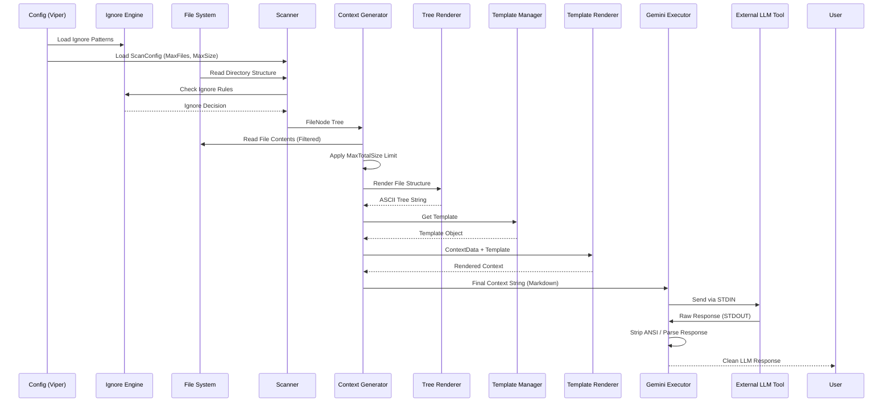
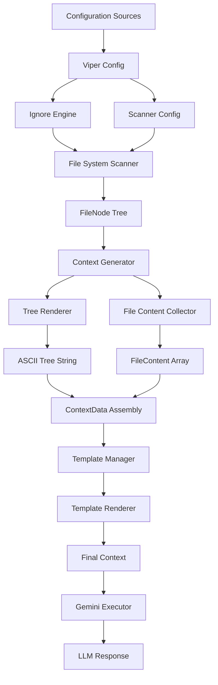

Based on my comprehensive analysis of the shotgun-cli codebase, I can now provide a detailed data flow analysis. Here's the complete documentation:

# Data Flow Analysis
## Data Models Overview

The application uses several key data structures to manage configuration, file system representation, and the final LLM context.

| Data Model | Location | Purpose | Key Fields |
| :--- | :--- | :--- | :--- |
| **Configuration** | `github.com/spf13/viper` | Stores application settings loaded from defaults, file, environment, and flags. | Hierarchical keys (e.g., `scanner.max-files`, `context.max-total-size`). |
| **`scanner.FileNode`** | `internal/core/scanner/scanner.go` | Represents a file or directory in the codebase tree. | `Path`, `RelPath`, `IsDir`, `Children`, `Size`, `IsGitignored`, `IsCustomIgnored`. |
| **`scanner.ScanConfig`** | `internal/core/scanner/scanner.go` | Configuration for the file system scanning process. | `MaxFileSize`, `MaxFiles`, `SkipBinary`, `IncludeIgnored`, `IgnorePatterns`. |
| **`context.GenerateConfig`** | `internal/core/context/generator.go` | Configuration for the context generation process. | `MaxTotalSize`, `MaxFiles`, `TemplateVars` (map[string]string). |
| **`context.FileContent`** | `internal/core/context/content.go` | Holds the content of a single file selected for the context. | `RelPath`, `Language` (detected), `Content`, `Size`. |
| **`context.ContextData`** | `internal/core/context/generator.go` | The root data structure passed to the Go template engine. | `Task`, `Rules`, `FileStructure` (rendered tree), `Files` ([]FileContent). |
| **`template.Template`** | `internal/core/template/template.go` | Represents a template with metadata and content. | `Name`, `Description`, `Content`, `RequiredVars`, `FilePath`, `IsEmbedded`. |
| **`gemini.Result`** | `internal/platform/gemini/executor.go` | The result object returned after interacting with the LLM. | `Response` (clean), `RawResponse`, `Model`, `Duration`. |
| **`ignore.LayeredIgnoreEngine`** | `internal/core/ignore/engine.go` | Manages layered ignore rules for file filtering. | `builtInMatcher`, `gitignoreMatcher`, `customMatcher`, `explicitExcludes`, `explicitIncludes`. |

## Data Transformation Map

Data flows through the system in a pipeline, starting with configuration and ending with the LLM response.

| Stage | Input Data | Output Data | Transformation Component | Description |
| :--- | :--- | :--- | :--- | :--- |
| **1. Config Loading** | OS Environment, Config File (YAML), CLI Flags | `viper` (in-memory map) | `cmd/root.go:initConfig` | Loads and merges configuration sources, setting defaults. |
| **2. Ignore Rule Loading** | `.gitignore`, `.shotgunignore`, custom patterns | `ignore.LayeredIgnoreEngine` | `ignore.NewIgnoreEngine()` | Loads layered ignore rules with priority: explicit excludes → explicit includes → built-in → .gitignore → custom. |
| **3. File System Scanning** | `scanner.ScanConfig`, Root Path, Ignore Engine | `scanner.FileNode` Tree | `scanner.FileSystemScanner.ScanWithProgress()` | Two-pass scanning: first counts items for progress, then builds tree with ignore filtering. |
| **4. Content Collection** | `FileNode` Tree, `GenerateConfig`, Selections | `[]context.FileContent` | `context.collectFileContents()` | Iterates over selected nodes, reads file content, checks binary status, applies size limits, and detects language. |
| **5. Structure Rendering** | `FileNode` Tree | `FileStructure` (string) | `context.TreeRenderer.RenderTree()` | Converts the `FileNode` tree into an ASCII/Markdown representation with ignore indicators. |
| **6. Template Loading** | Embedded FS, User Templates, Custom Path | `template.Manager` | `template.NewManager()` | Loads templates from multiple sources with priority override system. |
| **7. Template Assembly** | `FileStructure`, `[]FileContent`, `TemplateVars` | `context.ContextData` | `context.DefaultContextGenerator` | Populates the final data structure for templating. |
| **8. Template Rendering** | `ContextData`, Template String | Final Context (string) | `template.Renderer.RenderTemplate()` | Executes variable substitution converting `{VAR}` syntax to actual values. |
| **9. LLM Execution** | Final Context (string) | `gemini.Result` | `gemini.Executor.Send()` | Sends the context string to the external `geminiweb` binary via `stdin`. |
| **10. Response Cleanup** | `RawResponse` (string) | `Response` (string) | `gemini.StripANSI`, `gemini.ParseResponse` | Removes ANSI escape codes and extracts the final LLM output. |

## Storage Interactions

The application's storage interactions are limited to configuration persistence, template management, and reading source files.

*   **Configuration Persistence:**
    *   **Mechanism:** The `github.com/spf13/viper` library is used for configuration management.
    *   **Format:** YAML (default).
    *   **Lifecycle:** Configuration is loaded during `initConfig` (`cmd/root.go`). It is written back to the file system only when the `config set` command is executed via `viper.WriteConfig()` (`cmd/config.go`).
    *   **Location:** Platform-specific configuration directory (e.g., `~/.config/shotgun-cli/config.yaml`).

*   **Template Storage:**
    *   **Embedded Templates:** Stored in `internal/assets/templates` as embedded filesystem.
    *   **User Templates:** Stored in XDG-compliant directory (`~/.config/shotgun-cli/templates`).
    *   **Custom Templates:** Configurable path via `template.custom-path` setting.
    *   **Loading:** `template.Manager` loads from multiple sources with priority override system.

*   **Source Code Access:**
    *   The `internal/core/context/content.go` package is responsible for reading the actual file contents using standard `os.Open` and `io.ReadAll`. This is a read-only interaction with the project's source files.

*   **Ignore Rule Files:**
    *   `.gitignore` files are loaded using `github.com/sabhiram/go-gitignore`.
    *   `.shotgunignore` files are loaded for project-specific ignore patterns.
    *   Custom ignore patterns are stored in configuration.

*   **Caching:**
    *   No internal caching mechanisms (e.g., for file contents or LLM responses) are implemented within the core data flow components.

## Validation Mechanisms

Data integrity and system constraints are enforced through several validation steps:

1.  **Configuration Validation (`cmd/config.go`):**
    *   **Key/Value Validation:** Ensures configuration keys are valid and that values (e.g., size strings like "5MB") conform to the expected format before being set and persisted.
    *   **Type Conversion:** `convertConfigValue` handles the transformation of string inputs into their native Go types (e.g., `int64` for sizes, `bool`).

2.  **Ignore Pattern Validation (`internal/core/ignore/engine.go`):**
    *   **Pattern Format:** Custom ignore patterns are validated using gitignore semantics.
    *   **Layer Priority:** Ensures proper precedence of ignore rules across different sources.

3.  **Context Generation Limits (`internal/core/context/content.go`):**
    *   **File Count Limit:** Stops processing files if `config.MaxFiles` is reached.
    *   **Total Size Limit:** Stops collecting content if the cumulative size exceeds `config.MaxTotalSize`. This is a critical check to prevent token overruns with the LLM.
    *   **Binary Check:** `isTextFile` performs a check for null bytes and UTF-8 validity on the file header to skip binary files if configured.

4.  **Template Validation (`internal/core/template/template.go`):**
    *   **Required Variables:** `validateVariables` ensures that essential variables (like `TASK`) are present and non-empty before template rendering.
    *   **Variable Syntax:** `validateTemplateContent` checks for malformed variable patterns and unmatched braces.
    *   **Template Structure:** Validates template content for proper formatting and variable extraction.

5.  **Scanner Validation (`internal/core/scanner/filesystem.go`):**
    *   **Path Validation:** Ensures root path exists and is accessible.
    *   **Size Limits:** Enforces `MaxFileSize` and `MaxFiles` limits during scanning.
    *   **Binary Detection:** Early binary file detection to avoid reading large binary files.

## State Management Analysis

The application follows a stateless, command-driven model, with state primarily managed by the CLI framework and the TUI library.

*   **Global State (Configuration):** The `viper` singleton holds the application's configuration state, which is immutable during a single command execution (except for the `config set` command).

*   **Execution State (Transient):** 
    *   The `scanner.FileNode` tree is the primary transient state, representing the codebase structure.
    *   This state is built in memory and passed through the context generation pipeline.
    *   Progress state is managed through channels for real-time updates.

*   **TUI State:** When running in interactive mode, the `internal/ui/wizard.go` component manages the multi-step process (file selection, task input, etc.) using the Bubble Tea framework's state machine:
    *   Current step tracking (`StepFileSelection`, `StepTemplateSelection`, etc.)
    *   User selections stored in maps (`selectedFiles`)
    *   Form inputs (`taskDesc`, `rules`)
    *   Component state for each screen

*   **Template Manager State:** 
    *   Thread-safe template cache using `sync.RWMutex`
    *   Template registry with priority-based override system
    *   Lazy loading of templates from multiple sources

*   **Ignore Engine State:**
    *   Layered matchers for different ignore rule sources
    *   Pattern accumulation across multiple calls
    *   Thread-safe rule evaluation

## Serialization Processes

The primary serialization process is the creation of the final LLM prompt.

*   **Input Serialization (Config):** Configuration is deserialized from YAML/JSON/TOML files into the `viper` map using `github.com/spf13/viper`.

*   **Template Serialization:**
    *   Templates are stored as markdown files with `{VARIABLE}` placeholders
    *   Template metadata is extracted and stored as JSON-serializable structs
    *   Embedded templates are serialized into the binary using Go's embed directive

*   **Output Serialization (Context):** The `context.DefaultContextGenerator` serializes the structured `ContextData` into a single Markdown string:
    *   The file structure is rendered as an ASCII tree with ignore indicators
    *   File contents are formatted into distinct blocks using a specific Markdown structure:
        ```markdown
        ### relative/path/to/file.go (go)

        ```go
        // file content...
        ```
        ```
    *   Language detection provides syntax highlighting hints
    *   Size information and ignore status are included in the tree representation

*   **LLM Communication:** 
    *   The final Markdown string is serialized as the `stdin` stream for the external `geminiweb` process
    *   The response is deserialized from `stdout` as a raw string, which is then cleaned up
    *   ANSI escape codes are stripped and response content is parsed

*   **Progress Serialization:** Progress updates are serialized through channels as structured messages (`scanner.Progress`, `context.GenProgress`).

## Data Lifecycle Diagrams



