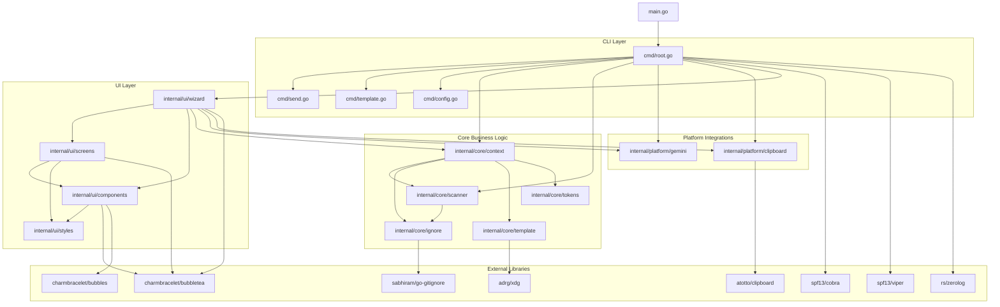

Based on my comprehensive analysis of the shotgun-cli codebase, I can now provide a complete dependency analysis. Let me create the final markdown document:

# Dependency Analysis
## Internal Dependencies Map

The project follows a clean architecture with clear separation of concerns across internal packages. The dependency flow is primarily from the `cmd` package (composition root) down through core business logic, platform integrations, and UI components.

### Core Dependency Hierarchy:

**cmd Package (Composition Root)**
- Depends on: `internal/core/*`, `internal/platform/*`, `internal/ui/*`
- Role: Orchestrates all components, handles CLI commands, configuration, and application lifecycle

**internal/core/context**
- Depends on: `internal/core/ignore`, `internal/core/scanner`, `internal/core/template`, `internal/core/tokens`
- Role: Manages LLM context generation, combining file structures, content, and templates

**internal/core/template**
- Depends on: External filesystem access via `github.com/adrg/xdg`
- Role: Template loading, management, and rendering with multi-source support

**internal/core/ignore**
- Depends on: `github.com/sabhiram/go-gitignore`
- Role: Implements layered ignore engine with built-in patterns, .gitignore, .shotgunignore, and custom rules

**internal/core/scanner**
- Depends on: `internal/core/ignore`
- Role: Filesystem traversal and file tree construction with progress reporting

**internal/core/tokens**
- Depends on: No internal dependencies
- Role: Token estimation utilities for LLM context optimization

**internal/platform/gemini**
- Depends on: External `geminiweb` binary
- Role: Google Gemini API integration with configuration and execution management

**internal/platform/clipboard**
- Depends on: `github.com/atotto/clipboard`
- Role: Cross-platform clipboard operations

**internal/ui/wizard**
- Depends on: `internal/core/*`, `internal/platform/*`, `internal/ui/screens`, `internal/ui/components`
- Role: Main TUI wizard orchestrating the 5-step workflow

**internal/ui/screens**
- Depends on: `internal/ui/components`, `internal/ui/styles`
- Role: Individual TUI screens (file selection, template selection, task input, etc.)

**internal/ui/components**
- Depends on: `internal/ui/styles`
- Role: Reusable TUI components (progress bars, tree views)

**internal/ui/styles**
- Depends on: No internal dependencies
- Role: TUI styling and theming

**internal/utils**
- Depends on: No internal dependencies
- Role: Utility functions for size conversion and common operations

## External Libraries Analysis

### Primary Dependencies:

**CLI Framework:**
- `github.com/spf13/cobra v1.8.1` - Command structure, argument parsing, and CLI organization
- `github.com/spf13/viper v1.21.0` - Configuration management from files, environment variables, and flags

**TUI Framework:**
- `github.com/charmbracelet/bubbletea v1.3.5` - Model-View-Update pattern for interactive terminal interfaces
- `github.com/charmbracelet/bubbles v0.21.0` - Pre-built TUI components (text inputs, lists, etc.)
- `github.com/charmbracelet/lipgloss v1.1.0` - TUI styling and layout management

**Core Utilities:**
- `github.com/rs/zerolog v1.33.0` - Fast, structured logging
- `github.com/sabhiram/go-gitignore v0.0.0-20210923224102-525f6e181f06` - .gitignore pattern matching
- `github.com/adrg/xdg v0.5.3` - XDG Base Directory Specification implementation
- `github.com/atotto/clipboard v0.1.4` - Cross-platform clipboard access

**Development/Testing:**
- `github.com/stretchr/testify v1.11.1` - Testing assertions and utilities
- `golang.org/x/text v0.28.0` - Text processing utilities

### Indirect Dependencies:
- Multiple `charmbracelet/x/*` packages for advanced TUI features
- `github.com/muesli/*` packages for terminal handling and ANSI processing
- `github.com/spf13/afero`, `github.com/spf13/cast`, `github.com/spf13/pflag` - Supporting libraries for the spf13 ecosystem
- `github.com/pelletier/go-toml/v2 v2.2.4` - TOML configuration parsing

## Service Integrations

### Primary External Service Integration:

**Google Gemini API**
- **Integration Point:** `internal/platform/gemini` package
- **Protocol:** External binary execution (`geminiweb`) with HTTP communication to Gemini API
- **Components:**
  - `executor.go` - Manages command execution, timeout handling, and response processing
  - `config.go` - Configuration management for API keys, models, and settings
  - `parser.go` - Response parsing and ANSI code stripping
- **Features:**
  - Model selection (gemini-1.5-pro, gemini-1.5-flash, etc.)
  - Timeout management
  - Progress reporting
  - Error handling and retry logic
  - Browser refresh configuration

### System-Level Integrations:

**Filesystem Operations**
- **Integration Points:** `internal/core/scanner`, `internal/core/ignore`, `internal/core/template`
- **Features:** Recursive directory traversal, file content reading, ignore pattern matching
- **Standards:** XDG Base Directory Specification for config paths

**Clipboard Operations**
- **Integration Point:** `internal/platform/clipboard`
- **Library:** `github.com/atotto/clipboard`
- **Features:** Cross-platform clipboard read/write operations

## Dependency Injection Patterns

The project uses **manual dependency injection** with the `cmd` package serving as the composition root:

### 1. Constructor Injection Pattern
```go
// Example from wizard.go
func NewWizard(rootPath string, config *scanner.ScanConfig) *WizardModel {
    return &WizardModel{
        step:              StepFileSelection,
        selectedFiles:     make(map[string]bool),
        rootPath:          rootPath,
        config:            config,
        progressComponent: components.NewProgress(),
    }
}
```

### 2. Configuration Injection
- Viper configuration is initialized in `cmd/root.go` via `initConfig()`
- Configuration values are passed to components during construction
- Environment variable binding with `SHOTGUN_` prefix

### 3. Interface-Based Design
- `Scanner` interface in `internal/core/scanner`
- `TemplateManager` interface in `internal/core/template`
- `IgnoreEngine` interface in `internal/core/ignore`
- `ContextGenerator` interface in `internal/core/context`

### 4. Factory Pattern
- `template.NewManager()` creates template managers with multi-source loading
- `gemini.NewExecutor(config)` creates configured Gemini executors
- `scanner.NewFileSystemScanner()` creates file system scanners

### 5. No DI Container
- The project avoids complex DI containers like `wire` or `fx`
- Dependencies are explicitly passed, promoting clarity and testability

## Module Coupling Assessment

### High Cohesion Modules:

**internal/core/context**
- **Cohesion:** High - Focused solely on LLM context generation
- **Coupling:** Moderate - Depends on scanner, ignore, template, and tokens modules
- **Assessment:** Well-designed with clear responsibilities and necessary dependencies

**internal/core/scanner**
- **Cohesion:** High - Dedicated to filesystem scanning operations
- **Coupling:** Low - Only depends on ignore engine
- **Assessment:** Excellent separation of concerns

**internal/platform/gemini**
- **Cohesion:** High - Solely focused on Gemini API integration
- **Coupling:** Low - Isolated from core business logic
- **Assessment:** Good encapsulation of external service integration

### Moderate Coupling Areas:

**internal/ui/wizard**
- **Cohesion:** Medium - Orchestrates multiple UI screens and core operations
- **Coupling:** High - Depends on most internal packages
- **Assessment:** Acceptable as it's the main UI coordinator

**cmd Package**
- **Cohesion:** Low - Serves as composition root for all functionality
- **Coupling:** Very High - Connects all modules together
- **Assessment:** Appropriate for composition root pattern

### Loose Coupling Examples:

**internal/ui/components** and **internal/ui/screens**
- **Cohesion:** High - Focused on specific UI functionality
- **Coupling:** Low - Minimal dependencies, clear interfaces
- **Assessment:** Well-structured UI architecture

## Dependency Graph



## Potential Dependency Issues

### 1. TUI Framework Lock-in
**Issue:** Heavy reliance on `charmbracelet` ecosystem creates tight coupling
**Impact:** Difficult to migrate to different UI paradigms (web UI, simple CLI)
**Mitigation:** The coupling is contained within the `internal/ui` package, making it manageable

### 2. External Binary Dependency
**Issue:** `geminiweb` binary dependency for Gemini integration
**Impact:** Requires external tool installation and configuration
**Mitigation:** Proper availability checks and clear error messages guide users

### 3. Configuration Complexity
**Issue:** Viper's global state can lead to implicit dependencies
**Impact:** Potential for configuration access patterns that are hard to test
**Current State:** Well-managed with explicit configuration passing in most cases

### 4. Template System Complexity
**Issue:** Multi-source template loading (embedded, user config, custom path) adds complexity
**Impact:** Potential for template conflicts and debugging challenges
**Mitigation:** Clear priority system and source tracking in template metadata

### 5. Platform-Specific Dependencies
**Issue:** Clipboard and filesystem operations have platform-specific behaviors
**Impact:** Potential inconsistencies across different operating systems
**Mitigation:** Use of well-tested cross-platform libraries (`atotto/clipboard`, `xdg`)

### 6. No LLM Provider Abstraction
**Issue:** Direct coupling to Gemini API implementation
**Impact:** Difficult to add support for other LLM providers
**Recommendation:** Consider introducing an LLM provider interface in `internal/core` for future extensibility

### 7. Large Dependency Tree
**Issue:** 50+ direct and indirect dependencies for a CLI tool
**Impact:** Larger binary size, potential security surface area
**Mitigation:** Dependencies are well-chosen and primarily from reputable sources

The dependency structure is generally well-architected with clear separation of concerns, though some areas could benefit from additional abstraction for future extensibility.