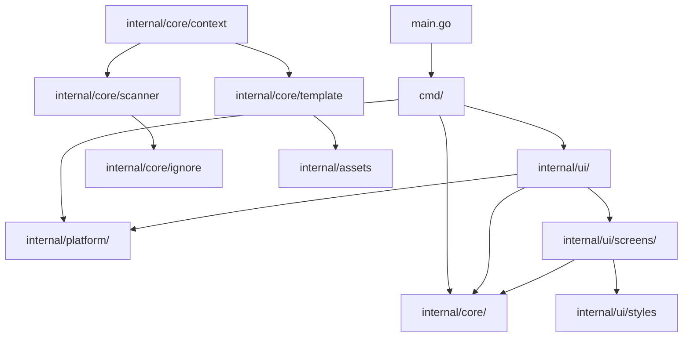

# Dependency Analysis

## Internal Dependencies
The project is structured into a strictly hierarchical package layout, ensuring a clear separation of concerns between the CLI entry points, UI components, and core business logic.

- **`main.go`**: Entry point that initializes logging and calls the `cmd` package.
- **`cmd/`**: CLI layer using Cobra. It depends on `internal/ui` for the interactive mode and `internal/core` for headless operations.
- **`internal/ui/`**: TUI layer using Bubble Tea. The `WizardModel` acts as the primary coordinator, depending on:
    - `internal/core/context` for prompt generation logic.
    - `internal/core/scanner` for file discovery.
    - `internal/core/template` for managing prompt templates.
    - `internal/platform/` for clipboard and LLM integration.
    - `internal/ui/screens/` and `internal/ui/components/` for UI state and rendering.
- **`internal/core/`**: Core logic layer.
    - `context` depends on `scanner` and `template`.
    - `scanner` depends on `ignore` for filtering logic.
    - `template` depends on `internal/assets` for default embedded templates.
- **`internal/platform/`**: Infrastructure adapters.
    - `gemini` interacts with the external `geminiweb` tool.
    - `clipboard` interacts with the system clipboard.
- **`internal/utils/`**: Shared utility functions used across all layers.

## External Dependencies
The application leverages the standard Go ecosystem for CLI and TUI development.

| Library | Purpose |
|---------|---------|
| `github.com/spf13/cobra` | CLI command structure and argument parsing. |
| `github.com/spf13/viper` | Configuration management and environment variable binding. |
| `github.com/charmbracelet/bubbletea` | The Elm Architecture (TEA) framework for the TUI wizard. |
| `github.com/charmbracelet/bubbles` | Common TUI components (progress bars, etc.). |
| `github.com/charmbracelet/lipgloss` | Terminal UI styling and layout. |
| `github.com/rs/zerolog` | Structured logging. |
| `github.com/sabhiram/go-gitignore` | Pattern matching for `.gitignore` file compliance. |
| `github.com/atotto/clipboard` | Cross-platform system clipboard access. |
| `github.com/adrg/xdg` | XDG Base Directory specification support for config paths. |
| `github.com/stretchr/testify` | Unit testing assertions and mocking. |

### Runtime Dependencies
- **`geminiweb`**: An external CLI tool required for Google Gemini integration. It is invoked via `os/exec`.

## Dependency Graph
The dependency structure follows a layered architecture:

## Dependency Injection
The project utilizes **Manual Constructor Injection**.
- Components receive their dependencies (configuration, scanners, executors) as arguments in `New...` functions.
- There is no global state for core logic; objects are instantiated in the `cmd` layer or the `wizard` coordinator and passed down.
- **TUI Pattern**: In the UI layer, decoupling is achieved through Bubble Tea's message-passing system. Screens do not call the Wizard directly; they return `tea.Msg` (e.g., `RescanRequestMsg`), which the Wizard handles to change state or trigger core logic.

## Potential Issues
- **God Object Pattern**: `internal/ui/wizard.go` (the `WizardModel`) carries significant responsibility. It manages the TUI state machine, coordinates all screens, and triggers all core logic operations. While manageable now, this could become a maintenance bottleneck as more steps are added.
- **External CLI Coupling**: The Gemini integration is tightly coupled to a specific external tool (`geminiweb`) rather than an SDK. This creates a brittle runtime dependency that cannot be easily verified at compile time.
- **Tight UI/Core Coupling**: While core logic is independent of the UI, the UI layer is tightly coupled to core data structures (like `scanner.FileNode`). Changes in the core data model directly impact the TUI rendering and event handling.
- **Implicit Filesystem Dependency**: `internal/core/scanner` and `internal/core/context` make direct calls to the `os` and `io` packages. While tested via `_test.go` files, abstracting the filesystem (e.g., using `afero`) would improve testability and allow for virtual codebase analysis.