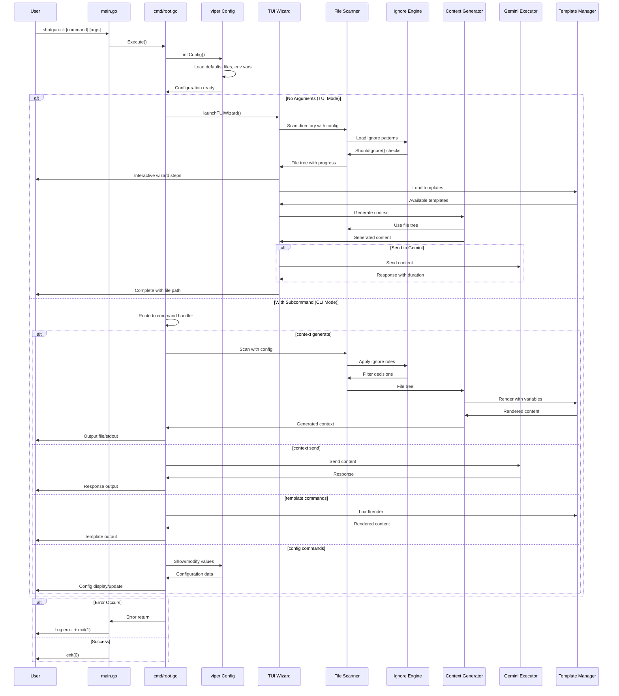

Based on my comprehensive analysis of the shotgun-cli codebase, I can now provide a detailed request flow analysis. This is a CLI application, so the "request flow" refers to command execution flow rather than HTTP requests.

# Request Flow Analysis

## Entry Points Overview

The system has a single external entry point through the `shotgun-cli` binary execution:

1. **`main.go`** - Application bootstrap
   - Initializes `zerolog` structured logging with console output
   - Calls `cmd.Execute()` to start the Cobra command framework
   - Handles fatal errors by logging and exiting with status code 1

2. **`cmd/root.go`** - Command framework entry point
   - `Execute()` function initiates the Cobra command tree
   - Routes to either TUI wizard mode or headless CLI mode based on arguments

3. **Mode Selection**:
   - **TUI Wizard Mode**: No arguments/subcommands → `launchTUIWizard()` → Bubble Tea TUI
   - **Headless CLI Mode**: With subcommands → Direct command execution

## Request Routing Map

The routing mechanism is implemented using Cobra's command tree structure:

| Command Path | Handler Function | Primary Purpose |
|-------------|------------------|-----------------|
| `shotgun-cli` | `runRootCommand` | Root command - launches TUI or shows help |
| `shotgun-cli context generate` | `runContextGenerate` | Generate codebase context files |
| `shotgun-cli context send [file]` | `runContextSend` | Send content to Gemini LLM |
| `shotgun-cli template list` | `runTemplateList` | List available templates |
| `shotgun-cli template render [name]` | `runTemplateRender` | Render templates with variables |
| `shotgun-cli config show` | `runConfigShow` | Display current configuration |
| `shotgun-cli config set [key] [value]` | `runConfigSet` | Update configuration values |
| `shotgun-cli completion` | Cobra default | Generate shell completions |

## Middleware Pipeline

The CLI middleware consists of configuration loading, validation, and preprocessing:

1. **Configuration Initialization** (`cobra.OnInitialize(initConfig)`):
   - Logging setup with zerolog and console writer
   - Config file discovery in standard XDG locations (platform-specific)
   - Environment variable binding (`SHOTGUN_` prefix with dot notation)
   - Default value application for scanner, context, template, output, and gemini settings
   - Flag-to-viper binding for persistent flags
   - Final logging level adjustment based on verbose/quiet flags

2. **Pre-Run Validation** (`PreRunE` functions):
   - Path existence and accessibility checks
   - File format validation (size formats like "1MB", "5GB")
   - Template existence verification
   - External tool availability checks (geminiweb binary)
   - Configuration key validation for config commands

3. **TUI Wizard Preprocessing**:
   - Current working directory detection as scan root
   - Scanner configuration from viper settings
   - Bubble Tea program initialization with alt screen and mouse support

## Controller/Handler Analysis

### TUI Wizard Flow (`launchTUIWizard`)
- **Entry**: `runRootCommand` detects no arguments
- **Initialization**: Creates `WizardModel` with scan configuration
- **Execution**: `tea.NewProgram().Run()` starts interactive session
- **Steps**: 5-step wizard process managed by `WizardModel.Update()`
  1. File Selection (`screens/file_selection.go`) - Interactive file tree with filtering
  2. Template Selection (`screens/template_selection.go`) - Choose prompt template
  3. Task Input (`screens/task_input.go`) - Describe the task
  4. Rules Input (`screens/rules_input.go`) - Specify generation rules
  5. Review & Generation (`screens/review.go`) - Review and generate context

### Context Generation Flow (`runContextGenerate`)
- **Configuration Building**: Parse flags and build `GenerateConfig` with validation
- **Scanning**: `FileSystemScanner.Scan()` with progress reporting via channels
- **Content Generation**: `ContextGenerator.GenerateWithProgressEx()` with structured progress
- **Template Rendering**: Apply template with file structure and content using Go templates
- **Output**: Write to file or stdout, optional Gemini sending with auto-send configuration

### Gemini Integration Flow (`runContextSend`)
- **Input Acquisition**: File or stdin content reading with validation
- **Prerequisite Validation**: `gemini.IsAvailable()` and `gemini.IsConfigured()` checks
- **Execution**: `gemini.Executor.Send()` with external process management and timeout
- **Response Processing**: ANSI stripping and response parsing
- **Output**: File writing or stdout printing with duration reporting

### Template Management Flow
- **Manager Initialization**: `template.NewManager()` with multi-source loading (embedded → user config → custom path)
- **Source Priority**: Embedded templates have highest priority, followed by user config, then custom paths
- **Rendering**: Template variable substitution with validation of required variables
- **Completion**: Shell completion support with template descriptions

### Configuration Management Flow
- **Display**: `showCurrentConfig()` shows all values with sources (default, config file, env var, flag)
- **Modification**: `setConfigValue()` validates keys and values, converts types, writes to config file
- **Validation**: Key validation against allowed configuration paths and value format validation

## Authentication & Authorization Flow

Traditional authentication is not applicable, but the system implements prerequisite validation:

1. **Gemini Access Control**:
   - `gemini.IsAvailable()`: Binary existence check in PATH using `exec.LookPath`
   - `gemini.IsConfigured()`: Authentication configuration validation via `geminiweb` status
   - Failure results in command termination with helpful error messages and installation instructions

2. **File System Access**:
   - Path existence and permission validation using `os.Stat`
   - Directory accessibility checks with absolute path resolution
   - Configuration file read/write permissions with automatic directory creation

3. **Resource Limits**:
   - File size limits enforcement during scanning
   - Token count validation using `tokens.EstimateFromBytes`
   - Memory usage constraints with configurable limits

## Error Handling Pathways

Error handling follows a layered approach:

1. **Command-Level Errors** (`RunE`, `PreRunE`):
   - Validation errors wrapped with context using `fmt.Errorf`
   - External tool failures with detailed messages and remediation suggestions
   - Configuration errors with specific guidance for resolution

2. **TUI Error Handling**:
   - Graceful degradation for terminal size issues via `tea.WindowSizeMsg`
   - Progress reporting for long-running operations using structured progress messages
   - User-friendly error messages in wizard steps with recovery options

3. **Fatal Application Errors**:
   - `main.go` catches `cmd.Execute()` errors
   - Structured logging with `zerolog.Error().Err(err).Msg()`
   - Clean exit with appropriate status codes (1 for errors, 0 for success)

4. **External Process Errors**:
   - Timeout handling for external tool execution using `context.WithTimeout`
   - Stderr capture and inclusion in error messages for debugging
   - Context cancellation support for graceful shutdown

5. **Scanning and Generation Errors**:
   - Progress channel communication for async error reporting
   - File system permission errors with specific path information
   - Template rendering errors with variable context

## Request Lifecycle Diagram

The request flow demonstrates a well-structured CLI application with clear separation of concerns, comprehensive error handling, and both interactive (TUI) and programmatic (CLI) interfaces for different use cases. The system effectively manages complex workflows like file scanning, template rendering, and external service integration while maintaining a clean user experience.