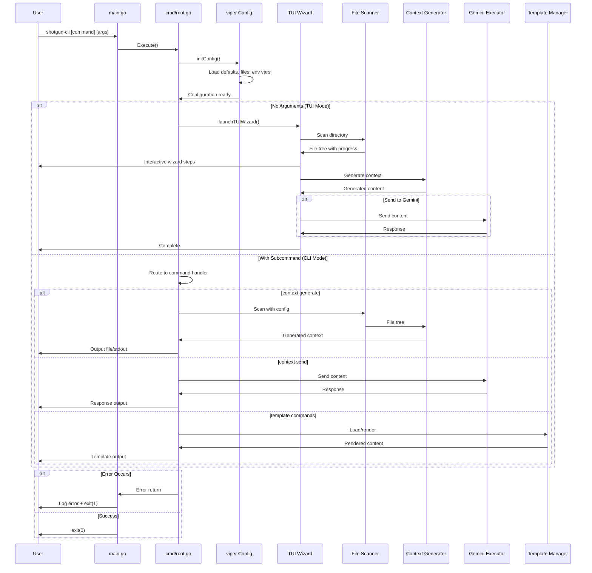

Based on my analysis of the shotgun-cli codebase, I can now provide a comprehensive request flow analysis. This is a CLI application, so the "request flow" refers to command execution flow rather than HTTP requests.

# Request Flow Analysis

## Entry Points Overview

The system has a single external entry point through the `shotgun-cli` binary execution:

1. **`main.go`** - Application bootstrap
   - Initializes `zerolog` structured logging
   - Calls `cmd.Execute()` to start the Cobra command framework
   - Handles fatal errors by logging and exiting with status code 1

2. **`cmd/root.go`** - Command framework entry point
   - `Execute()` function initiates the Cobra command tree
   - Routes to either TUI wizard mode or headless CLI mode based on arguments

3. **Mode Selection**:
   - **TUI Wizard Mode**: No arguments/subcommands → `launchTUIWizard()` → Bubble Tea TUI
   - **Headless CLI Mode**: With subcommands → Direct command execution

## Request Routing Map

The routing mechanism is implemented using Cobra's command tree structure:

| Command Path | Handler Function | Primary Purpose |
|-------------|------------------|-----------------|
| `shotgun-cli` | `runRootCommand` | Root command - launches TUI or shows help |
| `shotgun-cli context generate` | `runContextGenerate` | Generate codebase context files |
| `shotgun-cli context send [file]` | `runContextSend` | Send content to Gemini LLM |
| `shotgun-cli template list` | `runTemplateList` | List available templates |
| `shotgun-cli template render [name]` | `runTemplateRender` | Render templates with variables |
| `shotgun-cli config show` | `runConfigShow` | Display current configuration |
| `shotgun-cli config set [key] [value]` | `runConfigSet` | Update configuration values |
| `shotgun-cli completion` | Cobra default | Generate shell completions |

## Middleware Pipeline

The CLI middleware consists of configuration loading, validation, and preprocessing:

1. **Configuration Initialization** (`cobra.OnInitialize(initConfig)`):
   - Logging setup with zerolog
   - Config file discovery in standard XDG locations
   - Environment variable binding (`SHOTGUN_` prefix)
   - Default value application
   - Flag-to-viper binding
   - Final logging level adjustment

2. **Pre-Run Validation** (`PreRunE` functions):
   - Path existence and accessibility checks
   - File format validation (size formats, etc.)
   - Template existence verification
   - External tool availability checks (geminiweb)

3. **TUI Wizard Preprocessing**:
   - Current working directory detection
   - Scanner configuration from viper settings
   - Bubble Tea program initialization with screen options

## Controller/Handler Analysis

### TUI Wizard Flow (`launchTUIWizard`)
- **Entry**: `runRootCommand` detects no arguments
- **Initialization**: Creates `WizardModel` with scan configuration
- **Execution**: `tea.NewProgram().Run()` starts interactive session
- **Steps**: 5-step wizard process managed by `WizardModel.Update()`
  1. File Selection (`screens/file_selection.go`)
  2. Template Selection (`screens/template_selection.go`) 
  3. Task Input (`screens/task_input.go`)
  4. Rules Input (`screens/rules_input.go`)
  5. Review & Generation (`screens/review.go`)

### Context Generation Flow (`runContextGenerate`)
- **Configuration Building**: Parse flags and build `GenerateConfig`
- **Scanning**: `FileSystemScanner.Scan()` with progress reporting
- **Content Generation**: `ContextGenerator.GenerateWithProgressEx()`
- **Template Rendering**: Apply template with file structure and content
- **Output**: Write to file or stdout, optional Gemini sending

### Gemini Integration Flow (`runContextSend`)
- **Input Acquisition**: File or stdin content reading
- **Prerequisite Validation**: `gemini.IsAvailable()` and `gemini.IsConfigured()`
- **Execution**: `gemini.Executor.Send()` with external process management
- **Response Processing**: ANSI stripping and response parsing
- **Output**: File writing or stdout printing

### Template Management Flow
- **Manager Initialization**: `template.NewManager()` with multi-source loading
- **Source Priority**: Embedded → User config → Custom path
- **Rendering**: Template variable substitution and validation

## Authentication & Authorization Flow

Traditional authentication is not applicable, but the system implements prerequisite validation:

1. **Gemini Access Control**:
   - `gemini.IsAvailable()`: Binary existence check in PATH
   - `gemini.IsConfigured()`: Authentication configuration validation
   - Failure results in command termination with helpful error messages

2. **File System Access**:
   - Path existence and permission validation
   - Directory accessibility checks
   - Configuration file read/write permissions

3. **Resource Limits**:
   - File size limits enforcement
   - Token count validation
   - Memory usage constraints

## Error Handling Pathways

Error handling follows a layered approach:

1. **Command-Level Errors** (`RunE`, `PreRunE`):
   - Validation errors wrapped with context
   - External tool failures with detailed messages
   - Configuration errors with remediation suggestions

2. **TUI Error Handling**:
   - Graceful degradation for terminal size issues
   - Progress reporting for long-running operations
   - User-friendly error messages in wizard steps

3. **Fatal Application Errors**:
   - `main.go` catches `cmd.Execute()` errors
   - Structured logging with `zerolog`
   - Clean exit with appropriate status codes

4. **External Process Errors**:
   - Timeout handling for external tool execution
   - Stderr capture and inclusion in error messages
   - Context cancellation support

## Request Lifecycle Diagram

The request flow demonstrates a well-structured CLI application with clear separation of concerns, comprehensive error handling, and both interactive (TUI) and programmatic (CLI) interfaces for different use cases.