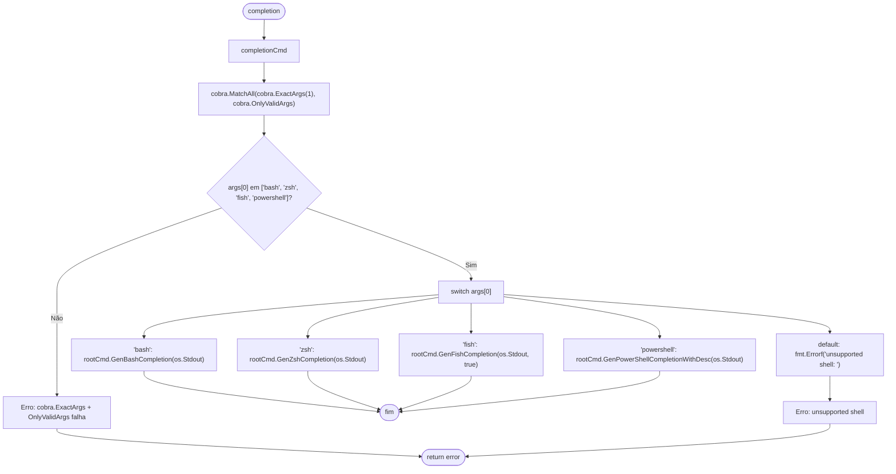
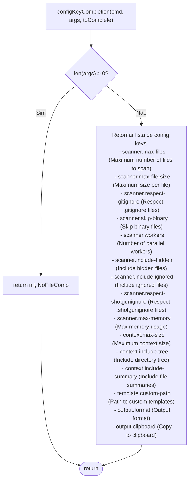
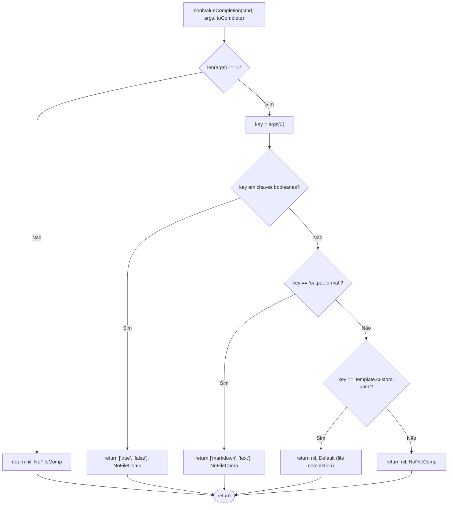

# Fluxo: Shell Completion

> **Arquivo fonte:** `completion.go`  
> **Comando:** `shotgun-cli completion [bash\|zsh\|fish\|powershell]`

---

## Diagrama de Fluxo

---

## Diagrama de Fluxo: Config Key Completion

---

## Diagrama de Fluxo: Bool Value Completion

---

## Registro de Completers

| Comando | Completador | Função | Quando é chamado |
|---|---|---|---|
| `template render` | Template names | `ValidArgsFunction` | No 1º argumento |
| `config set` | Config keys | `configKeyCompletion` | No 1º argumento |
| `config set` | Values | `boolValueCompletion` | No 2º argumento |

---

## Observações

🟡 **Order dependency:** O completer de `config set` é registrado em `init()` após a verificação `if configSetCmd != nil`, o que depende que `configCmd` e `configSetCmd` já tenham sido criados (ordem de `init()` nos arquivos Go).
