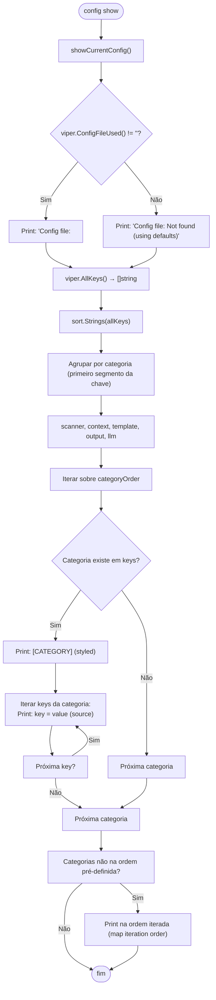
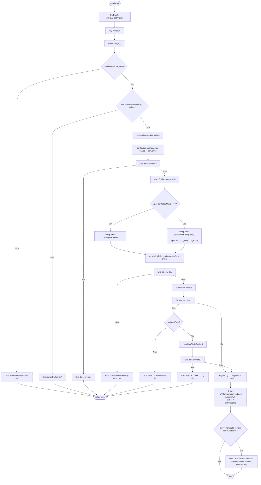
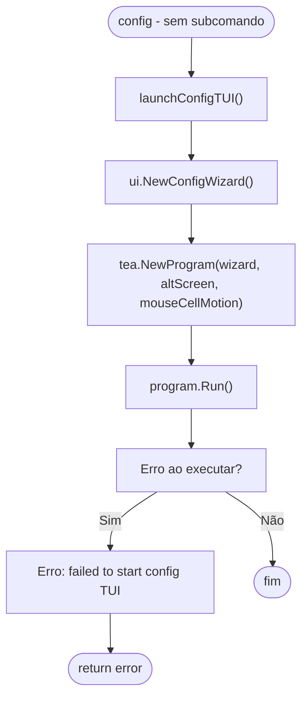

# Fluxo: Config (show / set / TUI)

> **Arquivo fonte:** `config.go`  
> **Comandos:** `shotgun-cli config`, `shotgun-cli config show`, `shotgun-cli config set`

---

## Diagrama de Fluxo: config show

---

## Diagrama de Fluxo: config set

---

## Diagrama de Fluxo: config TUI

---

## Resumo de Flags

| Comando | Flag | Tipo | Padrão | Descrição |
|---|---|---|---|---|
| `config` | — | — | — | Lança TUI interativo |
| `config show` | — | — | — | Exibe configuração |
| `config set` | `[key]` | positional | — | Chave de configuração |
| `config set` | `[value]` | positional | — | Valor |

---

## Categorias de Configuração

| Categoria | Chaves |
|---|---|
| `scanner` | `scanner.max-files`, `scanner.max-file-size`, `scanner.max-memory`, `scanner.respect-gitignore`, `scanner.skip-binary`, `scanner.workers`, `scanner.include-hidden`, `scanner.respect-shotgunignore` |
| `context` | `context.max-size`, `context.include-tree`, `context.include-summary` |
| `template` | `template.custom-path` |
| `output` | `output.format`, `output.clipboard` |
| `llm` | `llm.provider`, `llm.api-key`, `llm.base-url`, `llm.model`, `llm.timeout`, `llm.save-response` |
| `global` | `verbose`, `quiet` |

---

## Mapeamento de Tipos por Chave

| Chave | Tipo Convertido | Exemplos Válidos |
|---|---|---|
| `scanner.max-files` | `int64` | `10000` |
| `scanner.max-file-size` | `string` | `"1MB"` |
| `scanner.max-memory` | `string` | `"500MB"` |
| `scanner.respect-gitignore` | `bool` | `true`, `false` |
| `scanner.skip-binary` | `bool` | `true`, `false` |
| `scanner.workers` | `int` | `4` |
| `context.max-size` | `string` | `"10MB"` |
| `context.include-tree` | `bool` | `true`, `false` |
| `output.format` | `string` | `markdown`, `text` |
| `output.clipboard` | `bool` | `true`, `false` |
| `llm.provider` | `string` | `openai`, `anthropic`, `gemini` |
| `llm.api-key` | `string` | `sk-your-key` |
