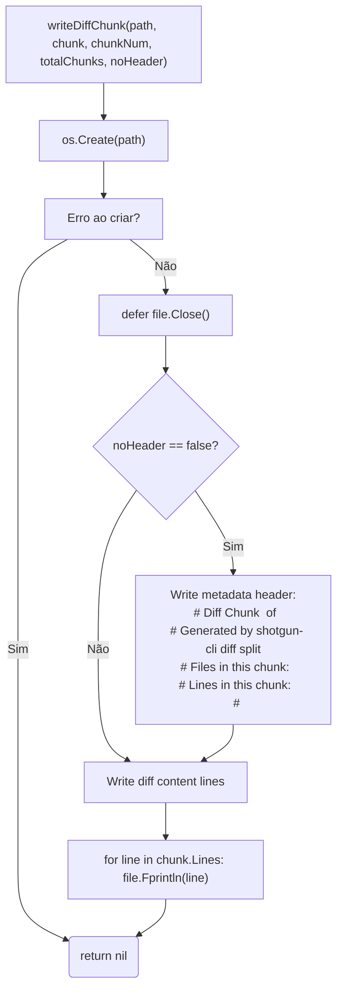

# Fluxo: Diff Split

> **Arquivo fonte:** `diff.go`  
> **Comando:** `shotgun-cli diff split`

---

## Diagrama de Fluxo

```mermaid
flowchart TD
    Start([diff split]) --> preRunE["PreRunE"]
    
    preRunE --> getInput{"--input flag definido?"}
    getInput -->|Não| errNoInput["Erro: input file is required"]
    getInput -->|Sim| inputExists["os.Stat(input) existe?"]
    
    errNoInput --> returnErr([return error])
    
    inputExists -->|Não| errNotExist["Erro: input file does not exist"]
    inputExists -->|Sim| inputReadable["os.Open(input)"]
    
    errNotExist --> returnErr
    
    inputReadable --> openErr["Erro ao abrir?"]
    openErr -->|Sim| errRead["Erro: cannot read input file"]
    openErr -->|Não| closeFile["_ = file.Close()"]
    
    errRead --> returnErr
    
    closeFile --> getApproxLines{"--approx-lines > 0?"}
    getApproxLines -->|Não| errApproxLines["Erro: approx-lines must be positive"]
    getApproxLines -->|Sim| preRunOK["PreRun OK"]
    
    errApproxLines --> returnErr
    
    preRunOK --> runE["runE: diffSplitCmd"]
    
    runE --> readFlags["Ler flags: input, output-dir, approx-lines, no-header"]
    
    readFlags --> splitDiff["splitDiffFile(inputPath, outputDir, approxLines, noHeader)"]
    
    splitDiff --> mkdirOutput["os.MkdirAll(outputDir, 0750)"]
    mkdirOutput --> mkdirErr["Erro ao criar dir?"]
    mkdirErr -->|Sim| errMkdir["Erro: failed to create output directory"]
    mkdirErr -->|Não| openInput["os.Open(inputPath)"]
    
    errMkdir --> returnErr
    
    openInput --> openErr2["Erro?"]
    openErr2 -->|Sim| errOpen["Erro: failed to open input file"]
    openErr2 -->|Não| deferClose["defer file.Close()"]
    
    errOpen --> returnErr
    
    deferClose --> readScanner["bufio.NewScanner(file)"]
    
    readScanner --> scanLines["scanner.Scan() → allLines (todas as linhas)"]
    
    scanLines --> scanErr["scanner.Err()?" ]
    scanErr -->|Sim| errScan["Erro: failed to read input file"]
    scanErr -->|Não| emptyCheck{"len(allLines) == 0?"}
    
    errScan --> returnErr
    
    emptyCheck -->|Sim| errEmpty["Erro: input file is empty"]
    emptyCheck -->|Não| logRead["log.Info: totalLines = <n>"]
    
    errEmpty --> returnErr
    
    logRead --> intelligentSplit["diff.IntelligentSplit(allLines, SplitConfig{ApproxLines})"]
    
    intelligentSplit --> chunks["[]diff.Chunk:
  - Lines []string
  - FileCount int
  - StartLine int"]
    
    chunks --> logSplit["log.Info: chunks = <n>"]
    logSplit --> basename["filepath.Base(inputPath) → inputBasename"]
    
    basename --> removeExt["strings.TrimSuffix(inputBasename, ext)"]
    removeExt --> writeLoop["Iterar chunks"]
    
    writeLoop --> chunkFmt["chunkFilename = '%s-chunk-%02d.diff' % (inputBasename, i+1)"]
    chunkFmt --> chunkPath["filepath.Join(outputDir, chunkFilename)"]
    chunkPath --> writeChunk["writeDiffChunk(chunkPath, chunk, i+1, len(chunks), noHeader)"]
    
    writeChunk --> wcErr["Erro?"]
    wcErr -->|Sim| errWriteChunk["Erro: failed to write chunk <n>"]
    wcErr -->|Não| printChunk["Print: '📄 Chunk <n>: <filename> (<lines> lines, <files> files)'"]
    
    errWriteChunk --> returnErr
    
    printChunk --> nextChunk["Próximo chunk?"]
    nextChunk -->|Sim| writeLoop
    nextChunk -->|Não| printSuccess["Print:
  ✅ Diff file split successfully!
  📁 Input file: <input>
  📂 Output directory: <outputDir>"]
    
    printSuccess --> logSuccess["log.Info: 'Diff split done'"]
    logSuccess --> endSplit(["fim"])
```



---

## Sub-fluxo: writeDiffChunk



---

## Resumo de Flags

| Flag | Tipo | Curto | Padrão | Obrigatório | Descrição |
|---|---|---|---|---|---|
| `--input` / `-i` | string | `-i` | — | Sim | Arquivo diff de entrada |
| `--output-dir` / `-o` | string | `-o` | `"chunks"` | Não | Diretório de saída |
| `--approx-lines` | int | — | `500` | Não | Linhas aproximadas por chunk |
| `--no-header` | bool | — | `false` | Não | Omitir headers de metadados |

---

## Formato de Saída

### Arquivos de Chunk

| Arquivo | Formato | Descrição |
|---|---|---|
| `{input-base}-chunk-01.diff` | Diff format com header opcional | Primeiro chunk |
| `{input-base}-chunk-02.diff` | Diff format com header opcional | Segundo chunk |
| ... | ... | ... |
| `{input-base}-chunk-N.diff` | Diff format com header opcional | Último chunk |

### Header de Metadados (quando `--no-header` não é usado)

```
# Diff Chunk 1 of 3
# Generated by shotgun-cli diff split
# Files in this chunk: 5
# Lines in this chunk: 150
#
```

---

## Observações

🟡 **Memória:** Todo o arquivo diff é lido em memória (`allLines`) antes do split. Não há streaming para arquivos muito grandes.

🟡 **Validação de arquivo:** O `PreRunE` abre e fecha o arquivo para verificar legibilidade, mas não lê o conteúdo para validar se é realmente um diff válido.
