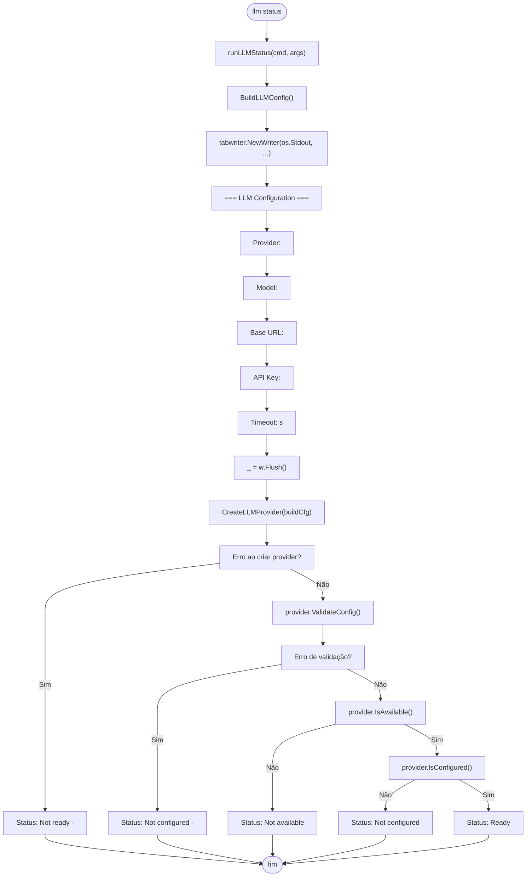
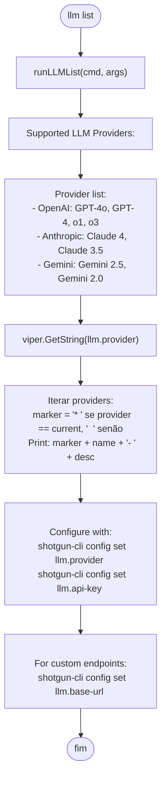
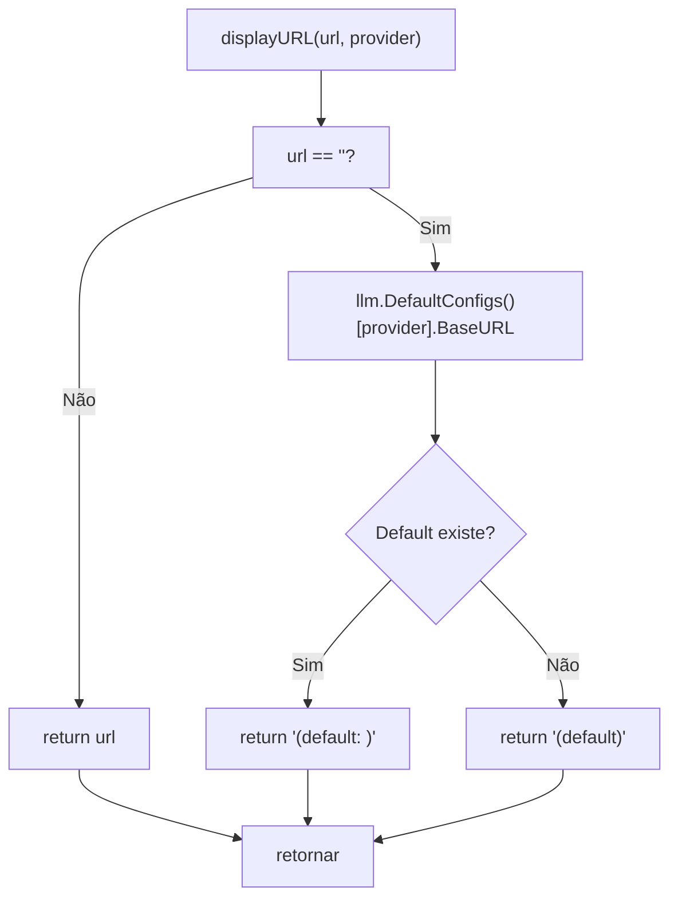

# Fluxo: LLM Provider Management (status / doctor / list)

> **Arquivo fonte:** `llm.go`, `config_llm.go`, `providers.go`  
> **Comandos:** `shotgun-cli llm status`, `shotgun-cli llm doctor`, `shotgun-cli llm list`

---

## Diagrama de Fluxo: llm status

---

## Diagrama de Fluxo: llm doctor

```mermaid
flowchart TD
    Start([llm doctor]) --> runLLMDoctor["runLLMDoctor(cmd, args)"]
    
    runLLMDoctor --> buildCfg["BuildLLMConfig()"]
    
    buildCfg --> printDiagStart["Print: 'Running diagnostics for <provider>...'"]
    
    printDiagStart --> checkProvider["Checking provider..."]
    checkProvider --> isValidProvider{"llm.IsValidProvider(cfg.Provider)?"}
    isValidProvider -->|Sim| printProviderOK["<provider>"]
    isValidProvider -->|Não| printProviderBad["invalid: <provider>"]
    
    printProviderBad --> addIssue1["issues += 'Invalid provider: <provider>'"]
    addIssue1 --> checkAPIKey["Checking API key..."]
    printProviderOK --> checkAPIKey
    
    checkAPIKey --> apiKeySet{"cfg.APIKey != ''?"}
    apiKeySet -->|Sim| printKeyOK["configured"]
    apiKeySet -->|Não| printKeyBad["not configured"]
    
    printKeyBad --> addIssue2["issues += 'API key not configured'"]
    addIssue2 --> checkModel["Checking model..."]
    printKeyOK --> checkModel
    
    checkModel --> modelSet{"cfg.Model != ''?"}
    modelSet -->|Sim| printModelOK["<cfg.Model>"]
    modelSet -->|Não| printModelBad["not configured"]
    
    printModelBad --> addIssue3["issues += 'Model not configured'"]
    addIssue3 --> createProvider["CreateLLMProvider(cfg)"]
    printModelOK --> createProvider
    
    createProvider --> createErr["Erro ao criar?"]
    createErr -->|Sim| providerCheckDone["continuar sem checks de provider"]
    createErr -->|Não| checkAvail["Checking provider availability..."]
    
    checkAvail --> availOK["provider.IsAvailable()"]
    availOK -->|Sim| printAvailOK["OK"]
    availOK -->|Não| printAvailBad["not available"]
    
    printAvailBad --> addIssue4["issues += '<provider> is not available'"]
    addIssue4 --> checkCfg["Checking provider configuration..."]
    printAvailOK --> checkCfg
    
    checkCfg --> cfgOK["provider.IsConfigured()"]
    cfgOK -->|Sim| printCfgOK["OK"]
    cfgOK -->|Não| printCfgBad["not configured"]
    
    printCfgBad --> addIssue5["issues += '<provider> is not fully configured'"]
    printCfgOK --> issuesDone([checks concluídos])
    addIssue5 --> issuesDone
    providerCheckDone --> issuesDone
    
    issuesDone --> printSummary["Print: Found <n> issue(s)"]
    
    printSummary --> noIssues{"len(issues) == 0?"}
    noIssues -->|Sim| printSuccess["No issues found! <provider> is ready."]
    noIssues -->|Não| printIssues["Iterar issues"]
    
    printSuccess --> endDoctor(["fim"])
    
    printIssues --> printNextSteps["\nNext steps:"]
    printNextSteps --> nextStepsSwitch["switch cfg.Provider"]
    
    nextStepsSwitch --> switchOpenAI["ProviderOpenAI:
  1. Get API key from: https://platform.openai.com/api-keys
  2. Configure: shotgun-cli config set llm.api-key YOUR_KEY
  3. (Optional) Set model: shotgun-cli config set llm.model gpt-4o"]
    
    nextStepsSwitch --> switchAnthropic["ProviderAnthropic:
  1. Get API key from: https://console.anthropic.com/settings/keys
  2. Configure: shotgun-cli config set llm.api-key YOUR_KEY
  3. (Optional) Set model: ...claude-sonnet-4-20250514"]
    
    nextStepsSwitch --> switchGemini["ProviderGemini:
  1. Get API key from: https://aistudio.google.com/app/apikey
  2. Configure: shotgun-cli config set llm.api-key YOUR_KEY
  3. (Optional) Set model: ...gemini-2.5-flash"]
    
    switchOpenAI --> endDoctor
    switchAnthropic --> endDoctor
    switchGemini --> endDoctor
```

---

## Diagrama de Fluxo: llm list

---

## Sub-fluxo: displayURL

---

## Resumo de Flags

| Comando | Flag | Tipo | Padrão | Descrição |
|---|---|---|---|---|
| `llm status` | — | — | — | Exibir status do provider |
| `llm doctor` | — | — | — | Executar diagnósticos |
| `llm list` | — | — | — | Listar providers suportados |

---

## Resumo de Variáveis de Configuração Usadas

| Chave Viper | Uso no fluxo |
|---|---|
| `llm.provider` | Provider atual (status, list) |
| `llm.api-key` | Verificação de config (doctor) |
| `llm.base-url` | Exibição de URL (status) |
| `llm.model` | Verificação de config (doctor) |
| `llm.timeout` | Exibição de timeout (status) |
