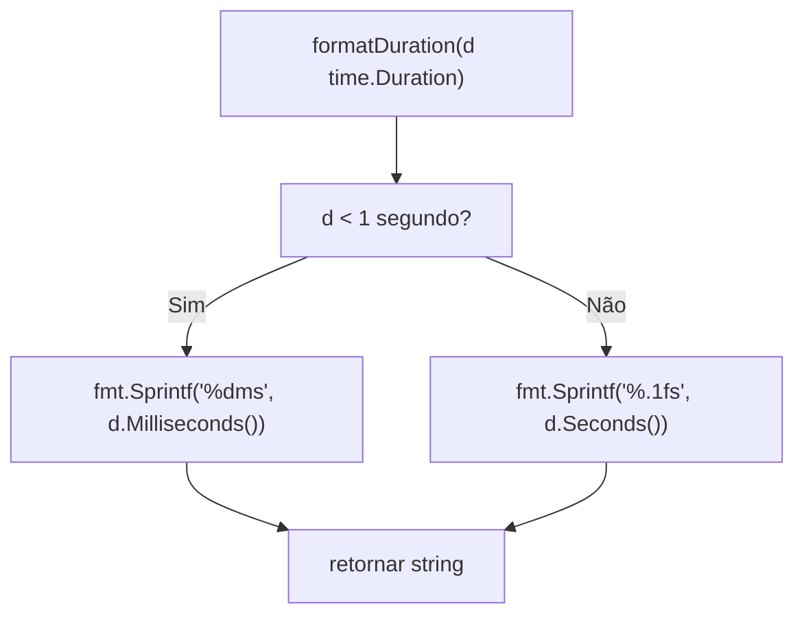

# Fluxo: Send to LLM (context send)

> **Arquivo fonte:** `send.go`  
> **Comando:** `shotgun-cli context send [file]`

---

## Diagrama de Fluxo

```mermaid
flowchart TD
    Start([context send]) --> argsCheck["Args: cobra.MaximumNArgs(1)"]
    argsCheck --> preRunE["PreRunE"]
    
    preRunE --> argCount["len(args) > 0?"]
    argCount -->|Sim| fileExists["os.Stat(args[0]) existe?"]
    fileExists -->|Não| errFileNotFound["Erro: file not found: <file>"]
    fileExists -->|Sim| preRunOK["PreRun OK"]
    argCount -->|Não (stdin)| preRunOK
    
    errFileNotFound --> returnErr([return error])
    
    preRunOK --> runContextSend["runContextSend(cmd, args)"]
    
    runContextSend --> readContent{"len(args) > 0?"}
    
    readContent -->|Sim: file| readFile["os.ReadFile(args[0])"]
    readFile --> readErr["Erro ao ler?"]
    readErr -->|Sim| errReadFile["Erro: failed to read file"]
    readErr -->|Não| contentFile["content = file content"]
    
    readContent -->|Não: stdin| checkStdin["os.Stdin.Stat() - char device?"]
    checkStdin -->|Sim (terminal)| errNoInput["Erro: no input provided. Specify file or pipe via stdin"]
    checkStdin -->|Não (pipe)| readStdin["io.ReadAll(os.Stdin)"]
    readStdin --> stdinErr["Erro?"]
    stdinErr -->|Sim| errReadStdin["Erro: failed to read stdin"]
    stdinErr -->|Não| contentStdin["content = stdin data"]
    
    errReadFile --> returnErr
    errNoInput --> returnErr
    errReadStdin --> returnErr
    
    contentFile --> emptyCheck["TrimSpace(content) vazio?"]
    contentStdin --> emptyCheck
    
    emptyCheck -->|Sim| errEmpty["Erro: no content to send"]
    emptyCheck -->|Não| getFlags["Ler flags: model, timeout, output, raw"]
    
    errEmpty --> returnErr
    
    getFlags --> saveResponse["viper.Get(llm.save-response)"]
    saveResponse --> outputFileCheck{"output flag vazio? E save-response=true?"}
    
    outputFileCheck -->|Sim| autoOutput["auto-output: llm-response-TIMESTAMP.md"]
    outputFileCheck -->|Não| buildConfig["BuildLLMConfigWithOverrides(model, timeout)"]
    
    autoOutput --> buildConfig
    
    buildConfig --> createProvider["CreateLLMProvider(cfg)"]
    createProvider --> providerErr["Erro ao criar?"]
    providerErr -->|Sim| errProvider["Erro: failed to create provider"]
    providerErr -->|Não| checkAvail{"provider.IsAvailable()?"}
    
    errProvider --> returnErr
    
    checkAvail -->|Não| errNotAvail["Erro: <provider> not available. Run 'llm doctor'"]
    checkAvail -->|Sim| validateCfg["provider.ValidateConfig()"]
    
    errNotAvail --> returnErr
    
    validateCfg --> validateErr["Erro de config?"]
    validateErr -->|Sim| errValidate["Erro: <provider> configuration error"]
    validateErr -->|Não| logSend["log: Sending to LLM"]
    
    errValidate --> returnErr
    
    logSend --> printSend["fmt: 'Sending to <provider> (<model>)...'"]
    printSend --> llmSend["llmProvider.Send(ctx, content)"]
    
    llmSend --> sendErr["Erro no envio?"]
    sendErr -->|Sim| errSend["Erro: request failed"]
    sendErr -->|Não| result["*llm.Result"]
    
    errSend --> returnErr
    
    result --> rawFlag["flag --raw?" ]
    rawFlag -->|Sim| rawResponse["response = result.RawResponse"]
    rawFlag -->|Não| procResponse["response = result.Response"]
    
    rawResponse --> outputCheck{"outputFile != ''?"}
    procResponse --> outputCheck
    
    outputCheck -->|Sim| writeFile["os.WriteFile(outputFile, response, 0600)"]
    writeFile --> writeErr["Erro ao salvar?"]
    writeErr -->|Sim| errWrite["Erro: failed to save response"]
    writeErr -->|Não| savedMsg["fmt: 'Response saved to: <outputFile>'"]
    
    outputCheck -->|Não| printResponse["fmt.Println(response)"]
    
    errWrite --> returnErr
    
    savedMsg --> showUsage["Mostrar usage se result.Usage != nil:
  Tokens: total (prompt, completion)"]
    showUsage --> showDuration["Show duration: formatDuration(result.Duration)"]
    
    printResponse --> showUsage
    
    showDuration --> end([fim])
```

---

## Sub-fluxo: formatDuration



---

## Resumo de Flags

| Flag | Tipo | Curto | Padrão | Obrigatório | Descrição |
|---|---|---|---|---|---|
| `[file]` | positional | — | — | Não (ou stdin) | Arquivo de entrada (ou pipe via stdin) |
| `--output` / `-o` | string | `-o` | `""` | Não | Arquivo de resposta |
| `--model` / `-m` | string | `-m` | `""` | Não | Modelo (override) |
| `--timeout` | int | — | `0` | Não | Timeout em segundos |
| `--raw` | bool | — | `false` | Não | Resposta bruta |

---

## Resumo de Variáveis de Configuração Usadas

| Chave Viper | Uso |
|---|---|
| `llm.provider` | Provider a usar (via BuildLLMConfig) |
| `llm.api-key` | API key (via BuildLLMConfig) |
| `llm.base-url` | Base URL (via BuildLLMConfig) |
| `llm.model` | Modelo padrão (via BuildLLMConfig) |
| `llm.timeout` | Timeout padrão (via BuildLLMConfig) |
| `llm.save-response` | Auto-save se `--output` não especificado |
