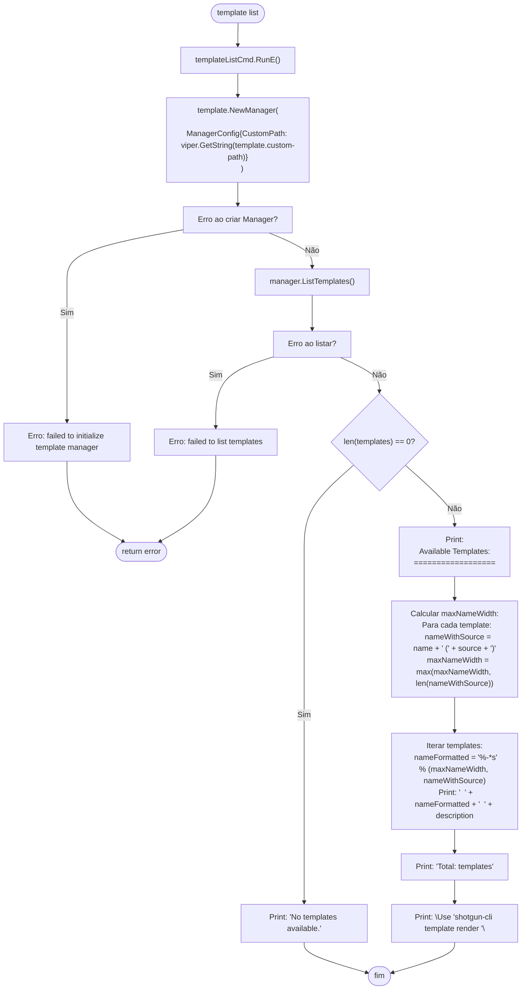
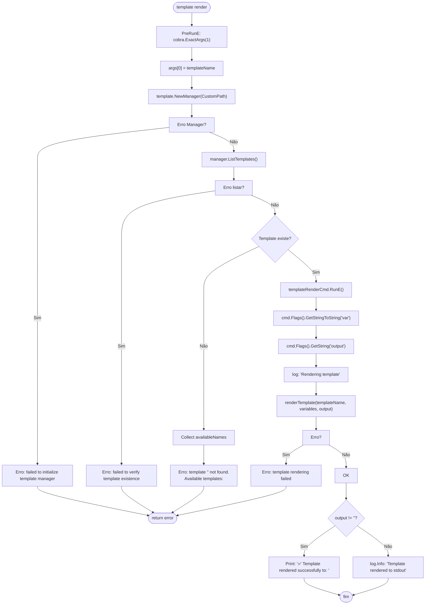
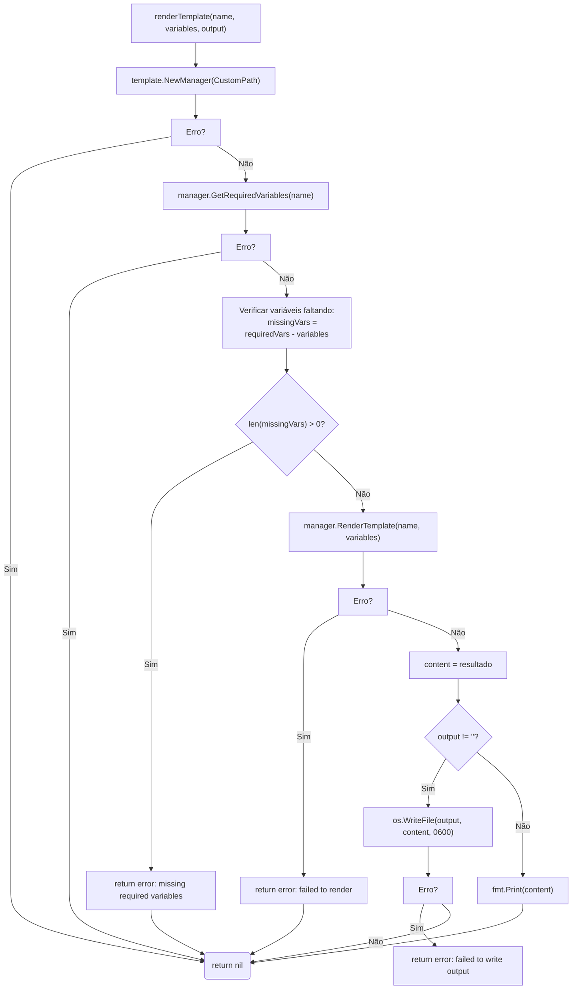
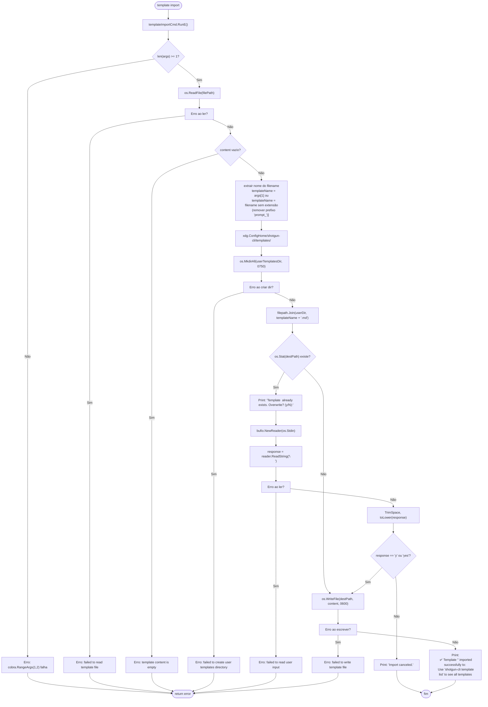
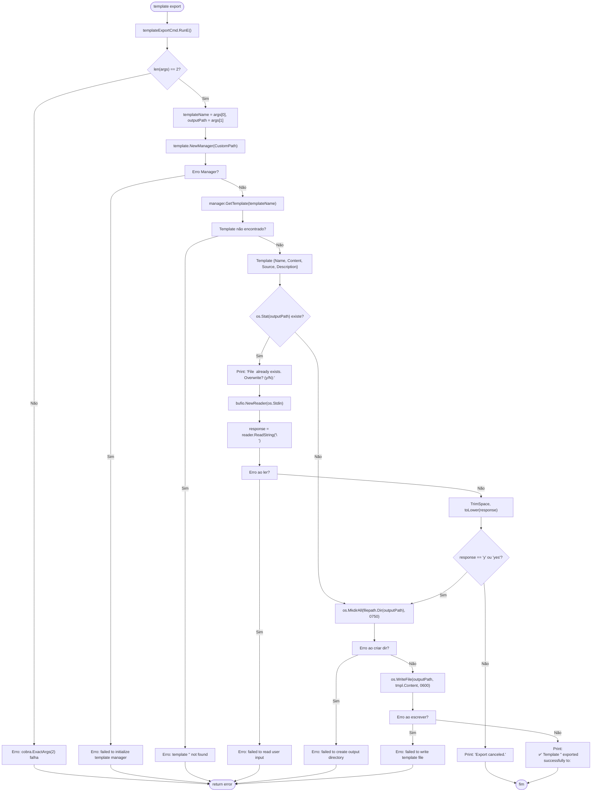

# Fluxo: Template Management (list / render / import / export)

> **Arquivo fonte:** `template.go`  
> **Comandos:** `shotgun-cli template list`, `shotgun-cli template render`, `shotgun-cli template import`, `shotgun-cli template export`

---

## Diagrama de Fluxo: template list

---

## Diagrama de Fluxo: template render

---

## Sub-fluxo: renderTemplate (interno)

---

## Diagrama de Fluxo: template import

---

## Diagrama de Fluxo: template export

---

## Resumo de Flags

| Comando | Flag | Tipo | Padrão | Obrigatório | Descrição |
|---|---|---|---|---|---|
| `template list` | — | — | — | — | Listar templates |
| `template render` | `[template-name]` | positional | — | Sim | Nome do template |
| `template render` | `--var` | stringToString | `{}` | Não | Variáveis KEY=VALUE |
| `template render` | `--output` / `-o` | string | `""` | Não | Arquivo de saída |
| `template import` | `<file>` | positional | — | Sim | Arquivo de template |
| `template import` | `[name]` | positional | auto | Não | Nome (auto do filename) |
| `template export` | `<name>` | positional | — | Sim | Nome do template |
| `template export` | `<file>` | positional | — | Sim | Arquivo de destino |

---

## Resumo de Variáveis de Configuração

| Chave Viper | Uso |
|---|---|
| `template.custom-path` | Caminho para templates customizados no Manager |

---

## Observações Importantes

🟡 **Inconsistência de caminho:** `template import` usa `xdg.ConfigHome` hardcoded para determinar o diretório de templates, enquanto `config show/set` usa `getDefaultConfigPath()` (que respeita a plataforma). Isso pode levar a caminhos diferentes em macOS e Windows.

🟡 **Validação de template:** O import não usa `template.NewManager()` para validação do conteúdo — usa validação básica (não vazio). A validação completa de template variables é feita apenas no render.
