# Fluxo: Geração de Contexto (`GenerateWithProgress`)

**Arquivo fonte:** `service.go:68-154`
**Método:** `(*DefaultContextService).GenerateWithProgress`
**Iniciador:** CLI (`cmd`) ou TUI (`ui`)

---

## Fluxograma Mermaid

```mermaid
flowchart TD
    Start([Início: GenerateWithProgress]) --> Validate["cfg.Validate()\n- rootPath vazio?\n- rootPath existe?\n- rootPath é diretório?\n- Normalizar para absoluto"]

    Validate -->|Erro| ErrValidate["Erro: invalid config"]
    Validate -->|OK| DefaultScan["ScanConfig = cfg.ScanConfig\n?? scanner.DefaultScanConfig()"]

    DefaultScan --> ProgressScanning["Progress: scanning / 'Scanning files...' / 0,0"]

    ProgressScanning --> CheckProgress{"Progress\ncallback != nil?"}

    CheckProgress -->|Sim: Async| AsyncScan["Goroutine: range progressCh → report()\nScanWithProgress(rootPath, ScanConfig, progressCh)\nClose(progressCh), <-done"]
    CheckProgress -->|Não: Sync| SyncScan["Scan(rootPath, ScanConfig)"]

    AsyncScan --> ScanErr{"Scan\nerro?"}
    SyncScan --> ScanErr

    ScanErr -->|Sim| ErrScan["Erro: scan failed"]
    ScanErr -->|Não| CheckSelections

    CheckSelections["Selections = cfg.Selections\n?? scanner.NewSelectAll(tree)"] --> ProgressGen["Progress: generating / 'Generating context...' / 0,0"]

    ProgressGen --> CheckGenProgress{"Progress\ncallback != nil?"}

    CheckGenProgress -->|Sim: Async| AsyncGen["GenerateWithProgressEx(\n    tree, selections, genConfig,\n    adaptedCallback)"]
    CheckGenProgress -->|Não: Sync| SyncGen["Generate(\n    tree, selections, genConfig)"]

    AsyncGen --> GenErr{"Geração\nerro?"}
    SyncGen --> GenErr

    GenErr -->|Sim| ErrGen["Erro: generation failed"]
    GenErr -->|Não| CheckLimit

    CheckLimit["contentSize = len(content)\n\nSe cfg.EnforceLimit &&\n    cfg.MaxSize > 0 &&\n    contentSize > cfg.MaxSize → Erro"] --> CheckLimitResult{"Limit\nexcedido?"}

    CheckLimitResult -->|Sim| ErrLimit["Erro: content size exceeds limit"]
    CheckLimitResult -->|Não| ProgressSave["Progress: saving / 'Saving output...' / 0,0"]

    ProgressSave --> WriteFile["os.WriteFile(\n    outputPath,\n    []byte(content),\n    0600)"] --> WriteErr{"Save\nerro?"}

    WriteErr -->|Sim| ErrSave["Erro: failed to save output"]
    WriteErr -->|Não| CheckClipboard

    CheckClipboard["Se cfg.CopyToClipboard:\n    clipboard.Copy(content)\n    → copied = true"] --> ProgressComplete["Progress: complete / 'Done' / 1,1"]

    ProgressComplete --> Result["Retornar GenerateResult{\n    Content, OutputPath,\n    FileCount, ContentSize,\n    TokenEstimate, CopiedToClipboard}"]

    ErrValidate --> End1([Fim: Error])
    ErrScan --> End2([Fim: Error])
    ErrGen --> End3([Fim: Error])
    ErrLimit --> End4([Fim: Error])
    ErrSave --> End5([Fim: Error])

    Result --> End6([Fim: Success])

    classDef success fill:#90EE90,stroke:#333,stroke-width:2px
    classDef error fill:#FFB6C1,stroke:#333,stroke-width:2px
    classDef process fill:#87CEEB,stroke:#333,stroke-width:2px
    classDef decision fill:#FFD700,stroke:#333,stroke-width:2px

    class Result success
    class ErrValidate,ErrScan,ErrGen,ErrLimit,ErrSave error
    class Validate,DefaultScan,ProgressScanning,AsyncScan,SyncScan,CheckSelections,ProgressGen,AsyncGen,SyncGen,CheckLimit,ProgressSave,WriteFile,CheckClipboard,ProgressComplete process
    class CheckProgress,CheckGenProgress,ScanErr,GenErr,CheckLimitResult,WriteErr decision
```



---

## Detalhamento Passo a Passo

### Etapa 1: Validação de Configuração
**Linha:** `service.go:82-87`
- Chama `cfg.Validate()` que verifica:
  - `RootPath` não é vazio
  - `filepath.Abs(RootPath)` não retorna erro
  - `os.Stat(absPath)` retorna uma pasta (não arquivo)
- **Efeito colateral:** `cfg.RootPath` é reescrito para caminho absoluto

### Etapa 2: Configuração do Scanner
**Linha:** `service.go:89-91`
- Se `cfg.ScanConfig` é `nil`, substitui por `scanner.DefaultScanConfig()`
- Default: `MaxFileSize=0, MaxFiles=0, MaxMemory=0, Workers=1, RespectGitignore=true`

### Etapa 3: Escaneamento do Filesystem (Sincrono ou Assíncrono)

#### Caminho Assíncrono (progress != nil)
**Linha:** `service.go:93-103`
1. Cria canal `progressCh := make(chan scanner.Progress, 100)` — buffer de 100
2. Lança goroutine que range `progressCh` e chama `report()` para cada evento
3. Chama `s.scanner.ScanWithProgress(rootPath, scanConfig, progressCh)`
4. Fecha `progressCh` e espera goroutine terminar (`<-done`)

#### Caminho Síncrono (progress == nil)
**Linha:** `service.go:105-106`
1. Chama diretamente `s.scanner.Scan(rootPath, scanConfig)`

### Etapa 4: Seleção de Arquivos
**Linha:** `service.go:108-110`
- Se `cfg.Selections` é `nil`, substitui por `scanner.NewSelectAll(tree)`
- `NewSelectAll` cria um mapa onde todas as chaves (caminhos) são `true`

### Etapa 5: Geração de Contexto (Sincrono ou Assíncrono)
**Linha:** `service.go:112-129`

Constrói `contextgen.GenerateConfig` a partir de `GenerateConfig`:
| Campo app | Campo core | Fonte |
|-----------|-----------|-------|
| `MaxTotalSize` | `MaxTotalSize` | `cfg.MaxSize` |
| `TemplateVars` | `TemplateVars` | `cfg.TemplateVars` |
| `Template` | `Template` | `cfg.Template` |
| `SkipBinary` | `SkipBinary` | `cfg.SkipBinary` |
| `IncludeTree` | `IncludeTree` | `cfg.IncludeTree` |
| `IncludeSummary` | `IncludeSummary` | `cfg.IncludeSummary` |

#### Caminho Assíncrono
Chama `s.generator.GenerateWithProgressEx()` com callback adaptado

#### Caminho Síncrono
Chama `s.generator.Generate()`

### Etapa 6: Verificação de Limite
**Linha:** `service.go:133-136`
- Se `cfg.EnforceLimit && cfg.MaxSize > 0 && contentSize > cfg.MaxSize`:
  - Retorna erro: `"content size (%d) exceeds limit (%d)"`

### Etapa 7: Salvamento
**Linha:** `service.go:138-142`
- `outputPath = cfg.GenerateOutputPath()`:
  - Se `cfg.OutputPath` é vazio, gera `shotgun-prompt-YYYYMMDD-HHMMSS.md`
- `os.WriteFile(outputPath, []byte(content), 0600)` — permissão owner-only

### Etapa 8: Clipboard
**Linha:** `service.go:144-147`
- Se `cfg.CopyToClipboard`:
  - Chama `clipboard.Copy(content)`
  - `copied = true` se sem erro

### Etapa 9: Resultado
**Linha:** `service.go:149-157`
```go
&GenerateResult{
    Content:           content,
    OutputPath:        outputPath,
    FileCount:         tree.CountFiles(),
    ContentSize:       contentSize,
    TokenEstimate:     int64(tokens.EstimateFromBytes(contentSize)),
    CopiedToClipboard: copied,
}
```

---

## Pontos de Falha

| Ponto | Falha Possível | Tratamento |
|-------|---------------|------------|
| Validação | Path não existe ou não é diretório | Erro com wrapped error |
| Scanner | Disk error, permission denied | Goroutine monitora canal, erro propagado |
| Generator | Template inválido, buffer overflow | Erro com wrapped error |
| Limite | Content > MaxSize | Erro, arquivo não salvo |
| WriteFile | Disk full, permission denied | Erro, resultado não retornado |
| Clipboard | X11/Wayland not available | Silencioso — `if err == nil` |

---

## Thread Safety

| Recurso | Seguro? | Justificativa |
|---------|---------|--------------|
| `progressCh` (buffered 100) | ✅ | Buffer previne blocking se produtor > consumidor |
| Goroutine de drain | ✅ | `defer close(done)` + `close(progressCh)` + `<-done` garante término |
| `tree` (FileNode) | ✅ | Imutável após scan (não há escrita concorrente) |
| `content` (string) | ✅ | Strings são imutáveis em Go |
| `cfg` (GenerateConfig) | ❌ | Side-effect em `Validate()` modifica rootPath |
