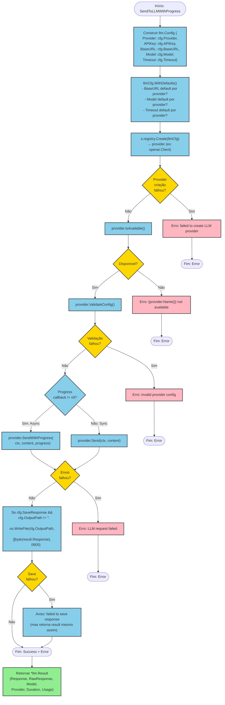

# Fluxo: Envio a LLM (`SendToLLMWithProgress`)

**Arquivo fonte:** `service.go:156-207`
**Método:** `(*DefaultContextService).SendToLLMWithProgress`
**Iniciador:** CLI (`cmd`) ou TUI (`ui`)

---

## Fluxograma Mermaid



---

## Detalhamento Passo a Passo

### Etapa 1: Construção do `llm.Config`
**Linha:** `service.go:169-175`
Mapeia `LLMSendConfig` (app) para `llm.Config` (core):

| LLMSendConfig | llm.Config | Observação |
|---------------|------------|------------|
| `Provider` | `Provider` | Tipo direto |
| `APIKey` | `APIKey` | Chave de autenticação |
| `BaseURL` | `BaseURL` | URL customizada (opcional) |
| `Model` | `Model` | Nome do modelo |
| `Timeout` | `Timeout` | Segundos |

**Campos NÃO mapeados:** `SaveResponse` e `OutputPath` — usados apenas após o envio.

### Etapa 2: Aplicação de Defaults
**Linha:** `service.go:176`
`llmCfg.WithDefaults()` aplica defaults por provider:

| Provider | BaseURL | Modelo | Timeout |
|----------|---------|--------|---------|
| OpenAI | `https://api.openai.com/v1` | `gpt-4o` | 300s |
| Anthropic | `https://api.anthropic.com` | `claude-sonnet-4-20250514` | 300s |
| Gemini | `https://generativelanguage.googleapis.com/v1beta` | `gemini-2.5-flash` | 300s |

Defaults aplicados **apenas se o campo está vazio/zero**:
- `BaseURL == ""` → usa default
- `Model == ""` → usa default
- `Timeout == 0` → usa default

### Etapa 3: Criação do Provider
**Linha:** `service.go:178-181`
`s.registry.Create(llmCfg)`:
1. Registry procura creator por `llmCfg.Provider`
2. Se não encontrado: erro `"unsupported provider"`
3. Se encontrado: chama `creator(llmCfg)` → retorna provider
4. Se factory falha: erro propagado

### Etapa 4: Verificação de Disponibilidade
**Linha:** `service.go:183-185`
`provider.IsAvailable()` — verifica dependências (ex: `gpt-4o` binário para OpenAI).

### Etapa 5: Validação da Configuração
**Linha:** `service.go:187-189`
`provider.ValidateConfig()` — verifica requisitos específicos do provider (ex: API key presente).

### Etapa 6: Envio ao Provider (Sincrono ou Assíncrono)

#### Caminho Assíncrono
**Linha:** `service.go:192-193`
`provider.SendWithProgress(ctx, content, progress)`:
- Provider implementa o envio com callbacks de progresso
- Callbacks incluem stages como: `"Initializing"`, `"Connecting"`, `"Sending"`, `"Waiting"`, `"Receiving"`, `"Complete"`

#### Caminho Síncrono
**Linha:** `service.go:194-195`
`provider.Send(ctx, content)`:
- Envio bloqueante sem callbacks
- `context.Context` permite cancelamento

### Etapa 7: Salvamento da Resposta (Opcional)
**Linha:** `service.go:198-203`
```go
if cfg.SaveResponse && cfg.OutputPath != "" {
    os.WriteFile(cfg.OutputPath, []byte(result.Response), 0600)
}
```
**Comportamento de erro:** Se o save falhar, o erro é **retornado junto com o resultado**:
- `result` é retornado (contém a resposta válida)
- O erro de save é combinado com `fmt.Errorf("failed to save response: %w", writeErr)`

---

## Fluxo Alternativo: `SendToLLM` (Simples)

**Arquivo fonte:** `service.go:156-167`
**Método:** `(*DefaultContextService).SendToLLM`

Diferenças em relação ao `SendToLLMWithProgress`:
1. **Recebe provider já instanciado** — não usa registry
2. **Sem callback de progresso**
3. **Sem salvamento de resposta**
4. **Validação mais simples:** `IsAvailable()` + `ValidateConfig()`

```
SendToLLM(ctx, content, provider)
    → provider.IsAvailable()?
    → provider.ValidateConfig()?
    → provider.Send(ctx, content)
    → *llm.Result
```

---

## Pontos de Falha

| Ponto | Falha Possível | Tratamento |
|-------|---------------|------------|
| Registry.Create | Provider não registrado | Erro: `"failed to create LLM provider: unsupported provider"` |
| Factory | Erro na factory do provider | Erro: `"failed to create LLM provider: {err}"` |
| IsAvailable | Dependência ausente (ex: gpt binário) | Erro: `"{name} not available"` |
| ValidateConfig | API key ausente | Erro: `"invalid provider config: {err}"` |
| Send/SendWithProgress | Timeout, rede, erro API | Erro: `"LLM request failed: {err}"` |
| WriteFile (save) | Disk full, permission | **Resultado retornado mesmo com erro** |
| Context cancelado | ctx.Canceled | Propagado pelo provider |

---

## Thread Safety

| Recurso | Seguro? | Justificativa |
|---------|---------|--------------|
| `registry` (`*llm.Registry`) | ✅ | `sync.RWMutex` protege `creators` map |
| `ctx` (`context.Context`) | ✅ | Passado para provider — provider gerencia lifecycle |
| `llmCfg` (`llm.Config`) | ✅ | Struct por valor, não há compartilhamento |
| `result` (`*llm.Result`) | ✅ | Retornado ao caller, sem reuso |
| `progress` (callback) | ⚠️ | Provider deve garantir thread safety no callback |
| `os.WriteFile` (save) | ✅ | syscall atômico por arquivo |

---

## Matriz de Providers

| Provider | Interface `llm.Provider` | Factory | Implementação |
|----------|--------------------------|---------|--------------|
| OpenAI | ✅ `Send`, `SendWithProgress`, `Name`, `IsAvailable`, `IsConfigured`, `ValidateConfig` | `openai.NewClient(cfg)` | `internal/platform/openai` |
| Anthropic | ✅ Mesma interface | `anthropic.NewClient(cfg)` | `internal/platform/anthropic` |
| Gemini | ✅ Mesma interface | `geminiapi.NewClient(cfg)` | `internal/platform/geminiapi` |

---

## Consumo de `llm.Result`

| Campo | Tipo | Uso no Service |
|-------|------|---------------|
| `Response` | `string` | Salvo em arquivo se `SaveResponse=true` |
| `RawResponse` | `string` | Não utilizado pelo service (disponível ao caller) |
| `Model` | `string` | Não utilizado pelo service (disponível ao caller) |
| `Provider` | `string` | Não utilizado pelo service (disponível ao caller) |
| `Duration` | `time.Duration` | Não utilizado pelo service (disponível ao caller) |
| `Usage` | `*Usage` | Não utilizado pelo service (disponível ao caller) |

**Observação:** O service trata `llm.Result` como opaque — passa o resultado ao caller sem interpretar campos. A responsabilidade de usar `Response`, `RawResponse`, `Model`, `Duration`, `Usage` fica com o caller (`cmd` ou `ui`).
