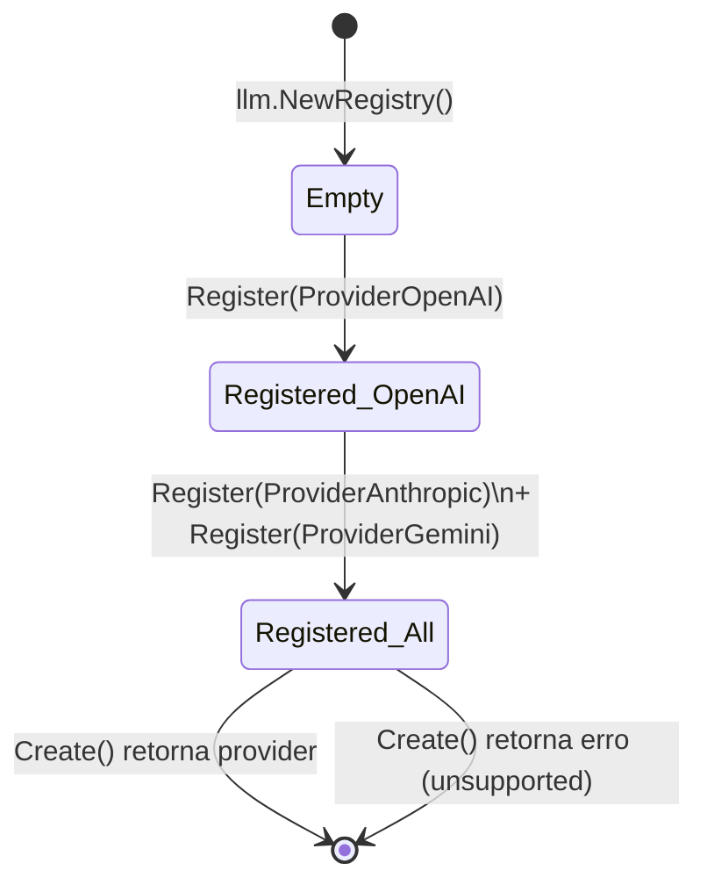
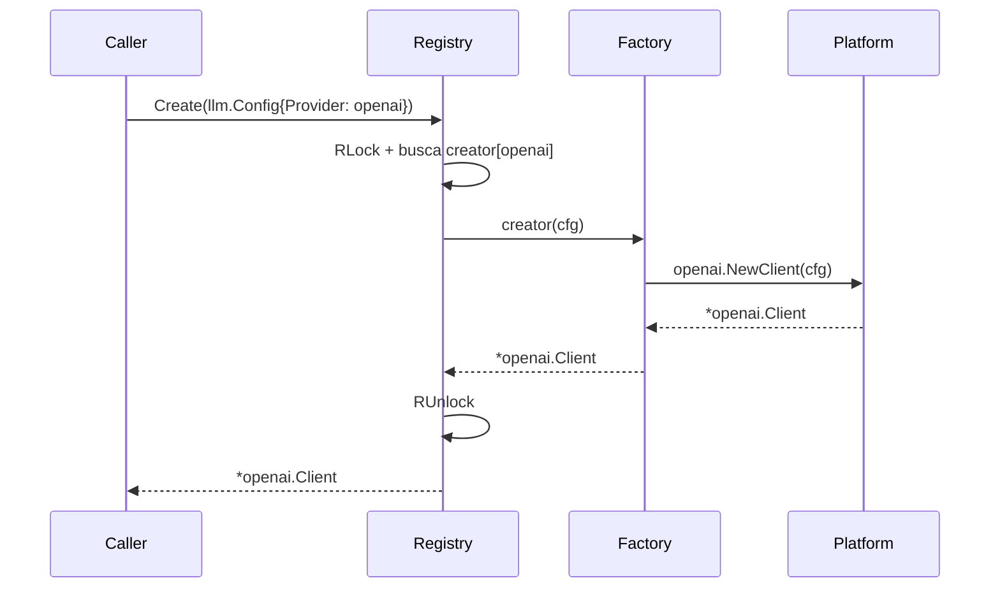
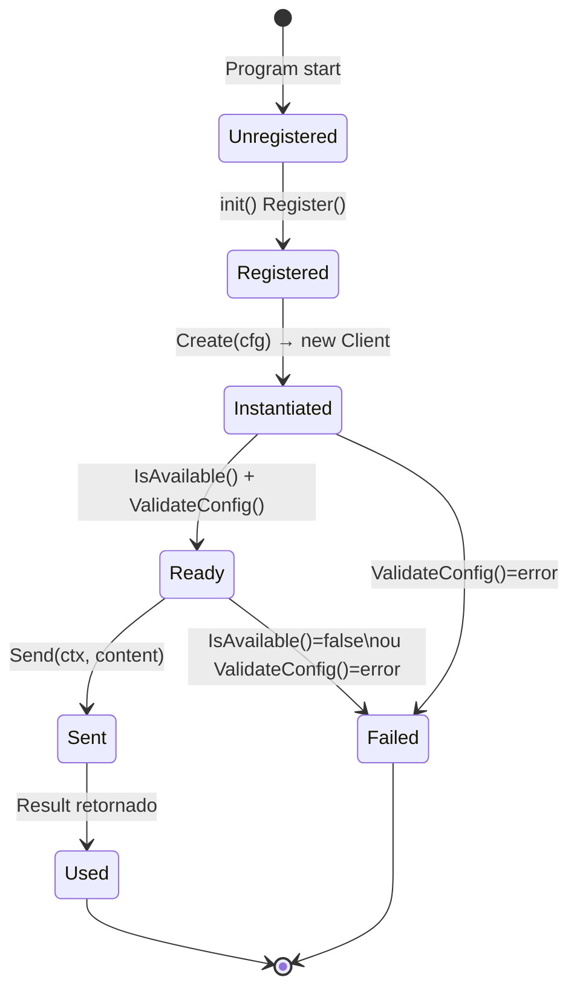

# Fluxo: Registro e Inicialização de Providers

**Arquivo fonte:** `providers.go`
**Módulo:** `github.com/quantmind-br/shotgun-cli/internal/app`
**Tipo:** `*llm.Registry` + `init()`

---

## Fluxograma Mermaid

```mermaid
flowchart TD
    Start([Programa inicia\ngo build]) --> Boot["Pacotes são bootstrapped\nordem não garantida\nmas init() é determinística"]

    Boot --> InitApp["init() em internal/app/providers.go\nexecutado"]

    InitApp --> NewRegistry["DefaultProviderRegistry = llm.NewRegistry()\n→ criam map[ProviderType]ProviderCreator vazio"]

    NewRegistry --> RegisterOpenAI["Register(ProviderOpenAI,\n    func(cfg llm.Config) (Provider, error) {\n        return openai.NewClient(cfg)\n    })\n→ openai.NewClient é chamado na factory"]

    RegisterOpenAI --> RegisterAnthropic["Register(ProviderAnthropic,\n    func(cfg llm.Config) (Provider, error) {\n        return anthropic.NewClient(cfg)\n    })\n→ anthropic.NewClient é chamado na factory"]

    RegisterAnthropic --> RegisterGemini["Register(ProviderGemini,\n    func(cfg llm.Config) (Provider, error) {\n        return geminiapi.NewClient(cfg)\n    })\n→ geminiapi.NewClient é chamado na factory"]

    RegisterGemini --> RegistryReady["DefaultProviderRegistry pronto:\n  - providers: [openai, anthropic, gemini]\n  - criadores: 3 funções registradas"]

    RegistryReady --> BootCmd["Pacotes cmd/ e ui/ bootstrapped"]

    BootCmd --> NewService["app.NewContextService()\n→ registry = DefaultProviderRegistry"]

    NewService --> SendToLLM["SendToLLMWithProgress()\n    cfg = LLMSendConfig{Provider: openai}"]

    SendToLLM --> RegistryCreate["registry.Create(llm.Config{Provider: openai})\n→ procura creator em map"]

    RegistryCreate --> Found["Encontrado: openai.NewClient\n→ factory(llm.Config)\n→ openai.Client{config}"]

    Found --> ProviderReady([Provider pronto para uso])

    classDef initPhase fill:#E6E6FA,stroke:#333,stroke-width:2px
    classDef runtime fill:#87CEEB,stroke:#333,stroke-width:2px
    classDef success fill:#90EE90,stroke:#333,stroke-width:2px

    class Boot,InitApp,NewRegistry,RegisterOpenAI,RegisterAnthropic,RegisterGemini,RegistryReady initPhase
    class BootCmd,NewService,SendToLLM,RegistryCreate,Found runtime
    class ProviderReady success
```



---

## Detalhamento: Fase de Inicialização (init())

### Passos

1. **`llm.NewRegistry()`** — cria registry com map vazio
   ```go
   &Registry{
       mu:       sync.RWMutex{},  // zero value
       creators: make(map[ProviderType]ProviderCreator),
   }
   ```

2. **Registro de OpenAI** — `init()` chama `DefaultProviderRegistry.Register(llm.ProviderOpenAI, factory)`
   - `factory` é uma closure: `func(cfg llm.Config) (llm.Provider, error) { return openai.NewClient(cfg) }`
   - `openai.NewClient` é chamado **somente quando `Create()` é invocado em runtime**, não no init

3. **Registro de Anthropic** — idem com `anthropic.NewClient(cfg)`

4. **Registro de Gemini** — idem com `geminiapi.NewClient(cfg)`

### Garantias

- `init()` é chamado **antes** de `main()`
- `init()` é chamado **uma vez** por programa
- A ordem de execução entre `init()` de pacotes diferentes **não é garantida**, mas os pacotes `platform/*` são importados por `providers.go` via `import`, então seus `init()` também são executados antes
- **Não há race condition** no `init()` — é sequencial dentro de um pacote

---

## Detalhamento: Fase de Runtime (Create)

### Passos

1. **`registry.Create(cfg)`** é chamado com `llm.Config{Provider: openai, ...}`
2. **`mu.RLock()`** — lock read (multi-thread safe)
3. **Busca em `creators[cfg.Provider]`**
   - Se não encontrado → retorna erro `"unsupported provider: {type}"`
   - Se encontrado → chama `creator(cfg)`
4. **`mu.RUnlock()`** — desbloqueia
5. **Factory é invocada** — `openai.NewClient(cfg)` cria instância concreta
6. **Provider é retornado** ao caller

### Lock Strategy

| Operação | Lock | Motivo |
|----------|------|--------|
| `Create()` | `RLock` | Multipla leitura simultânea permitida |
| `Register()` | `Lock` | Exclusiva — escrita no map |
| `SupportedProviders()` | `RLock` | Multipla leitura |
| `IsRegistered()` | `RLock` | Multipla leitura |

**Problema potencial:** `Register()` é chamado durante `init()` (antes de qualquer goroutine). Se algum código chamar `Register()` em runtime (não recomendado), há uma window onde `Create()` pode não ver o novo registro se `Lock/Unlock` não sincronizar corretamente com goroutines existentes. No caso atual, **não há risco** pois `Register()` só é chamado em `init()`.

---

## Diagrama de Estado do Registry



---

## Fluxo de Factory



---

## Ciclo de Vida do Provider



---

## Observações sobre Acoplamento

| Aspecto | Detalhe |
|---------|---------|
| **Hardcoded** | 3 providers registrados via `init()` — extensível via `Register()` mas não via config |
| **Importação** | `providers.go` importa explicitamente os 3 packages `platform/*` |
| **Constrangimento** | Adicionar um 4º provider exige: (1) package em `platform/`, (2) `import` em `providers.go`, (3) `Register()` em `init()` |
| **Extensão possível** | `NewContextService(WithRegistry(customRegistry))` permite substituir o registry — útil para testes ou providers customizados |
