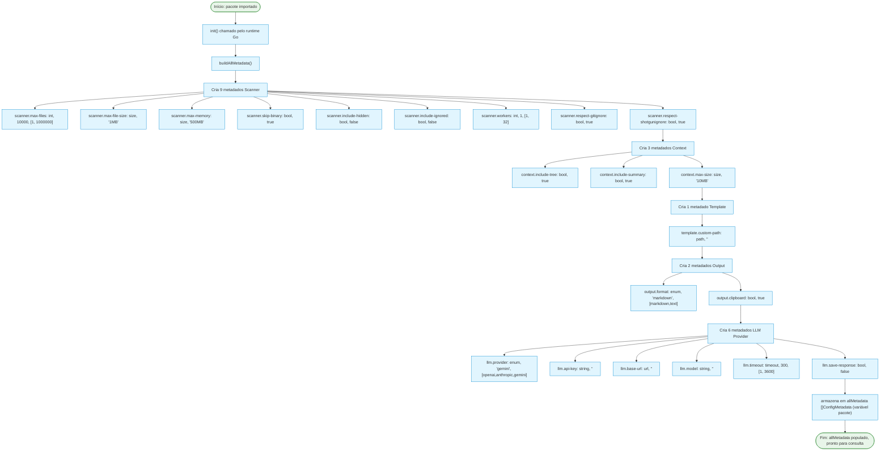
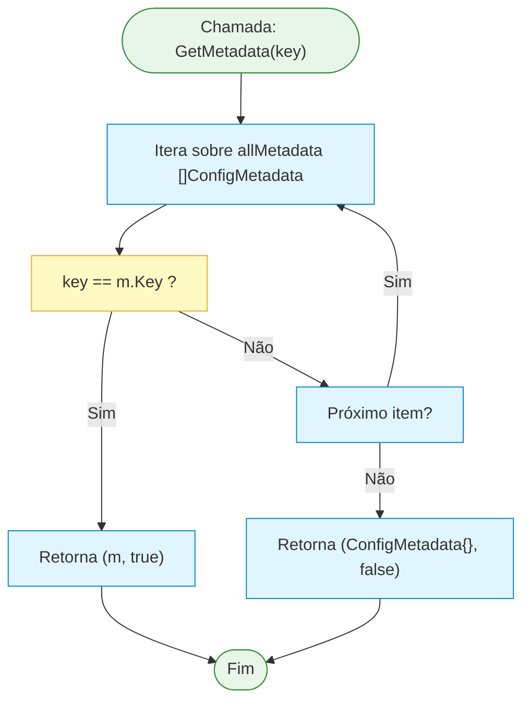
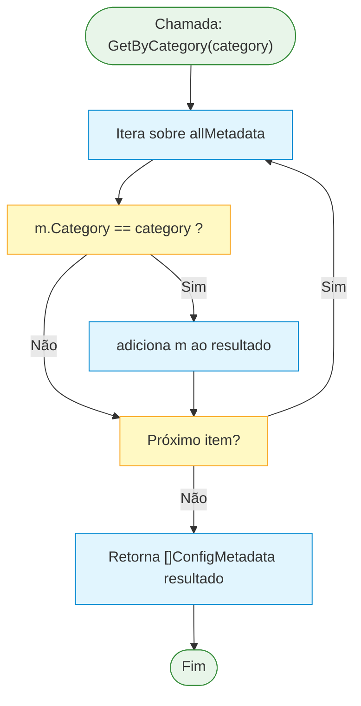
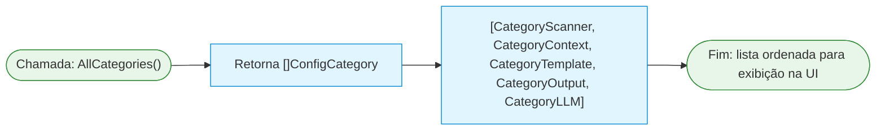
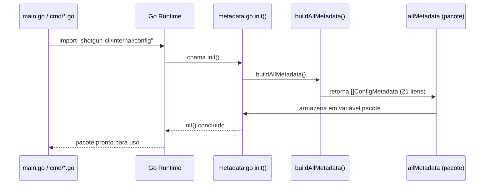

# Fluxograma: Inicialização de Configuração e Metadados

| Item       | Detalhe                                              |
|------------|------------------------------------------------------|
| **Módulo** | `internal/config`                                    |
| **Arquivo** | `metadata.go` (`init()`)                            |
| **Fluxo**  | Inicialização e carregamento dos metadados de configuração |

---

---

## 2. Consulta a Metadados

---

## 3. Fluxo de Inicialização (Diagrama de Sequência)

---

## 4. Notas

- O fluxo é **unidirecional e imutável** após `init()`: `allMetadata` é um slice populado uma vez e nunca modificado.
- A ordem de construção segue a ordem: Scanner (9) → Context (3) → Template (1) → Output (2) → LLM Provider (6).
- Não há dependência de arquivos externos (YAML, JSON, etc.) para metadados — tudo é código Go puro.
- A UI (`internal/ui/`) depende desse fluxo: `config_wizard.go` chama `AllCategories()` e `AllConfigMetadata()` para renderizar campos.
