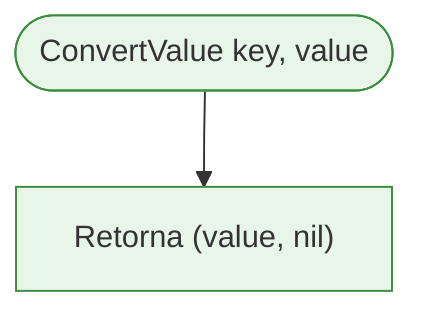

# Fluxograma: Conversão de Valor de Configuração

| Item       | Detalhe                                                      |
|------------|--------------------------------------------------------------|
| **Módulo** | `internal/config`                                            |
| **Arquivo** | `validator.go` (`ConvertValue`)                              |
| **Fluxo**  | Converte uma string de configuração para o tipo Go apropriado |

---

## 1. Fluxo Principal `ConvertValue`

```mermaid
flowchart TD
    Start(["ConvertValue key, value"]) --> Dispatch["switch key"]
    
    Dispatch --> I1["key ∈ max-files, workers, llm.timeout"]
    I1 --> Scan["fmt.Sscanf value, '%d', &intVal]"]
    Scan -->|Falha| ErrInt(["erro: "failed to parse integer"])
    Scan -->|Sucesso| RetInt["Retorna (intVal, nil)"]
    
    Dispatch --> B1["key ∈ 9 chaves bool"]
    B1 --> Lower["strings.ToLower value)"]
    Lower --> Eq["== "true"?"]
    Eq -->|Sim| RetBoolTrue["Retorna (true, nil)"]
    Eq -->|Não| RetBoolFalse["Retorna (false, nil)"]
    
    Dispatch --> Default["default — string types"]
    Default --> RetStr["Retorna (value, nil) — string original"]
    
    RetInt --> End(["Fim"])
    ErrInt --> End
    RetBoolTrue --> End
    RetBoolFalse --> End
    RetStr --> End
    
    classDef startend fill:#e8f5e9,stroke:#388e3c
    classDef process fill:#e1f5fe,stroke:#0288d1
    classDef decision fill:#fff9c4,stroke:#f9a825
    classDef error fill:#ffebee,stroke:#c62828
    class Start,End startend
    class RetInt,RetBoolTrue,RetBoolFalse,RetStr process
    class Scan,Eq decision
    class ErrInt error
```

---

## 2. Mapeamento de Chave → Tipo de Retorno

| Tipo de Retorno | Chaves que retornam este tipo | Conversão Aplicada |
|-----------------|-------------------------------|--------------------|
| `int` (via `interface{}`) | `scanner.max-files`, `scanner.workers`, `llm.timeout` | `fmt.Sscanf("%d", &intVal)` |
| `bool` (via `interface{}`) | `scanner.skip-binary`, `scanner.include-hidden`, `scanner.include-ignored`, `scanner.respect-gitignore`, `scanner.respect-shotgunignore`, `context.include-tree`, `context.include-summary`, `output.clipboard`, `llm.save-response` | `strings.ToLower(value) == "true"` |
| `string` (via `interface{}`) | Todas as demais (size, path, url, enum, string) | Retorno direto do valor original |

---

## 3. Fluxo Detalhado: Conversão Inteira

```mermaid
flowchart TD
    Start(["ConvertValue key, value"]) --> Sscanf["fmt.Sscanf value, '%d', &intVal]"]
    Sscanf -->|Falha| Err(["erro: "failed to parse integer value"])
    Sscanf -->|Sucesso| Ret["Retorna (intVal, nil)"]
    
    classDef startend fill:#e8f5e9,stroke:#388e3c
    classDef process fill:#e1f5fe,stroke:#0288d1
    classDef error fill:#ffebee,stroke:#c62828
    class Start,Ret startend
    class Sscanf process
    class Err error
```

---

## 4. Fluxo Detalhado: Conversão Booleana

```mermaid
flowchart TD
    Start(["ConvertValue key, value"]) --> Lower["strings.ToLower value)"]
    Lower --> Eq["== "true"?"]
    Eq -->|Sim| RetT["Retorna (true, nil)"]
    Eq -->|Não| RetF["Retorna (false, nil)"]
    
    classDef startend fill:#e8f5e9,stroke:#388e3c
    classDef process fill:#e1f5fe,stroke:#0288d1
    classDef decision fill:#fff9c4,stroke:#f9a825
    class Start,RetT,RetF startend
    class Lower process
    class Eq decision
```

---

## 5. Fluxo Detalhado: Conversão de String (default)



---

## 6. Observações sobre `ConvertValue`

- **Sempre retorna `interface{}`** — o chamador deve fazer type assertion para usar o valor convertido.
- **Para tipos string** (size, url, path, enum, string puro), a conversão é uma **identidade**: retorna o valor original sem transformação.
- **A conversão booleana é case-insensitive** — `"TRUE"`, `"True"`, `"true"` todos resultam em `true`.
- **A conversão inteira usa `fmt.Sscanf`** em vez de `strconv.Atoi` — funcionalmente equivalente para ints válidos, mas menos idiomático em Go.
- **Nenhum range-check é feito** na conversão — isso é responsabilidade de `ValidateValue` chamado separadamente.
