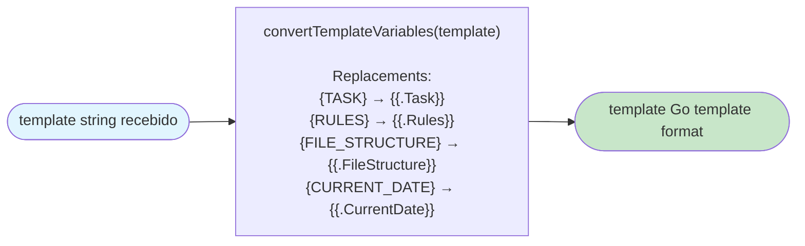

# Fluxo: Renderização de Template

| Campo | Valor |
|-------|-------|
| **Módulo** | `internal/core/contextgen` |
| **Arquivo fonte** | `template.go` |
| **Funções envolvidas** | `TemplateRenderer.RenderTemplate`, `validateRequiredVars`, `getDefaultTemplate`, `getTemplateFunctions`, `convertTemplateVariables` |
| **Nível de detalhe** | detalhado |

---

## Mermaid

```mermaid
flowchart TD
    Start([Início: RenderTemplate]) --> CheckDefault{templateContent ==\n getDefaultTemplate()?}

    CheckDefault -->|Sim| ValidateVars["validateRequiredVars(data)\nVerifica TemplateVars['TASK']\nexiste e não é vazio"]
    CheckDefault -->|Não| SkipValidate

    ValidateVars --> VarsValid{"TASK found?\n(TemplateVars has key AND\n value not blank)"}
    VarsValid -->|Sim| SkipValidate
    VarsValid -->|Não| ErrVars["ERROR: 'template variable validation failed: required template variable 'TASK' is missing or empty'"]

    SkipValidate --> Parse["text/template.New('context')\n.Funcs(getTemplateFunctions())\n.Parse(templateContent)\n→ tmpl"]

    Parse --> ParseOK{"parse success?"}
    ParseOK -->|Não| ErrParse["ERROR: 'failed to parse template: %w'"]
    ParseOK -->|Sim| Execute

    ErrVars --> EndErr([Erro retornado])
    ErrParse --> EndErr

    Execute["var buf bytes.Buffer\ntmpl.Execute(&buf, data)\n→ onde data = ContextData"] --> ExecOK{"execute success?"}
    ExecOK -->|Não| ErrExec["ERROR: 'failed to execute template: %w'"]
    ExecOK -->|Sim| ReturnBuf

    ErrExec --> EndErr
    ReturnBuf["return buf.String(), nil"] --> EndOk([Template renderizado como string])

    style Start fill:#e1f5fe
    style EndOk fill:#c8e6c9
    style EndErr fill:#ffcdd2
    style ErrVars fill:#ffcdd2
    style ErrParse fill:#ffcdd2
    style ErrExec fill:#ffcdd2
```

### Fluxo de conversão de variáveis (em generator.go)



---

## Detalhamento das Etapas

### Etapa A: Validação de Variáveis Obrigatórias
- Se o template recebido é **exatamente** o template padrão (`== getDefaultTemplate()`), valida variáveis obrigatórias.
- Para o template padrão, `TASK` é **obrigatório**:
  1. `data.Config.TemplateVars` deve conter a chave `"TASK"`.
  2. `strings.TrimSpace(data.Config.TemplateVars["TASK"])` não pode ser vazio.
- Se não passar → erro: `"required template variable 'TASK' is missing or empty"`.
- Se template é **customizado** (diferente do default), a validação é **pulada** — qualquer template é aceito.

### Etapa B: Parse do Template
1. `text/template.New("context")` — cria template com nome `"context"`.
2. `.Funcs(getTemplateFunctions())` — registra funções customizadas:
   - `truncate` — truncamento com `...`
   - `formatSize` — formatação de tamanho
   - `detectLang` — detecção de linguagem
   - `now` — data/hora atual
   - `join` — join de strings
   - `title` — title case
   - `upper` — maiúsculas
   - `lower` — minúsculas
3. `.Parse(templateContent)` — parseia o template.

### Etapa C: Execução do Template
1. `tmpl.Execute(&buf, data)` — executa com `data ContextData`.
2. `buf.String()` — retorna resultado.

### Etapa D: Conversão de Variáveis (generator.go)
Antes de chamar `RenderTemplate`, `convertTemplateVariables` converte:

| Substituição | Exemplo |
|-------------|---------|
| `{TASK}` | → `{{.Task}}` |
| `{RULES}` | → `{{.Rules}}` |
| `{FILE_STRUCTURE}` | → `{{.FileStructure}}` |
| `{CURRENT_DATE}` | → `{{.CurrentDate}}` |

Isso permite que usuários escrevam templates com sintaxe `{VAR}` mais simples, que é automaticamente convertida para a sintaxe Go template `{{.Var}}`.

---

## Template Padrão — Detalhe

```
# Project Context

**Generated:** {{now}}
{{if .Task}}**Task:** {{.Task}}{{end}}
{{if .Rules}}**Rules:** {{.Rules}}{{end}}
{{if .FileStructure}}
## File Structure

{{.FileStructure}}
{{end}}
## File Contents
{{range .Files}}
### {{.RelPath}}{{if .Language}} ({{.Language}}){{end}}

```{{if .Language}}{{.Language}}{{end}}
{{.Content}}
```
{{end}}

---
*Context generated with {{formatSize .Config.MaxTotalSize}} size limit*
```

**Campos utilizados:**
| Campo Go | Condição | Saída |
|----------|----------|-------|
| `{{now}}` | Sempre | Data/hora atual |
| `{{if .Task}}...` | .Task não vazio | **Task:** valor |
| `{{if .Rules}}...` | .Rules não vazio | **Rules:** valor |
| `{{if .FileStructure}}...` | .FileStructure não vazio | Seção File Structure |
| `{{range .Files}}...{{end}}` | Para cada FileContent | Seção File Contents |
