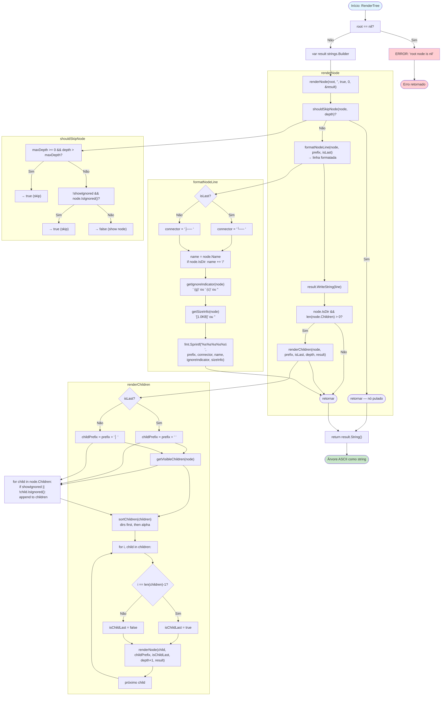

# Fluxo: Renderização de Árvore de Arquivos

| Campo | Valor |
|-------|-------|
| **Módulo** | `internal/core/contextgen` |
| **Arquivo fonte** | `tree.go` |
| **Funções envolvidas** | `TreeRenderer.RenderTree`, `renderNode`, `renderChildren`, `formatNodeLine`, `getIgnoreIndicator`, `getSizeInfo`, `getVisibleChildren`, `sortChildren`, `shouldSkipNode`, `formatFileSize` |
| **Nível de detalhe** | detalhado |

---

## Mermaid



---

## Detalhamento das Etapas

### Etapa A: Validação do Root
- Se `root == nil`, retorna erro `"root node is nil"`.
- Cria `strings.Builder` para acumular a saída.

### Etapa B: `renderNode` — Nó Atual
Para cada nó visitado:

1. **Verificar skip** (`shouldSkipNode`):
   - Se `maxDepth >= 0` e `depth > maxDepth` → skip (profundidade excessiva).
   - Se `!showIgnored` e `node.IsIgnored()` → skip (arquivo ignorado).
   - `node.IsIgnored()` retorna `node.IsGitignored || node.IsCustomIgnored`.

2. **Formatar linha** (`formatNodeLine`):
   - Conector: `└── ` se último filho, `├── ` se não.
   - Nome: `node.Name` + `/` se diretório.
   - Indicador de ignorado: `" (g)"` se gitignored, `" (c)"` se custom ignored.
   - Tamanho: `[1.0KB]` se arquivo com size > 0 (usando `formatFileSize`).
   - Linha: `prefix + connector + name + ignoreIndicator + sizeInfo + "\n"`.

3. **Processar filhos**:
   - Se `node.IsDir` e tem filhos → chama `renderChildren`.

### Etapa C: `renderChildren` — Filhos Visíveis
1. **Atualizar prefixo**:
   - Se pai era último filho (`isLast`): prefix filho = `prefix + "    "` (4 espaços).
   - Senão: prefix filho = `prefix + "│   "` (barra vertical + 3 espaços).

2. **Obter filhos visíveis** (`getVisibleChildren`):
   - Filtra `node.Children` removendo ignorados (a menos que `showIgnored == true`).

3. **Ordenar filhos** (`sortChildren`):
   - Diretores primeiro (`IsDir == true`).
   - Depois alfabeticamente por `Name`.

4. **Iterar filhos**:
   - Para cada filho: determina se é último filho.
   - Chama `renderNode` recursivamente com `depth + 1`.

### Etapa D: `formatNodeLine` — Formato da Linha

```
{prefix}{connector}{name}{ignoreIndicator}{sizeInfo}
```

Exemplos:
- `├── src/\n` (diretório, não último)
- `└── main.go [1.0KB]\n` (arquivo, último, com tamanho)
- `├── .gitignore (g)\n` (arquivo ignorado por git)
- `│   └── util.go (c) [256B]\n` (arquivo com indicador e tamanho, indentado)

### Etapa E: `formatFileSize` — Formatação de Tamanho

| Bytes | Saída |
|-------|-------|
| 0 | `0B` |
| 100 | `100B` |
| 1024 | `1.0KB` |
| 1536 | `1.5KB` |
| 1048576 | `1.0MB` |
| 1572864 | `1.5MB` |
| 1073741824 | `1.0GB` |
| 1610612736 | `1.5GB` |

Fórmula: `%.1f{unit}`, onde unit é GB, MB, KB ou B.

---

## Exemplo de Saída

```
project/
├── src/
│   ├── pkg/
│   │   └── deep.go [100B]
│   └── main.go [512B]
└── README.md [20B]
```

Com ignored files visíveis:
```
project/
├── src/
│   ├── pkg/
│   │   └── deep.go [100B]
│   ├── ignored.go (c) [100B]
│   └── main.go [512B]
├── .gitignore (g) [50B]
└── README.md [20B]
```
