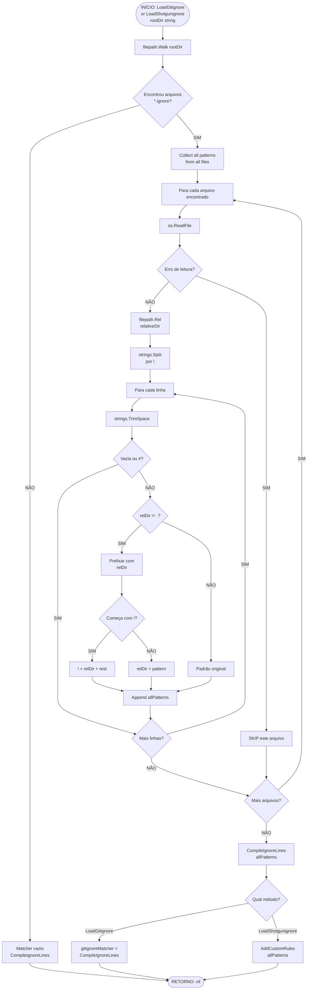

# Fluxo: LoadGitignore & LoadShotgunignore — Carregamento Recursivo de Regras

> **Módulo:** `internal/core/ignore`
> **Funções analisadas:** `LayeredIgnoreEngine.LoadGitignore()` e `LayeredIgnoreEngine.LoadShotgunignore()`
> **Arquivo fonte:** `internal/core/ignore/engine.go`

---

## 1. Visão Geral

Ambos os métodos seguem um **padrão idêntico** de carregamento recursivo de arquivos de regras (`*.ignore`) de toda a árvore de diretórios, com a diferença principal:
- `LoadGitignore` → compila diretamente no `gitignoreMatcher`.
- `LoadShotgunignore` → passa os padrões via `AddCustomRules()` (acumula em `customMatcher`).

---

## 2. Diagrama Mermaid — Carga de Regras



---

## 3. Descrição Detalhada do Fluxo

### Fase 1: Varredura Recursiva
```go
filepath.Walk(rootDir, func(path string, info os.FileInfo, err error) error {
    if !info.IsDir() && info.Name() == ".gitignore" {  // ou ".shotgunignore"
        gitignoreFiles = append(gitignoreFiles, path)
    }
    return nil  // nunca aborta walk
})
```
- **Walk síncrono:** sequencial, não usa goroutines.
- **Nunca aborta:** callback retorna `nil` mesmo se houver erro de stat (o walk continua).
- **Busca todos os arquivos:** inclui `.gitignore` em subdiretórios (nested).
- **Arquivo alvo:** `.gitignore` ou `.shotgunignore` (nome fixo).

### Fase 2: Agregação de Padrões
Para cada arquivo encontrado:
1. **Leitura:** `os.ReadFile(gitignoreFile)` — tolera erros (continue).
2. **Cálculo de contexto:** `filepath.Rel(rootDir, filepath.Dir(file))` — determina se o arquivo está no root ou em subdiretório.
3. **Parsing de linha:**
   - Split por `\n` (não trata `\r\n` — inferido como limite) 🟡 INFERIDO.
   - Trim whitespace de cada linha.
   - Skip vazio e comentários (`#`).
4. **Ajuste de escopo para nested:**
   - Se `relDir != "."` → prefixa padrão com `filepath.Join(relDir, pattern)`.
   - Negation (`!...`) preservada: `!"!" + relDir + pattern[1:]`.

### Fase 3: Compilação
```go
e.gitignoreMatcher = gitignore.CompileIgnoreLines(allPatterns...)
// OU
return e.AddCustomRules(allPatterns)  // para LoadShotgunignore
```
- **Single matcher:** todos os padrões de todos os arquivos são fundidos em um único matcher.
- **Não mantém escopo por diretório:** padrões nested perdem seu contexto original e ficam globais.
- **LoadShotgunignore:** passa por `AddCustomRules()`, que **acumula** com padrões customizados existentes.

---

## 4. Diferenças entre LoadGitignore e LoadShotgunignore

| Aspecto | LoadGitignore | LoadShotgunignore |
|---|---|---|
| Arquivo buscado | `.gitignore` | `.shotgunignore` |
| Resultado | `e.gitignoreMatcher = ...` | `e.AddCustomRules(...)` |
| Sem arquivo | Retorna nil (matcher vazio) | Retorna nil (sem efeito) |
| Com erro de leitura | Skip (continue) | Skip (continue) |
| Acumula com existente | **Não** — substitui matcher | **Sim** — via AddCustomRules |
| Retorno em erro Walk | `error` com wrapping | `error` com wrapping |

---

## 5. Limitações do Fluxo

| Limitação | Impacto |
|---|---|
| Walk síncrono | Lentidão em projetos grandes (O(n) sequencial) |
| Não trata `\r\n` | Padrões com CRLF podem ter `\r` no final 🟡 INFERIDO |
| Negation sem contexto | `!` patterns em nested arquivos são prefixados, mas `go-gitignore` pode não interpretar corretamente |
| Sem memoização de arquivos | Recarrega todos os arquivos a cada chamada |
| Sem parallelismo | `filepath.Walk` é single-thread |
| Nested patterns perdem escopo | Todos os padrões vão para um único matcher global |
