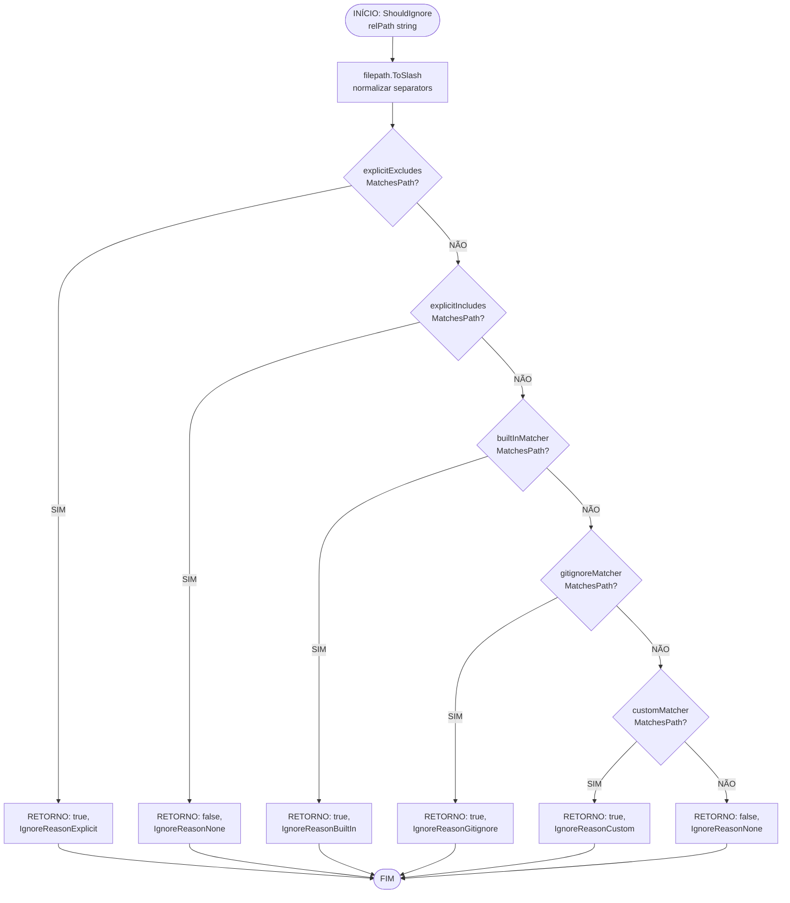

# Fluxo: ShouldIgnore — Avaliação de Regras em Camadas

> **Módulo:** `internal/core/ignore`
> **Função analisada:** `LayeredIgnoreEngine.ShouldIgnore(relPath string) (bool, IgnoreReason)`
> **Arquivo fonte:** `internal/core/ignore/engine.go`, linhas 128–151

---

## 1. Visão Geral

O método `ShouldIgnore` é o **ponto central** do módulo. Recebe um caminho relativo e retorna um par `(bool, IgnoreReason)` indicando se o caminho deve ser ignorado e por qual motivo. A avaliação segue uma ordem fixa de 5 camadas de regras.

---

## 2. Diagrama Mermaid



---

## 3. Descrição Detalhada do Fluxo

### Fase 1: Normalização
```go
normalizedPath := filepath.ToSlash(relPath)
```
- Converte `\` → `/` em Windows para consistência com o matcher.
- `gitignore.GitIgnore.MatchesPath` espera path com `/` como separator.
- **Sempre executado**, independentemente do resultado.

### Fase 2: Avaliação de Camadas (5 checks sequenciais)

#### Camada 1 — Explicit Excludes (Prioridade Máxima)
```go
if e.explicitExcludes.MatchesPath(normalizedPath) {
    return true, IgnoreReasonExplicit
}
```
- **Comportamento:** Se o path corresponde a qualquer padrão de exclusão explícita, retorna imediatamente.
- **Não há override:** esta é a camada mais alta — nada a sobrepuja.
- **Exemplo:** `AddExplicitExclude("*.secret")` → `file.secret` → `(true, Explicit)`.

#### Camada 2 — Explicit Includes (Override Positivo)
```go
if e.explicitIncludes.MatchesPath(normalizedPath) {
    return false, IgnoreReasonNone
}
```
- **Comportamento:** Se o path corresponde a qualquer padrão de inclusão explícita, retorna `false` (não ignorar), **sobrescrevendo todas as outras camadas**.
- **Exceção:** não pode sobrescrever `explicitExcludes` (que já foi avaliado antes).
- **Exemplo:** `AddExplicitInclude("*.important")` + `AddCustomRule("*.important")` → `data.important` → `(false, None)`.

#### Camada 3 — Built-In Patterns
```go
if e.builtInMatcher.MatchesPath(normalizedPath) {
    return true, IgnoreReasonBuiltIn
}
```
- **Comportamento:** Avalia contra os 42+ padrões embutidos inicializados no `NewIgnoreEngine()`.
- **Imutável:** padrões built-in não podem ser alterados em runtime.
- **Exemplo:** `node_modules/package/index.js` → `(true, BuiltIn)`.

#### Camada 4 — Gitignore Patterns
```go
if e.gitignoreMatcher.MatchesPath(normalizedPath) {
    return true, IgnoreReasonGitignore
}
```
- **Comportamento:** Avalia contra regras compiladas de `.gitignore` (carregadas via `LoadGitignore()`).
- **Pode estar vazio:** se nenhum `.gitignore` for encontrado, matcher é vazio (nunca matcha).
- **Exemplo:** `*.tmp` em `.gitignore` → `file.tmp` → `(true, Gitignore)`.

#### Camada 5 — Custom Patterns (Prioridade Mínima)
```go
if e.customMatcher.MatchesPath(normalizedPath) {
    return true, IgnoreReasonCustom
}
```
- **Comportamento:** Avalia contra padrões customizados acumulados via `AddCustomRule()` / `AddCustomRules()` / `LoadShotgunignore()`.
- **Acumulativo:** cada adição recompila o matcher com TODOS os padrões acumulados.
- **Exemplo:** `AddCustomRule("*.test")` → `file.test` → `(true, Custom)`.

### Fase 3: Caminho Final
```go
return false, IgnoreReasonNone
```
- Se nenhuma camada correspondeu, o caminho **não é ignorado**.

---

## 4. Fluxo de Dados — Estado do Engine

```
NewIgnoreEngine()
  │
  ├─ builtInMatcher = CompileIgnoreLines(42+ built-in patterns)
  ├─ gitignoreMatcher = CompileIgnoreLines()          ← vazio
  ├─ customMatcher = CompileIgnoreLines()             ← vazio
  ├─ explicitExcludes = CompileIgnoreLines()          ← vazio
  └─ explicitIncludes = CompileIgnoreLines()          ← vazio
  │
  ▼
[Engine pronto para uso — built-in ativo]
  │
  ├─ LoadGitignore(rootDir)
  │   ├─ Walk(rootDir) → .gitignore files
  │   ├─ Read + parse cada arquivo
  │   └─ gitignoreMatcher = CompileIgnoreLines(allPatterns)
  │
  ├─ LoadShotgunignore(rootDir)
  │   ├─ Walk(rootDir) → .shotgunignore files
  │   ├─ Read + parse cada arquivo
  │   └─ AddCustomRules(allPatterns)
  │       └─ customMatcher = CompileIgnoreLines(all custom patterns)
  │
  ├─ AddCustomRule(pattern)
  │   └─ customPatterns.append(pattern)
  │   └─ customMatcher = CompileIgnoreLines(customPatterns)
  │
  ├─ AddCustomRules(patterns)
  │   └─ customPatterns.append(valid patterns)
  │   └─ customMatcher = CompileIgnoreLines(customPatterns)
  │
  ├─ AddExplicitExclude(pattern)
  │   └─ explicitExcludePatterns.append(pattern)
  │   └─ explicitExcludes = CompileIgnoreLines(explicitExcludePatterns)
  │
  └─ AddExplicitInclude(pattern)
      └─ explicitIncludePatterns.append(pattern)
      └─ explicitIncludes = CompileIgnoreLines(explicitIncludePatterns)
  │
  ▼
[Engine atualizado — novo ShouldIgnore com regras combinadas]
```

---

## 5. Fluxo de Integração com Scanner

```
FileSystemScanner.ScanWithProgress(rootPath, config, progress)
  │
  ├─ config.RespectGitignore == true
  │   └─ ignoreEngine.LoadGitignore(rootPath)
  │
  ├─ config.RespectShotgunignore == true
  │   └─ ignoreEngine.LoadShotgunignore(rootPath)
  │
  ├─ config.IgnorePatterns len > 0
  │   └─ ignoreEngine.AddCustomRules(config.IgnorePatterns)
  │
  ▼
[Para cada arquivo no walk do filesystem:]
  │
  ├─ relPath = filepath.Rel(rootPath, absPath)
  │
  ├─ ignored, reason := ignoreEngine.ShouldIgnore(relPath)
  │   │
  │   ├─ ignored == true
  │   │   └─ isGitIgnored := (reason == IgnoreReasonGitignore)
  │   │   └─ isCustomIgnored := (reason != IgnoreReasonGitignore)
  │   │   └─ [decidir se ignora com base em config.IgnorePatterns]
  │   │
  │   └─ ignored == false
  │       └─ [processar arquivo normalmente]
  │
  ▼
[Resultado: árvore de arquivos filtrada]
```

> **Integração chave:** O `FileSystemScanner` usa `classifyIgnoreReason()` (linhas 463-470 de `filesystem.go`) para traduzir `IgnoreReason` em dois booleanos: `isGitIgnored` e `isCustomIgnored`, permitindo que a camada superior decida como reagir (pular, logar, etc.).

---

## 6. Casos de Borda do Fluxo

| Caso | Comportamento | Razão |
|---|---|---|
| Path com `\` (Windows) | Normalizado via `ToSlash` | Matcher espera `/` |
| Pattern `!negation` em `.gitignore` | Preservado como negation | `go-gitignore` interpreta `!` |
| Nested `.gitignore` | Padrões prefixados com `relDir` | Escopo local do subdiretório |
| Arquivo `.gitignore` não legível | `continue` (skip) | Tolerante a erros |
| `.gitignore` vazio | Matcher vazio, nenhum match | Sem erros |
| `ShouldIgnore` em path vazio `""` | Matcher vazio, retorna `(false, None)` | Sem match |
| `IgnoreReason(999).String()` | Retorna `"unknown"` | Fallback switch |
| `AddCustomRule("")` | Skip (nil return) | Padrão vazio ignorado |
| `AddExplicitInclude` + `AddCustomRule` mesmo padrão | Include prevalece | Ordem de avaliação |
