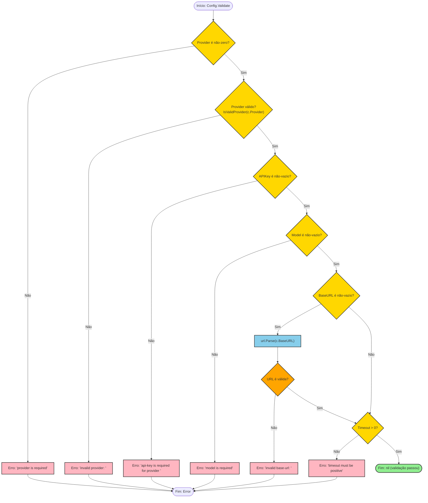

# Fluxograma: Validação de Configuração (`Config.Validate`)

**Arquivo fonte:** `config.go:44-65`
**Método:** `(*Config) Validate() error`
**Iniciador:** Qualquer chamada que use `Config` (CLI, TUI, service layer)

---

## Fluxograma Mermaid



---

## Detalhamento Passo a Passo

### Etapa 1: Verificação do Provider
**Linha:** `config.go:46-47`

```go
if c.Provider == "" {
    return fmt.Errorf("provider is required")
}
```
- `ProviderType` é `string` typed, zero value é `""`.
- Se o usuário não especificou provider, retorna erro imediato.

### Etapa 2: Validação do Provider
**Linha:** `config.go:49-51`

```go
if !IsValidProvider(string(c.Provider)) {
    return fmt.Errorf("invalid provider: %s", c.Provider)
}
```
- Chama `IsValidProvider()` que itera `AllProviders()` (openai, anthropic, gemini).
- Case-sensitive: "OPENAI" → inválido.
- Mensagem de erro inclui o valor inválido para debugging.

### Etapa 3: Verificação da API Key
**Linha:** `config.go:53-55`

```go
if c.APIKey == "" {
    return fmt.Errorf("api-key is required for provider %s", c.Provider)
}
```
- API key é obrigatória para **todos** os providers.
- Mensagem de erro inclui o provider para contexto.

### Etapa 4: Verificação do Modelo
**Linha:** `config.go:57-59`

```go
if c.Model == "" {
    return fmt.Errorf("model is required")
}
```
- Modelo é obrigatório.
- **Importante**: `WithDefaults()` pode preencher isso antes de `Validate()`, mas `Validate()` não depende disso.

### Etapa 5: Validação da URL Base (opcional)
**Linha:** `config.go:61-64`

```go
if c.BaseURL != "" {
    if _, err := url.Parse(c.BaseURL); err != nil {
        return fmt.Errorf("invalid base-url: %w", err)
    }
}
```
- Se `BaseURL` for vazio, é ignorado (permitido).
- Se não vazio, usa `url.Parse` do Go (rfc3986).
- Error wrapping com `%w` permite `errors.Is` em chamadas superiores.

### Etapa 6: Verificação do Timeout
**Linha:** `config.go:66-68`

```go
if c.Timeout <= 0 {
    return fmt.Errorf("timeout must be positive")
}
```
- Timeout deve ser **estritamente positivo**.
- 0 e valores negativos são rejeitados.
- **Nota**: Não há limite superior de timeout — qualquer int positivo é aceito.

---

## Fluxos de Erro Identificados

| # | Erro | Causa Comum | Dica |
|---|------|-------------|------|
| 1 | `provider is required` | Usuário esqueceu de especificar provider | Sempre definir `Config.Provider` |
| 2 | `invalid provider: <valor>` | Valor digitado errado ou case-sensitive | Usar `ProviderOpenAI` (const), não string |
| 3 | `api-key is required` | API key vazia ou não setada via config | Verificar `llm.api-key` na config |
| 4 | `model is required` | Modelo não especificado | Usar `WithDefaults()` antes de validar |
| 5 | `invalid base-url` | URL malformada (ex: falta scheme) | Usar URL completa com `https://` |
| 6 | `timeout must be positive` | Timeout = 0 ou negativo | Mínimo recomendado: 30s |

---

## Observações

- **Ordem de validação importa** — erros mais comuns (provider, api-key) são verificados primeiro para feedback rápido.
- **Validação parcial** — não há validação de `MaxTokens` ou `Temperature` (valores opcionais sem constraints).
- **`WithDefaults` vs `Validate`** — `WithDefaults()` preenche `BaseURL`, `Model`, `Timeout`; `Validate()` verifica os valores. Chamada recomendada: `cfg.WithDefaults().Validate()`.
