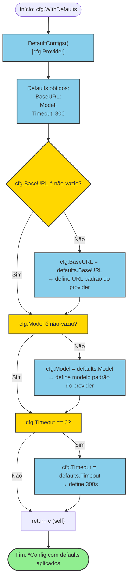

# Fluxograma: Aplicação de Valores Padrão (`Config.WithDefaults`)

**Arquivo fonte:** `config.go:72-83`
**Método:** `(*Config) WithDefaults() *Config`
**Iniciador:** Chamador antes de `Validate()` ou uso do provider

---

## Fluxograma Mermaid



---

## Detalhamento Passo a Passo

### Etapa 1: Lookup dos Defaults
**Linha:** `config.go:73`

```go
defaults := DefaultConfigs()[c.Provider]
```

- Chama `DefaultConfigs()` que retorna **um novo mapa** a cada chamada.
- Indexa pelo `c.Provider` — se provider inválido, retorna struct zero value (com campos vazios).
- **Não há validação do provider aqui** — `WithDefaults` assume que o provider é válido.

### Etapa 2: Preenchimento de `BaseURL`
**Linha:** `config.go:75-77`

```go
if c.BaseURL == "" {
    c.BaseURL = defaults.BaseURL
}
```

| Provider | Default BaseURL |
|----------|-----------------|
| `openai` | `https://api.openai.com/v1` |
| `anthropic` | `https://api.anthropic.com` |
| `gemini` | `https://generativelanguage.googleapis.com/v1beta` |

**Comportamento**: Só sobrescreve se `BaseURL` for vazio. Se o usuário forneceu uma URL customizada, ela é **preservada** (ex: endpoint de proxy, mirror local, API Gateway).

### Etapa 3: Preenchimento de `Model`
**Linha:** `config.go:78-80`

```go
if c.Model == "" {
    c.Model = defaults.Model
}
```

| Provider | Default Model |
|----------|---------------|
| `openai` | `gpt-4o` |
| `anthropic` | `claude-sonnet-4-20250514` |
| `gemini` | `gemini-2.5-flash` |

**Comportamento**: Só sobrescreve se `Model` for vazio. Usuário pode especificar outro modelo (ex: `gpt-4o-mini`, `claude-3-5-sonnet`).

### Etapa 4: Preenchimento de `Timeout`
**Linha:** `config.go:81-83`

```go
if c.Timeout == 0 {
    c.Timeout = defaults.Timeout  // 300s
}
```

- Timeout padrão: **300 segundos (5 minutos)**.
- **Só sobrescreve se == 0** — se o usuário especificou 60s, permanece 60s.
- **Não há validação de range aqui** — o range é validado por `Validate()` (deve ser > 0).

---

## Padrão de Uso Recomendado

```go
// 1. Construir config com dados mínimos
cfg := llm.Config{
    Provider: llm.ProviderOpenAI,
    APIKey:   os.Getenv("LLM_API_KEY"),
    Model:    "",  // pode deixar vazio → será preenchido
}

// 2. Aplicar defaults
cfg.WithDefaults()

// 3. Validar
if err := cfg.Validate(); err != nil {
    return err  // "model is required" se não foi preenchido
}

// 4. Usar no Registry
provider, err := registry.Create(cfg)
```

---

## Campos Não Preenchidos por Defaults

| Campo | Tratamento | Motivo |
|-------|------------|--------|
| `Provider` | **Não alterado** | Essencial para lookup dos defaults |
| `APIKey` | **Não alterado** | Jamais tem default (deve ser fornecida) |
| `MaxTokens` | **Não alterado** | Sem padrão universal (varia por modelo) |
| `Temperature` | **Não alterado** | Sem padrão universal (0.0 = defaults) |

**Nota**: `MaxTokens` e `Temperature` não têm valores padrão. Se não forem especificados, o provider usa os padrões dele (comportamento definido pela API do provedor).

---

## Observações

- **Modificação in-place** — o método altera o receiver `cfg` e retorna `*Config` para chaining. **Não cria uma cópia**.
- **Sem validação** — `WithDefaults` não valida nada. Pode produzir uma config inválida se `APIKey` ou `Provider` forem inválidos.
- **Ordem de chamadas** — recomenda-se `cfg.WithDefaults().Validate()` para garantir defaults antes da validação.
