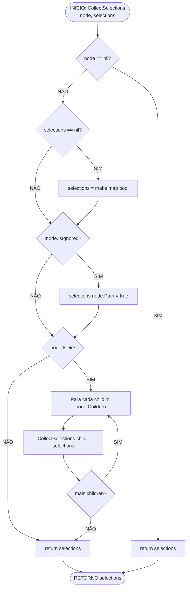

# Fluxo: CollectSelections — Coleta de Seleções da Árvore

> **Módulo:** `internal/core/scanner`
> **Função analisada:** `CollectSelections(node *FileNode, selections map[string]bool) map[string]bool`
> **Arquivo fonte:** `internal/core/scanner/helpers.go`, linhas 3–18

---

## 1. Visão Geral

`CollectSelections` é uma **função recursiva** que percorre a árvore de `FileNode` resultante de um scan e coleta todos os caminhos (`Path`) dos nós **não ignorados** em um mapa `map[string]bool`.

É usada para:
1. Construir a lista de arquivos a incluir em operações (ex: geração de contexto).
2. Implementar "select all" via `NewSelectAll(root)`.
3. Preservar seleções existentes ao adicionar novos nós.

---

## 2. Diagrama Mermaid



---

## 3. Descrição Detalhada do Fluxo

### Passo 1: Validação de Inputs

```go
if node == nil {
    return selections
}
```
- Se `node` é nil → retorna o mapa (pode ser nil ou existente).
- **Sempanico**, não inicializa mapa.

```go
if selections == nil {
    selections = make(map[string]bool)
}
```
- Se `selections` é nil → inicializa novo mapa vazio.
- A partir deste ponto, `selections` é sempre não-nil.

### Passo 2: Inclusão do Nó Atual

```go
if !node.IsIgnored() {
    selections[node.Path] = true
}
```
- Verifica `IsIgnored()` — retorna `true` se `IsGitignored || IsCustomIgnored`.
- Se **não ignorado**: adiciona `node.Path` ao mapa.
- **Nota:** inclui **diretórios** também (não só arquivos).
- Ex: `"/project"` e `"/project/src/main.go"` entram no mapa se ambos não-ignotos.

### Passo 3: Recursão sobre Filhos (se diretório)

```go
if node.IsDir {
    for _, child := range node.Children {
        CollectSelections(child, selections)
    }
}
```
- Só recursa se `node.IsDir == true`.
- Chama `CollectSelections` recursivamente para cada child.
- **Preserva o mesmo mapa** em todas as chamadas — acúmulo progressivo.
- Retorna o mesmo mapa (referência) após cada chamada recursiva.

### Passo 4: Retorno

```go
return selections
```
- Sempre retorna o mapa (inicializado ou existente).
- Mesmo mapa passado como argumento (side-effect no mapa).

---

## 4. `NewSelectAll` — Conveniência

```go
func NewSelectAll(root *FileNode) map[string]bool {
    return CollectSelections(root, make(map[string]bool))
}
```
- Cria novo mapa vazio e chama `CollectSelections`.
- Sempre retorna mapa **não-nil** (mesmo para `root == nil`).

---

## 5. Fluxo de Dados — Estado do Mapa

```
CollectSelections(root, map[string]bool{"/existing": true})
  │
  ├─ node = root (IsDir=true, IsIgnored=false)
  │   ├─ selections["/project"] = true
  │   │
  │   ├─ children[0] = FileNode{"src", IsDir=true, IsIgnored=false}
  │   │   ├─ selections["/project/src"] = true
  │   │   │
  │   │   ├─ children[0] = FileNode{"main.go", IsDir=false, IsIgnored=false}
  │   │   │   ├─ selections["/project/src/main.go"] = true
  │   │   │   └─ return (não é dir)
  │   │   │
  │   │   └─ children[1] = FileNode{".git", IsDir=true, IsGitignored=true}
  │   │       ├─ IsIgnored() → true
  │   │       ├─ NÃO adiciona ao mapa
  │   │       └─ return (não recursa pois ignorado... mas IsDir=true → recursa!)
  │   │           └─ children de .git também não adicionam (ignored transitivo)
  │   │
  │   └─ children[1] = FileNode{".env", IsDir=false, IsCustomIgnored=true}
  │       └─ IsIgnored() → true → NÃO adiciona ao mapa
  │
  ▼
selections = map[string]bool{
    "/existing":    true,
    "/project":     true,
    "/project/src": true,
    "/project/src/main.go": true,
}
```

> **Nota importante:** Nós de diretórios ignorados ainda **recursam** sobre os filhos. Se `IncludeIgnored=true` (arquivos com flags), os filhos dentro de um diretório ignorado podem não-ignotos e serão adicionados.

---

## 6. Casos de Borda

| Caso | Comportamento | Razão |
|---|---|---|
| `node == nil` | Retorna mapa original (pode ser nil) | Sem side-effect |
| `selections == nil` | Inicializa novo mapa vazio | Garante não-nil |
| Nó ignorado | Não entra no mapa | Filtro `IsIgnored()` |
| Dir ignorado com filhos não-ignotos | Filhos não-ignotos entram | Recursão não para em ignorados |
| Root é dir vazio | Só root entra no mapa | Sem children |
| Mapa já tem entradas | Preservadas | Side-effect no mesmo mapa |
