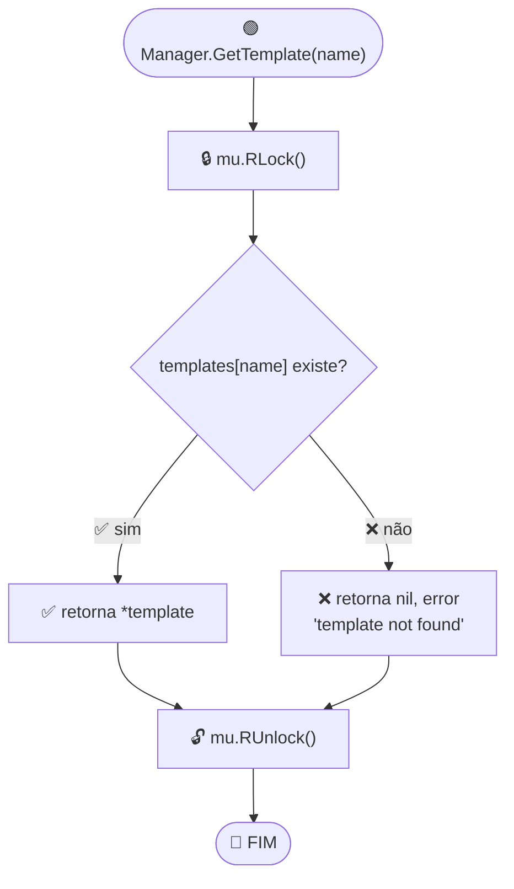
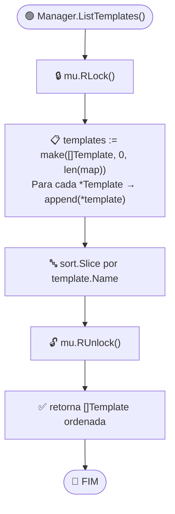
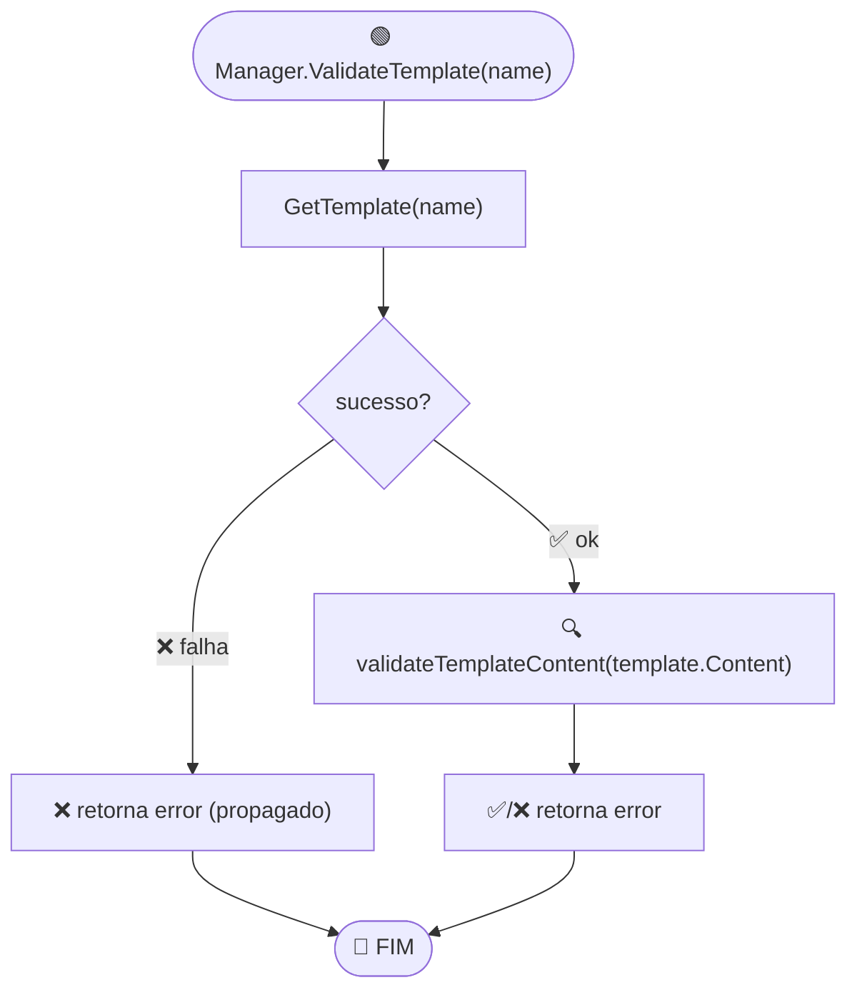
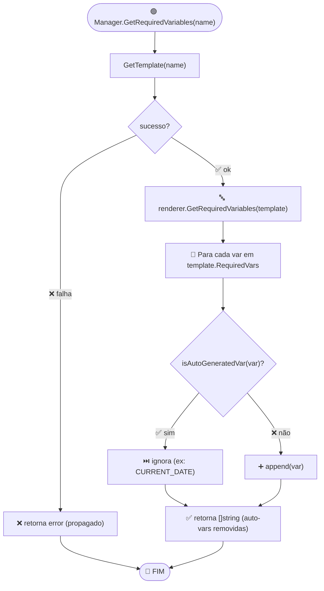
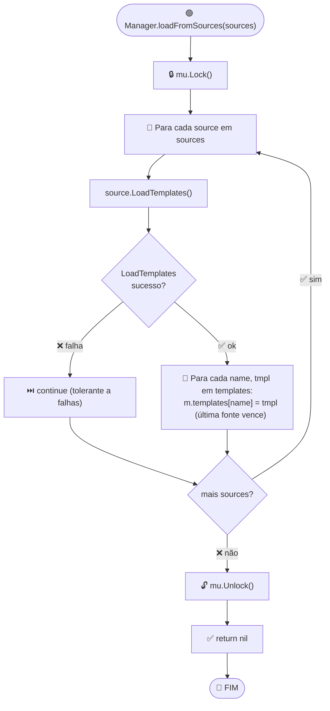

# Fluxo: API do Manager

> **Arquivo:** `manager.go`
> **Interface:** `TemplateManager`

## Fluxograma: GetTemplate

## Fluxograma: ListTemplates

## Fluxograma: ValidateTemplate

## Fluxograma: GetRequiredVariables

## Fluxograma: loadFromSources (multi-fonte)

## Resumo de Locking

| Método | Lock Type | Propósito |
|--------|-----------|-----------|
| `GetTemplate` | `RLock` | Leitura única |
| `ListTemplates` | `RLock` | Leitura + cópia |
| `RenderTemplate` | `RLock` → `GetTemplate` | Leitura |
| `ValidateTemplate` | `RLock` → `GetTemplate` | Leitura |
| `GetRequiredVariables` | `RLock` → `GetTemplate` | Leitura |
| `GetTemplateNames` | `RLock` | Leitura |
| `HasTemplate` | `RLock` | Leitura |
| `loadFromSources` | `Lock` | Escrita (merge) |
