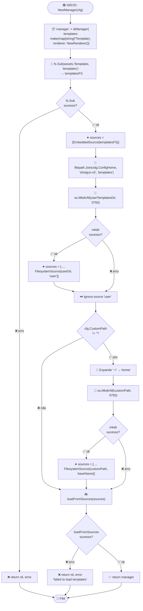
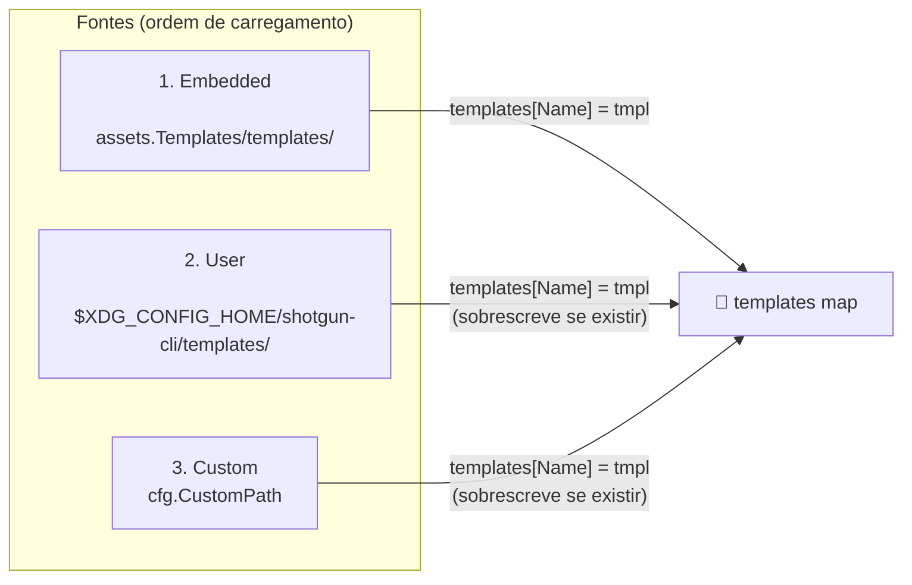

# Fluxo: Inicialização do Manager

> **Função:** `NewManager(cfg ManagerConfig) (*Manager, error)`
> **Arquivo:** `manager.go`

## Fluxograma

```mermaid
flowchart TD
    Start(["🟢 INÍCIO: NewManager(cfg)"]) --> InitManager["📦 manager := &Manager{\n  templates: make(map[string]*Template),\n  renderer: NewRenderer()}"]
    InitManager --> SubFS["📂 fs.Sub(assets.Templates, 'templates')\n   → templatesFS"]
    SubFS --> SubFSError{"fs.Sub\nsucesso?"}
    SubFSError -->|❌ erro| ReturnFS["❌ return nil, error"]
    SubFSError -->|✅ ok| AddEmbedded["➕ sources = [EmbeddedSource{templatesFS}]"]

    AddEmbedded --> UserDir["📂 filepath.Join(xdg.ConfigHome,\n  'shotgun-cli', 'templates')"]
    UserDir --> UserMkdir["📁 os.MkdirAll(userTemplatesDir, 0750)"]
    UserMkdir --> UserOK{"mkdir\nsucesso?"}
    UserOK -->|✅ ok| AddUser["➕ sources = [..., FilesystemSource{userDir, 'user'}]"]
    UserOK -->|❌ erro| CheckCustom["⏭️ Ignora source 'user'"]
    AddUser --> CheckCustom

    CheckCustom --> CustomPath{"cfg.CustomPath\n!= ''?"}
    CustomPath -->|❌ não| LoadAll["📥 loadFromSources(sources)"]
    CustomPath -->|✅ sim| TildeExp["📝 Expande '~/' → home/"]
    TildeExp --> CustomMkdir["📁 os.MkdirAll(customPath, 0750)"]
    CustomMkdir --> CustomOK{"mkdir\nsucesso?"}
    CustomOK -->|✅ ok| AddCustom["➕ sources = [..., FilesystemSource{customPath, baseName}]"]
    CustomOK -->|❌ erro| LoadAll
    AddCustom --> LoadAll

    LoadAll --> LoadErr{"loadFromSources\nsucesso?"}
    LoadErr -->|❌ erro| ReturnLoad["❌ return nil, error\n'failed to load templates'"]
    LoadErr -->|✅ ok| ReturnOK["✅ return manager"]
    ReturnOK --> End(["🔵 FIM"])
    ReturnFS --> End
    ReturnLoad --> End
```

## Regras de Prioridade (Merge)

```mermaid
flowchart LR
    subgraph Sources["Fontes (ordem de carregamento)"]
        E["1. Embedded\n   assets.Templates/templates/"]
        U["2. User\n   $XDG_CONFIG_HOME/shotgun-cli/templates/"]
        C["3. Custom\n   cfg.CustomPath"]
    end

    E -->|"templates[Name] = tmpl"| MergeMap["🔗 templates map"]
    U -->|"templates[Name] = tmpl\n(sobrescreve se existir)"| MergeMap
    C -->|"templates[Name] = tmpl\n(sobrescreve se existir)"| MergeMap
```
