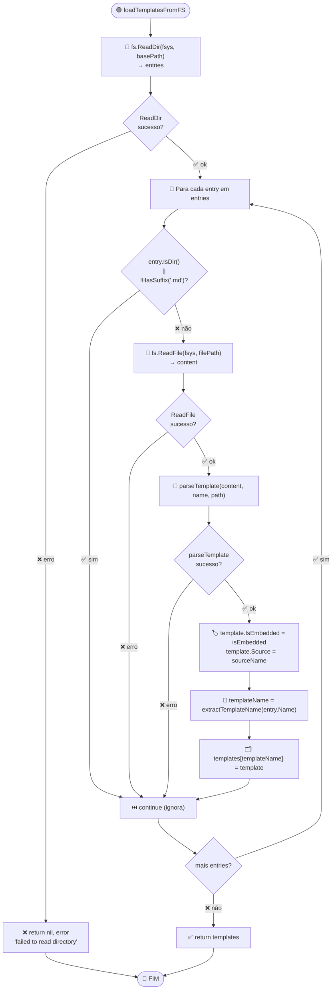
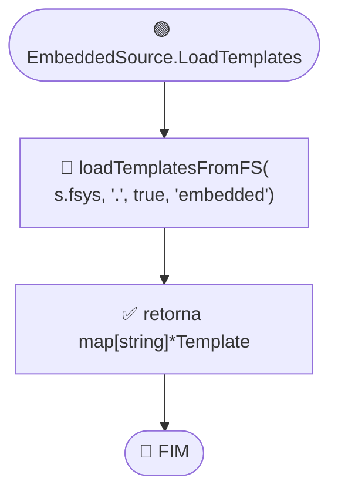
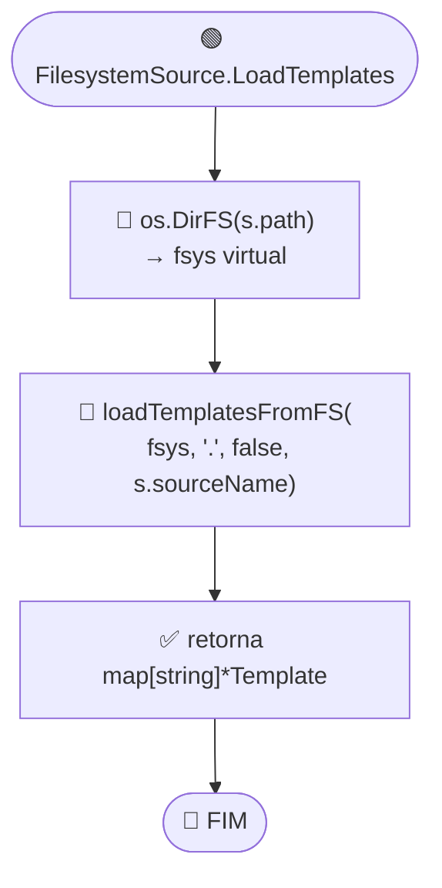

# Fluxo: Carregamento de Templates

> **Funções:** `loadTemplatesFromFS()`, `TemplateSource.LoadTemplates()`
> **Arquivos:** `loader.go`

## Fluxograma: loadTemplatesFromFS

## Fluxograma: EmbeddedSource

## Fluxograma: FilesystemSource

## Regras de Filtragem

| Critério | Ação |
|----------|------|
| `entry.IsDir() == true` | Ignora (continue) |
| `!strings.HasSuffix(name, ".md")` | Ignora (continue) |
| `fs.ReadFile` falha | Ignora com continue (silencioso) |
| `parseTemplate` retorna erro | Ignora com continue (silencioso) |
| `fs.ReadDir` falha | Retorna erro (não silencia) |
