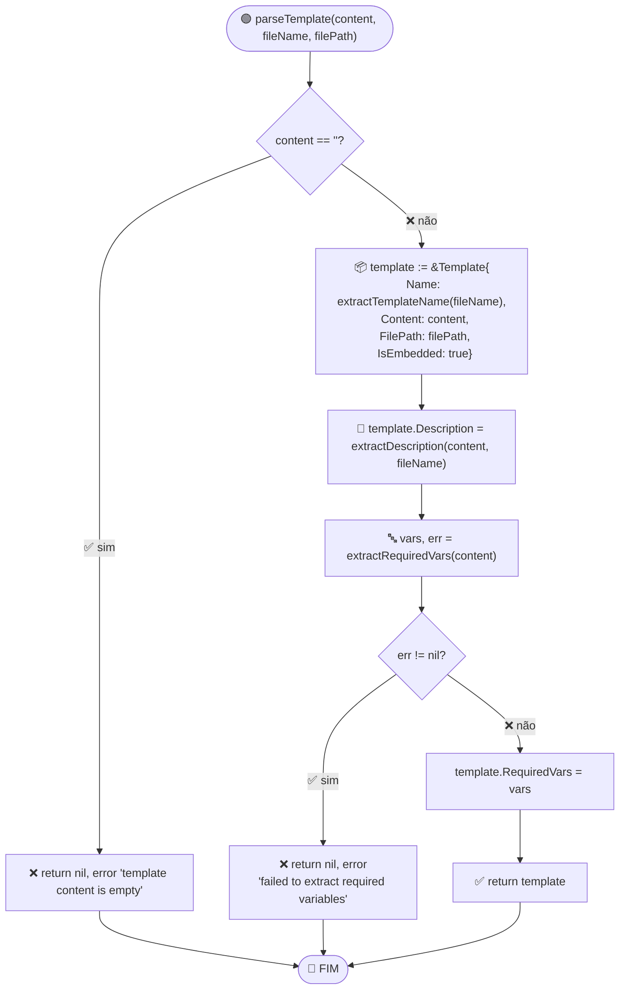
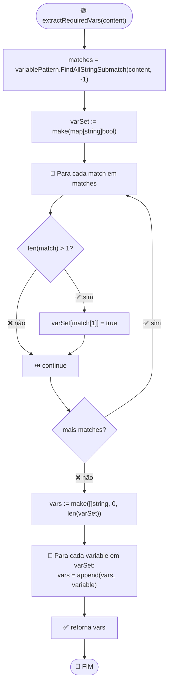

# Fluxo: Parse e Validação de Template

> **Funções:** `parseTemplate()`, `extractDescription()`, `extractRequiredVars()`, `validateTemplateContent()`
> **Arquivo:** `template.go`

## Fluxograma: parseTemplate



## Fluxograma: extractDescription

```mermaid
flowchart TD
    Start(["🟢 extractDescription(content, fileName)"]) --> Split["lines = Split(content, '\\n')"]
    Split --> ForLine["🔁 Para cada line em lines"]
    ForLine --> Trim["line = TrimSpace(line)"]
    Trim --> CheckHeader{"line starts with '#'?"}
    CheckHeader -->|✅ sim| ExtractHeader["description = TrimLeft(line, '#')"]
    ExtractHeader --> CheckDesc{"description != ''?"}
    CheckDesc -->|✅ sim| ReturnDesc["✅ retorna description"]
    CheckDesc -->|❌ não| ForLine

    CheckHeader -->|❌ não| CheckHTML{"line starts with '<!--'"\n&& ends with '-->'?"}
    CheckHTML -->|✅ sim| ExtractHTML["description = Trim(line[4:len(line)-3])"]
    ExtractHTML --> ReturnDesc

    CheckHTML -->|❌ não| CheckBreak{"line != '' &&\n!startsWith('#') &&\n!startsWith('<!--')?"}
    CheckBreak -->|✅ sim| CheckFallback["⏭️ break (sem header encontrado)"]
    CheckBreak -->|❌ não| ForLine

    CheckFallback --> Fallback["📛 default: 'Template for '+extractTemplateName(fileName)"]
    Fallback --> ReturnDefault["✅ retorna fallback"]
    ReturnDesc --> End(["🔵 FIM"])
    ReturnDefault --> End
```

## Fluxograma: extractRequiredVars



## Fluxograma: validateTemplateContent

```mermaid
flowchart TD
    Start(["🟢 validateTemplateContent(content)"]) --> EmptyCheck{"content == ''?"}
    EmptyCheck -->|✅ sim| ReturnEmptyErr["❌ error 'template content is empty'"]
    EmptyCheck -->|❌ não| Split["lines = Split(content, '\\n')"]
    Split --> InitCodeBlock["inCodeBlock := false"]
    InitCodeBlock --> ForLine["🔁 Para cada line em lines"]
    ForLine --> Trim["trimmed = TrimSpace(line)"]
    Trim --> CheckCodeBlock{"startsWith('```')?"}
    CheckCodeBlock -->|✅ sim| ToggleCodeBlock["inCodeBlock = !inCodeBlock\n⏭️ continue"]

    CheckCodeBlock -->|❌ não| InBlockCheck{inCodeBlock?"}
    InBlockCheck -->|✅ sim| ContinueBlock["⏭️ continue (ignora code blocks)"]

    InBlockCheck -->|❌ não| CountBraces["open = Count(trimmed, '{')\nclose = Count(trimmed, '}')"]
    CountBraces --> Balanced{"open != close?"}
    Balanced -->|✅ sim| ReturnUnbalanced["❌ error 'unmatched braces on line N'"]
    Balanced -->|❌ não| HasOpen{"contains '{'?"}
    HasOpen -->|✅ sim| ValidatePattern["matches = variablePattern.FindAllString(line)"]
    ValidatePattern --> ForMatchCheck["🔁 Para cada match:\n   !variablePattern.MatchString(match)?"]
    ForMatchCheck -->|✅ sim| ReturnMalformed["❌ error 'malformed variable pattern'"]
    ForMatchCheck -->|❌ não| Continue
    HasOpen -->|❌ não| Continue

    ToggleCodeBlock --> Continue
    ContinueBlock --> Continue
    ReturnUnbalanced --> End(["🔵 FIM"])
    ReturnMalformed --> End
    Continue --> MoreLines{"mais lines?"}
    MoreLines -->|✅ sim| ForLine
    MoreLines -->|❌ não| ReturnOk["✅ return nil"]
    ReturnEmptyErr --> End
    ReturnOk --> End
```

## Regras de Validação de Conteúdo

| Regra | Detalhe |
|-------|---------|
| Conteúdo vazio | Erro imediato |
| Balanceamento de `{}` | Verificado linha a linha (fora de code blocks) |
| Code blocks | `\`\`\`` e `\`\`\`` alternam flag `inCodeBlock`; conteúdo interno é ignorado |
| Padrão regex | Cada `{...}` fora de code blocks deve match `variablePattern` |
| Chaves JSON/Go | `{"key": "value"}` passa (chaves balanceadas) |
| Função `HasVariable` | Usa `strings.Contains` simples — pode false-positivo com sobreposição |
