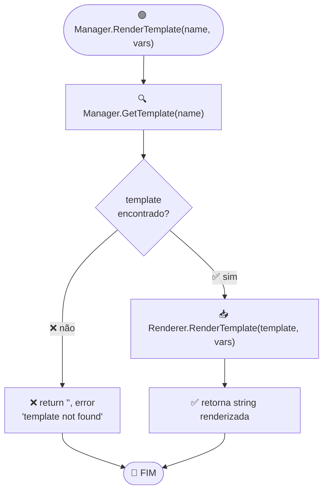
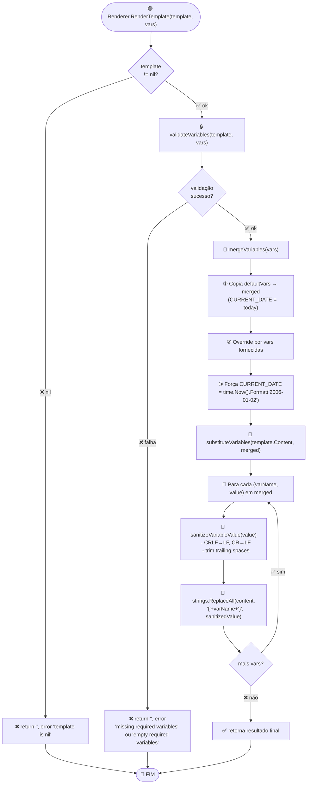
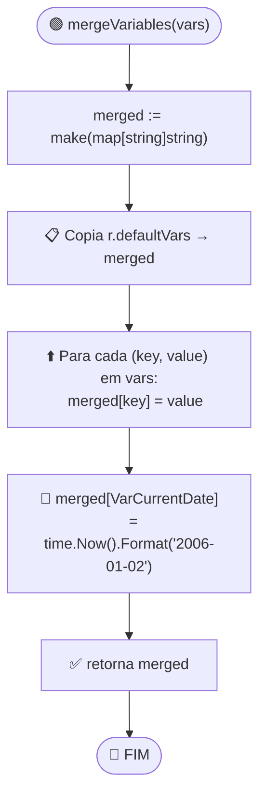
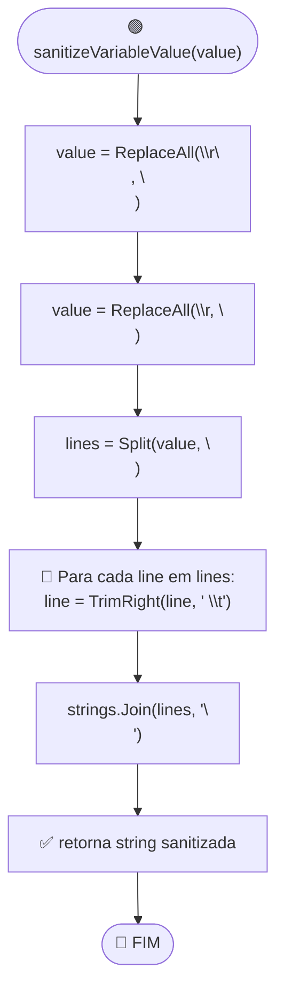
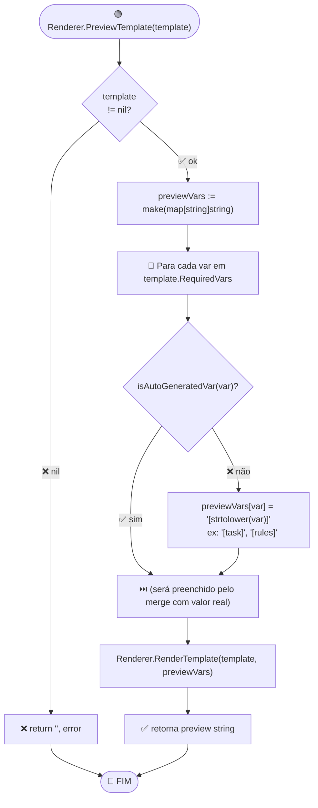

# Fluxo: Renderização de Template

> **Funções:** `Manager.RenderTemplate()`, `Renderer.RenderTemplate()`
> **Arquivos:** `manager.go`, `renderer.go`

## Fluxograma: Manager.RenderTemplate



## Fluxograma: Renderer.RenderTemplate (pipeline principal)



## Fluxograma: validateVariables

```mermaid
flowchart TD
    Start(["🟢 validateVariables(template, vars)"]) --> NilVars{"vars == nil?"}
    NilVars -->|✅ sim| InitVars["vars = make(map[string]string)"]
    NilVars -->|❌ não| MergeForVal["allVars = mergeVariables(vars)"]

    InitVars --> MergeForVal

    MergeForVal --> ForRequired["🔁 Para cada requiredVar em template.RequiredVars"]
    ForRequired --> AutoCheck{"isAutoGeneratedVar(requiredVar)?"}
    AutoCheck -->|✅ sim (ex: CURRENT_DATE)| SkipVar["⏭️ continue (ignora)"]
    AutoCheck -->|❌ não| GetValue["value, exists := allVars[requiredVar]"]

    GetValue --> Missing{"!exists?"}
    Missing -->|✅ sim| AddMissing["➕ missingVars = append(missingVars, requiredVar)"]
    Missing -->|❌ não| EmptyCheck{"trimmed value == ''?"}
    EmptyCheck -->|✅ sim| AddEmpty["➕ emptyVars = append(emptyVars, requiredVar)"]
    EmptyCheck -->|❌ não| SkipOk["⏭️ OK, continua"]

    AddMissing --> SkipOk
    AddEmpty --> SkipOk
    SkipVar --> SkipOk
    SkipOk --> MoreRequired{"mais requiredVars?"}
    MoreRequired -->|✅ sim| ForRequired
    MoreRequired -->|❌ não| CheckErrors{"len(missingVars) > 0?"}

    CheckErrors -->|✅ sim| ReturnMissing["❌ error 'missing required variables: %v'"]
    CheckErrors -->|❌ não| CheckEmpty{"len(emptyVars) > 0?"}
    CheckEmpty -->|✅ sim| ReturnEmpty["❌ error 'empty required variables: %v'"]
    CheckEmpty -->|❌ não| ReturnOk["✅ return nil"]

    ReturnMissing --> End(["🔵 FIM"])
    ReturnEmpty --> End
    ReturnOk --> End
```

## Fluxograma: mergeVariables



## Fluxograma: sanitizeVariableValue



## Fluxograma: PreviewTemplate



## Regras de Validação de Variáveis

| Regra | Detalhe |
|-------|---------|
| `vars == nil` | Convertido para `map[string]string{}` |
| `CURRENT_DATE` | Sempre auto-generated, nunca requerido do usuário |
| Variáveis vazias/trimmed | Consideradas erro (`empty required variables`) |
| Variáveis extras | Ignoradas silenciosamente |
| `CURRENT_DATE` override | Mesmo se o usuário fornecer um valor, é sobrescrito com a data atual |
