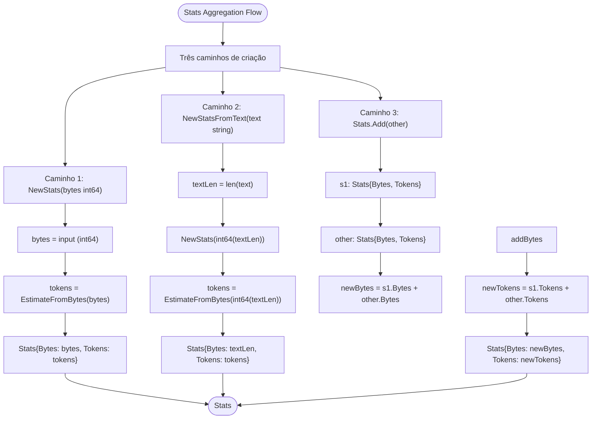
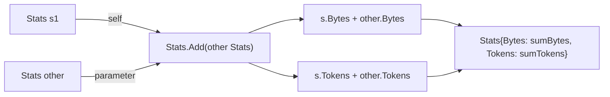

# Fluxo: Agregação de Estatísticas (Stats)

> **Arquivo fonte:** `estimator.go`  
> **Funções:** `NewStats()`, `NewStatsFromText()`, `Stats.Add()`

---

## Diagrama de Fluxo



### Fluxo Detalhado: `Stats.Add()`



---

## Fluxos Detalhados por Função

### 1. `NewStats(bytes int64) Stats`

```
Input: bytes (int64)
  → if bytes > 0:
      tokens = (bytes + 3) / 4    // ceil division
    else:
      tokens = 0
  → return Stats{Bytes: bytes, Tokens: tokens}
```

**Exemplos:**
| Input | Tokens | Output |
|-------|--------|--------|
| `0` | `0` | `Stats{Bytes: 0, Tokens: 0}` |
| `1024` | `256` | `Stats{Bytes: 1024, Tokens: 256}` |
| `5` | `2` | `Stats{Bytes: 5, Tokens: 2}` |

### 2. `NewStatsFromText(text string) Stats`

```
Input: text (string)
  → byteCount = len(text)    // número de bytes UTF-8
  → return NewStats(byteCount)
```

**Exemplos:**
| Input | len() | Output |
|-------|-------|--------|
| `""` | `0` | `Stats{Bytes: 0, Tokens: 0}` |
| `"Hello"` | `5` | `Stats{Bytes: 5, Tokens: 2}` |
| `"Hello, world!"` | `13` | `Stats{Bytes: 13, Tokens: 4}` |

### 3. `Stats.Add(other Stats) Stats`

```
Input: s (receiver Stats), other (Stats)
  → resultBytes = s.Bytes + other.Bytes
  → resultTokens = s.Tokens + other.Tokens
  → return Stats{Bytes: resultBytes, Tokens: resultTokens}
```

**Exemplos:**
| s.Bytes | s.Tokens | other.Bytes | other.Tokens | Result Bytes | Result Tokens |
|---------|----------|-------------|--------------|--------------|---------------|
| 100 | 25 | 200 | 50 | 300 | 75 |
| 5 | 2 | 10 | 3 | 15 | 5 |
| 0 | 0 | 1024 | 256 | 1024 | 256 |

---

## Limitações do `Add()`

### Não Recalcula Tokens

O método `Add()` soma tokens diretamente em vez de recalculá-los a partir da soma de bytes:

```go
// Comportamento real:
s1.Add(s2).Tokens = s1.Tokens + s2.Tokens  // soma direta

// Comportamento alternativo (não implementado):
// Ideal: EstimateFromBytes(s1.Bytes + s2.Bytes)  // recalcula
```

**Diferença máxima:** 2 tokens.

**Exemplo de divergência:**
```
s1 = Stats{Bytes: 5, Tokens: 2}  // ceil(5/4) = 2
s2 = Stats{Bytes: 5, Tokens: 2}  // ceil(5/4) = 2
s1.Add(s2) = Stats{Bytes: 10, Tokens: 4}  // 2 + 2 = 4

EstimateFromBytes(10) = ceil(10/4) = 3

Diferença: 4 - 3 = 1 token
```

A divergência ocorre porque `ceil(a/4) + ceil(b/4) ≥ ceil((a+b)/4)`.

**🟡 INFERIDO:** Esta é provavelmente uma escolha de design intencional — `Add()` é projetado para agregação incremental onde cada parte foi estimada separadamente, e a pequena imprecisão é aceitável.

---

## Propriedades Matemáticas

| Propriedade | Valor |
|-------------|-------|
| Comutatividade | `a.Add(b) == b.Add(a)` ✅ |
| Associatividade | `(a.Add(b)).Add(c) == a.Add(b.Add(c))` ✅ |
| Elemento neutro | `Stats{0,0}.Add(s) == s` ✅ |
| Conservação de bytes | `Add().Bytes == s1.Bytes + s2.Bytes` ✅ |
| Conservação de tokens | `Add().Tokens == s1.Tokens + s2.Tokens` ✅ |
| Equivalência com re-estimativa | `Add().Tokens == EstimateFromBytes(Add().Bytes)` ❌ (máx. diferença de 2) |
