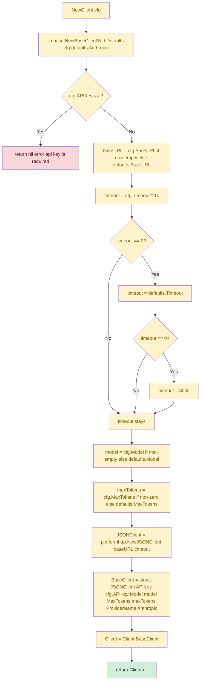
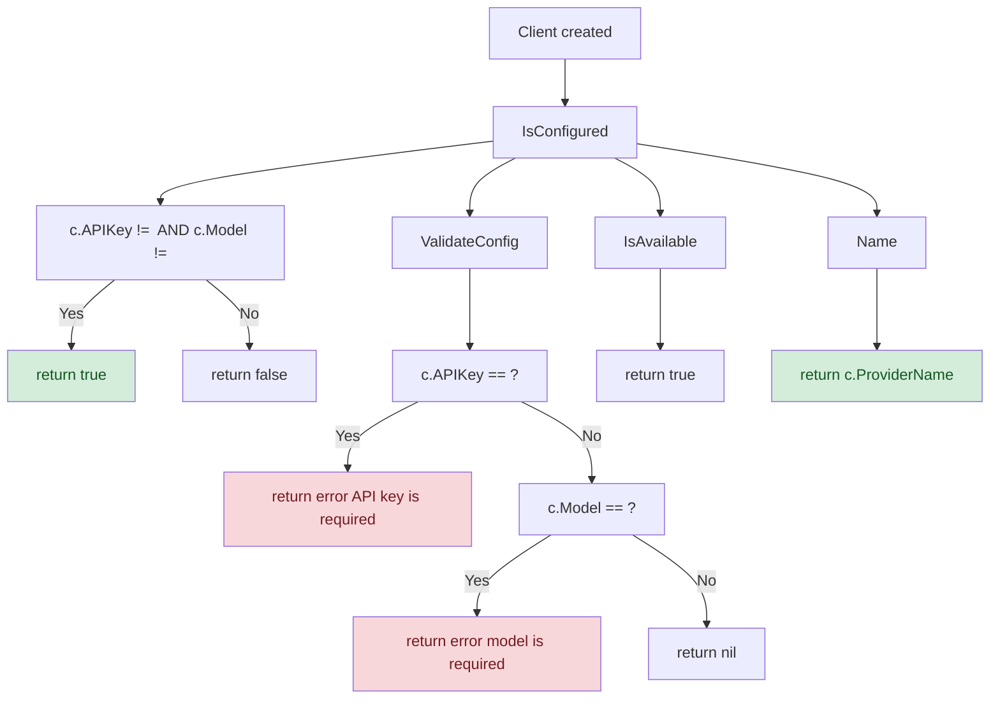
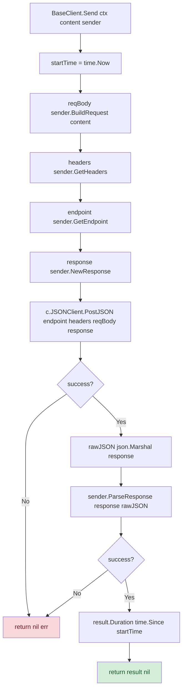
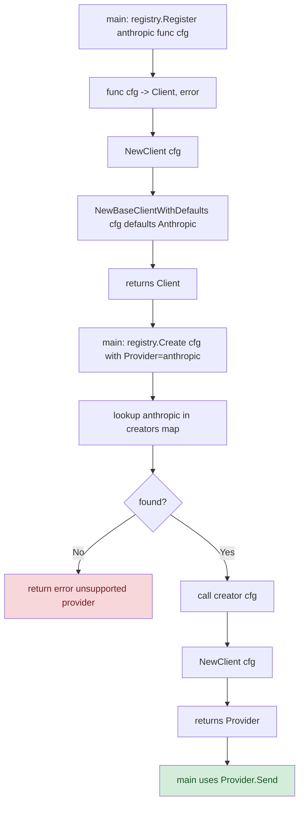
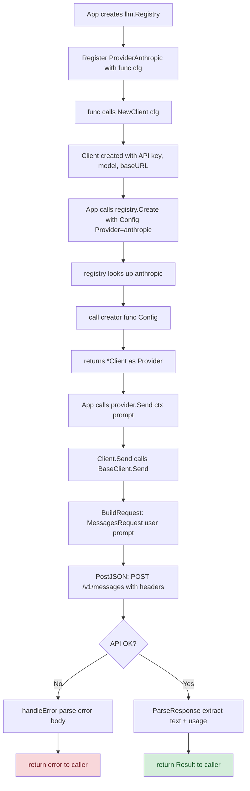
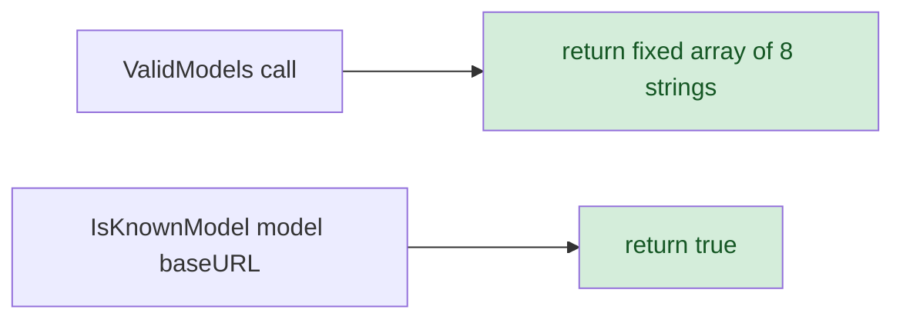

# Fluxo de Ciclo de Vida do Cliente — `NewClient()` e Configuração

> **Nível de detalhamento:** detalhado  
> **Idioma do documento:** pt-br  
> **Data:** 2026-05-20

---

## 1. Fluxo `NewClient(cfg llm.Config)`

### Passos de Default

| Config Field | Valor fornecido | Valor default (Anthropic) | Resultado |
|-------------|-----------------|--------------------------|-----------|
| `BaseURL` | `""` (vazio) | `"https://api.anthropic.com"` | Usa default |
| `BaseURL` | `"https://custom.api"` | `"https://api.anthropic.com"` | Usa fornecido |
| `Model` | `""` | `"claude-sonnet-4-20250514"` | Usa default |
| `Model` | `"claude-3-opus"` | `"claude-sonnet-4-20250514"` | Usa fornecido |
| `Timeout` | `0` | `300` segundos | 300s |
| `Timeout` | `60` | `300` segundos | 60s |
| `MaxTokens` | `0` | `8192` | Usa default |
| `MaxTokens` | `4096` | `8192` | Usa 4096 |
| `APIKey` | `""` | — | **ERRO** |

---

## 2. Fluxo de Configuração e Validação

---

## 3. Fluxo de Interação com `llmbase.BaseClient.Send()`

---

## 4. Fluxo de Integração com `llm.Registry` (como provider)

---

## 5. Fluxo de Uso Completo (Tentativa de Envio)

---

## 6. Fluxo de Validação de Modelos (`models.go`)

**Observação:** `IsKnownModel` foi modificado propositalmente para sempre retornar `true`. A validação de modelo foi removida para aceitar modelos customizados e preview. A função está marcada como `@deprecated`.

---

## 7. Tabela de Referência de Fluxos

| Fluxo | Arquivo Principal | Função Entry | Complexidade |
|-------|-------------------|-------------|-------------|
| **Criação do cliente** | `client.go` | `NewClient()` | Média — aplica defaults, valida API key |
| **Envio simples** | `client.go` + `base_client.go` | `Send()` | Alta — build → HTTP → parse |
| **Envio com progresso** | `client.go` + `base_client.go` | `SendWithProgress()` | Alta — idêntico a Send + 2 callbacks |
| **Tratamento de erro** | `client.go` + `base_client.go` | `handleError()` | Média — tenta parse JSON de erro, fallback |
| **Parsing de resposta** | `client.go` | `ParseResponse()` | Média — iterar content blocks, mapear usage |
| **Construção de requisição** | `client.go` | `BuildRequest()` | Baixa — cria struct simples |
| **Headers e endpoint** | `client.go` | `GetHeaders()` / `GetEndpoint()` | Baixa — retorne maps/strings |
| **Validação de modelo** | `models.go` | `ValidModels()` / `IsKnownModel()` | Baixa — retorna array / true |
