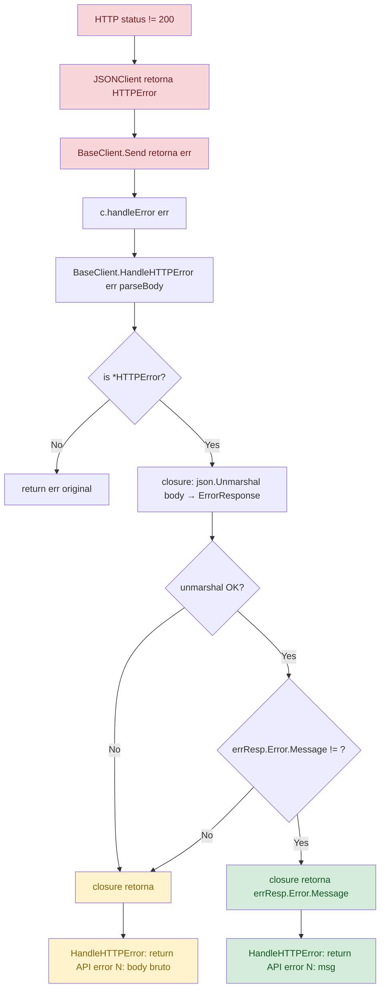
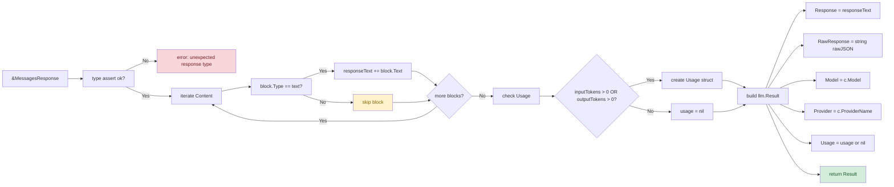

# Fluxo de Mensagem — `Send()` / `SendWithProgress()`

> **Nível de detalhamento:** detalhado  
> **Idioma do documento:** pt-br  
> **Data:** 2026-05-20

---

## 1. Fluxo `Send()` (Simples)

```mermaid
flowchart TD
    A[Client.Send ctx, content] --> B[c.BaseClient.Send ctx, content, sender=c]
    
    B --> B1[startTime = time.Now()]
    B1 --> B2[sender.BuildRequest content]
    B2 --> B2a[Create MessagesRequest]
    B2a --> B2b[Model = c.Model]
    B2b --> B2c[MaxTokens = c.MaxTokens]
    B2c --> B2d[Messages = [{Role: user, Content: content}]]
    B2d --> B2e[System = "" (omitted)]
    B2e --> B2f[Return MessagesRequest]
    
    B2 --> B3[sender.GetHeaders]
    B3 --> B3a[return map x-api-key + anthropic-version]
    
    B3 --> B4[sender.GetEndpoint]
    B4 --> B4a[return /v1/messages]
    
    B4 --> B5[sender.NewResponse]
    B5 --> B5a[return &MessagesResponse{}]
    
    B5 --> B6[c.JSONClient.PostJSON endpoint headers reqBody response]
    
    B6 --> B6a{JSONClient.PostJSON}
    B6a --> B6a1[marshal reqBody to JSON]
    B6a1 --> B6a2[build POST request with headers]
    B6a2 --> B6a3[httpClient.Do req]
    B6a3 --> B6a4{HTTP OK?}
    B6a4 -->|No| B6a5[return HTTPError{StatusCode, Body}]
    B6a4 -->|Yes| B6a6[unmarshal response to target]
    B6a6 --> B6a7{unmarshal OK?}
    B6a7 -->|No| B6a8[return error parse]
    B6a7 -->|Yes| B6a9[return nil]
    B6a5 --> B6_fail
    B6a8 --> B6_fail
    B6a9 --> B6_ok
    
    B6_fail --> B7[return err to BaseClient.Send]
    B7 --> C[c.handleError err]
    C --> C1[BaseClient.HandleHTTPError err parseBody]
    C1 --> C2{is HTTPError?}
    C2 -->|Yes| C3[parseBody: unmarshal ErrorResponse]
    C3 --> C4{msg != ""?}
    C4 -->|Yes| C5[return fmt API error N: msg]
    C4 -->|No| C6[return fmt API error N: body]
    C5 --> C_end
    C6 --> C_end
    C2 -->|No| C7[return err as-is]
    C7 --> C_end
    C_end --> D[return nil error]
    
    B6_ok --> B8[json.Marshal response to rawJSON]
    B8 --> B9[sender.ParseResponse response rawJSON]
    
    B9 --> B9a[type assert *MessagesResponse]
    B9a --> B9b{ok?}
    B9b -->|No| B9_fail[return unexpected response type]
    B9b -->|Yes| B9c[concat all ContentBlock.Text where Type==text]
    B9c --> B9d[build Usage if tokens>0]
    B9d --> B9e[return &llm.Result response rawJSON model provider usage]
    
    B9_fail --> B7
    
    B9e --> B10[result.Duration = time.Since startTime]
    B10 --> E[return result nil]
    
    classDef success fill:#d4edda,color:#155724
    classDef error fill:#f8d7da,color:#721c24
    classDef process fill:#cce5ff,color:#004085
    class E success
    class D error
    class B1,B2,B2a,B2b,B2c,B2d,B2e,B3,B3a,B4,B4a,B5,B5a,B6,B6a,B6a1,B6a2,B6a3,B6a4,B6a5,B6a6,B6a7,B6a8,B6a9,B7,B8,B9,B9a,B9b,B9c,B9d,B9e,B10 process
```

### Passos Detalhados

| # | Passo | Arquivo | Linha | Detalhe |
|---|-------|---------|-------|---------|
| 1 | `Client.Send()` | `client.go` | 44-49 | Entry point |
| 2 | `BaseClient.Send()` | `base_client.go` | 88 | Inicia cronômetro |
| 3 | `sender.BuildRequest()` | `client.go` | 66-73 | Cria `MessagesRequest` |
| 4 | `sender.GetHeaders()` | `client.go` | 104-108 | Headers com API key + version |
| 5 | `sender.GetEndpoint()` | `client.go` | 101 | `/v1/messages` |
| 6 | `sender.NewResponse()` | `client.go` | 111 | `&MessagesResponse{}` |
| 7 | `JSONClient.PostJSON()` | `client.go` (http) | 40 | Envio HTTP POST |
| 8 | `c.handleError()` | `client.go` | 113-119 | Tratamento de erro |
| 9 | `ParseResponse()` | `client.go` | 76-100 | Extração do resultado |
| 10 | `result.Duration` | `base_client.go` | 109 | Medição de tempo |

---

## 2. Fluxo `SendWithProgress()` (com callback)

```mermaid
flowchart TD
    A[Client.SendWithProgress ctx, content, progress] --> B[c.BaseClient.SendWithProgress ctx, content, sender=c, progress]
    
    B --> B1[progress Connecting to Anthropic...]
    B1 --> B2[c.Send ctx content sender]
    
    B2 --> B2a[startTime = time.Now()]
    B2a --> B2b[sender.BuildRequest content]
    B2b --> B2c[sender.GetHeaders]
    B2c --> B2d[sender.GetEndpoint]
    B2d --> B2e[sender.NewResponse]
    B2e --> B2f[c.JSONClient.PostJSON endpoint headers reqBody response]
    B2f --> B2g{success?}
    B2g -->|No| B2h[return err]
    B2g -->|Yes| B2i[rawJSON = json.Marshal response]
    B2i --> B2j[sender.ParseResponse response rawJSON]
    B2j --> B2k{success?}
    B2k -->|No| B2h
    B2k -->|Yes| B2l[result.Duration = time.Since startTime]
    B2l --> B3[return result err]
    
    B3 --> B4{err == nil?}
    B4 -->|No| B5[return result err]
    B4 -->|Yes| B6[progress Response received]
    B6 --> B7[return result nil]
    
    classDef start fill:#d1ecf1,color:#0c5460
    classDef end fill:#d4edda,color:#155724
    classDef progress fill:#fff3cd,color:#856404
    classDef error fill:#f8d7da,color:#721c24
    class A,B1 start
    class B7 end
    class B6 progress
    class B2h,B5 error
```

### Diferenças em relação a `Send()`

| Aspecto | `Send()` | `SendWithProgress()` |
|---------|----------|----------------------|
| **Callback de progresso** | Nenhum | `progress("Connecting to Anthropic...")` antes, `progress("Response received")` após |
| **Tratamento de erro** | `handleError()` chamados | `handleError()` chamados (mesmo) |
| **Fluxo de HTTP** | Idêntico | Idêntico |
| **Uso pelo sistema** | Chamado diretamente pelo `llm.Provider.Send()` | Chamado pelo TUI (Bubble Tea) que necessita de feedback visual |

---

## 3. Fluxo de Tratamento de Erros



### Exemplos de Mensagens de Erro

| Código HTTP | Causa | Mensagem gerada |
|-------------|-------|-----------------|
| 401 | API key inválida | `API error [401]: Invalid API key` |
| 429 | Rate limit | `API error [429]: Rate limit exceeded` |
| 500 | Erro do servidor | `API error [500]: <corpo da resposta>` |
| 503 | Service unavailable | `API error [503]: <corpo da resposta>` |
| 0 | Erro de rede | `request failed: <erro original>` |

---

## 4. Fluxo de Parsing de Resposta



### Pontos Críticos do Parsing

1. **Concatenação simples:** `responseText += block.Text` — não há separador entre blocos. Se a API retornar múltiplos blocos de texto, eles são colados sem espaço.

2. **Ignorância silenciosa:** Blocos com `Type != "text"` (ex: `tool_use`, `thinking`) são completamente ignorados. Não há log, não há aviso.

3. **Null Usage:** Se `InputTokens == 0 && OutputTokens == 0`, o campo `Usage` do `Result` fica `nil`. O código consumidor precisa verificar nil antes de acessar.
