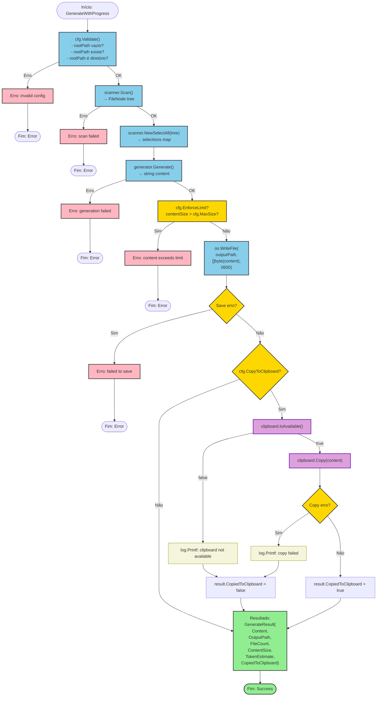

# Fluxograma: Integração do Clipboard no Fluxo `GenerateWithProgress`

| Item | Detalhe |
|------|---------|
| **Módulo** | `internal/platform/clipboard` + `internal/app` |
| **Arquivos** | `clipboard.go` + `service.go:140-154` |
| **Fluxo** | Como o clipboard é invocado durante a geração de contexto |

---

## 1. Contexto

A função `clipboard.Copy()` é chamada **dentro de** `app.DefaultContextService.GenerateWithProgress()`, exclusivamente quando a opção `CopyToClipboard` está habilitada.

**Localização exata:** `service.go:140-154` (dentro do workflow de geração)

---

## 2. Fluxograma Mermaid



---

## 3. Detalhamento Passo a Passo

### Etapa A: Gate Check (`IsAvailable`)

```go
// service.go — antes de Copy(), o caller NÃO verifica IsAvailable()
// A verificação é feita DENTRO de Copy() ou não é feita — Copy() tenta direto
```

**Observação importante:** `GenerateWithProgress` **não chama explicitamente** `IsAvailable()` antes de `Copy()`. A função `Copy()` é chamada diretamente. Se `IsAvailable()` retornasse `false`, `WriteAll()` falharia, e o erro seria capturado pelo `if err != nil` em `Copy()`.

### Etapa B: Execução (`Copy`)

```go
err := clipboard.Copy(content)
```

- Chamada síncrona
- Bloqueia até o lock do clipboard ser liberado
- Retorna `nil` (sucesso) ou `*ClipboardError` (falha)

### Etapa C: Tratamento (Non-Fatal)

```go
if err != nil {
    log.Printf("failed to copy to clipboard: %v", err)
} else {
    result.CopiedToClipboard = true
}
```

**Características:**
- Erro é **logged mas não retornado** — non-fatal
- O fluxo de geração continua mesmo se clipboard falhar
- `result.CopiedToClipboard` reflete o resultado exato
- **Não há retry** — uma única tentativa

### Etapa D: Resultado

```go
result := GenerateResult{
    Content:             content,
    OutputPath:          outputPath,
    FileCount:           tree.CountFiles(),
    ContentSize:         int64(len(content)),
    TokenEstimate:       tokens.EstimateFromBytes(contentSize),
    CopiedToClipboard:   !copyErr,
}
```

---

## 4. Fluxo Alternativo: `CopyToClipboard = false`

```
GenerateWithProgress
    ↓
... (geração e salvamento do arquivo)
    ↓
Check cfg.CopyToClipboard
    ↓
false → Pular completamente o bloco clipboard
    ↓
BuildResult (CopiedToClipboard = false por padrão)
    ↓
End Success
```

Neste caso, o package `clipboard` **não é invocado** — a biblioteca `atotto/clipboard` nem é carregada.

---

## 5. Propagação do Erro

| Nível | Comportamento |
|-------|---------------|
| `atotto/clipboard` | Retorna `error` nativo do SO |
| `clipboard.Copy()` | Empacota em `*ClipboardError` |
| `app.GenerateWithProgress()` | Logs e ignora — não propaga ao caller |
| Caller final | Nunca recebe erro de clipboard |

**🟡 INFERIDO:** Esta é uma escolha de design intencional. O caller (CLI/TUI) recebe apenas `GenerateResult.CopiedToClipboard` como indicador. Não há como o caller distinguir entre:
1. Clipboard não disponível (sistema)
2. Clipboard falhou (erro temporário)
3. `CopyToClipboard` não foi solicitado

---

## 6. Métricas de Integração

| Métrica | Valor |
|---------|-------|
| Linhas de código do bloco clipboard | ~10 (service.go:140-154) |
| Chamadas de `clipboard.Copy()` | 1 por geração |
| Chamadas de `IsAvailable()` | 0 (não explícito) |
| Tratamento de erro | Non-fatal, log-only |
| Retry | 0 |
| Timeout | Não aplicável (operação local) |
| Concorrência | Não aplicável (chamada única síncrona) |
