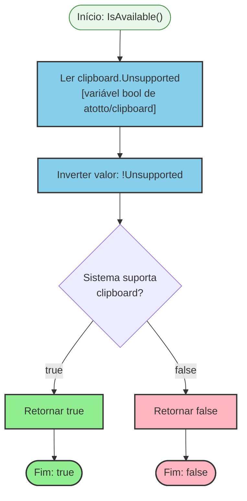

# Fluxograma: Função `IsAvailable`

| Item | Detalhe |
|------|---------|
| **Módulo** | `internal/platform/clipboard` |
| **Arquivo** | `clipboard.go:36-38` |
| **Fluxo** | Verificar se o sistema operacional suporta operações de clipboard |

---

## 1. Fluxo Principal `IsAvailable() bool`



---

## 2. Detalhamento Passo a Passo

### Passo 1: Ler `clipboard.Unsupported`

- **Origem:** `github.com/atotto/clipboard.Unsupported`
- **Tipo:** `bool` — variável global definida pela biblioteca
- **Inicialização:** Definido durante `init()` do package `atotto/clipboard`
- **Ciclo de vida:** Definido uma vez no início da execução do programa

### Passo 2: Verificar Plataforma

A biblioteca `atotto/clipboard` verifica a plataforma durante seu `init()`:

| Plataforma | Verificação | `Unsupported = true` se |
|------------|-------------|-------------------------|
| Linux | `runtime.GOOS == "linux"` | `X11` não encontrado E `Wayland` não encontrado |
| Windows | `runtime.GOOS == "windows"` | `OpenClipboard` falha |
| macOS | `runtime.GOOS == "darwin"` | `NSPasteboard` indisponível |
| Outros | Qualquer outro | `Unsupported = true` (fallback) |

### Passo 3: Retornar Resultado Invertido

- `Unsupported == true` → `IsAvailable()` retorna `false`
- `Unsupported == false` → `IsAvailable()` retorna `true`

---

## 3. Ambientes Típicos

| Ambiente | `IsAvailable()` | Razão |
|----------|-----------------|-------|
| Desktop Linux (GNOME/KDE) | `true` | X11 ou Wayland disponível |
| Desktop macOS | `true` | NSPasteboard sempre disponível |
| Desktop Windows | `true` | Win32 Clipboard API sempre disponível |
| CI/CD (GitHub Actions) | `false` | Sem display server |
| SSH headless | `false` | Sem variável `DISPLAY`/`WAYLAND_DISPLAY` |
| Docker container | `false` (sem `--privileged`) | Sem acesso ao host clipboard |
| Sandbox (Snap/Flatpak) | `false` (provável) | Restrição de sandbox |

---

## 4. Consumo no Projeto

### 4.1 Testes

```go
func TestCopySuccess(t *testing.T) {
    if !IsAvailable() {
        t.Skip("clipboard not available in this environment")
    }
    // ... testes reais de Copy()
}
```

**Padrão:** Todos os testes que envolvem `Copy()` verificam `IsAvailable()` primeiro e pulam em headless.

### 4.2 Benchmarks

```go
func BenchmarkCopy(b *testing.B) {
    if !IsAvailable() {
        b.Skip("clipboard not available in this environment")
    }
    // ... benchmark real
}
```

### 4.3 Aplicação Real

```go
// app.GenerateWithProgress — uso indireto
if cfg.CopyToClipboard {
    // O caller (app) NÃO verifica IsAvailable() antes de Copy()
    // Isso é um gap: Copy() pode falhar silenciosamente em headless
    err := clipboard.Copy(content)
    // Erro é logged mas não bloqueia
}
```

**🟡 INFERIDO:** O caller (`app.GenerateWithProgress`) **não chama `IsAvailable()`** antes de `Copy()`. Isso é aceitável porque:
1. Erro é non-fatal (logged mas não bloqueia)
2. O caller confia que `Copy()` lida internamente com estados indisponíveis

---

## 5. Complexidade

| Métrica | Valor |
|---------|-------|
| Cyclomatic Complexity | 1 (sem condições) |
| Linhas de código | 3 |
| Chamadas externas | 0 |
| Alocações de memória | 0 |
| Goroutines | 0 |
| I/O | 0 |