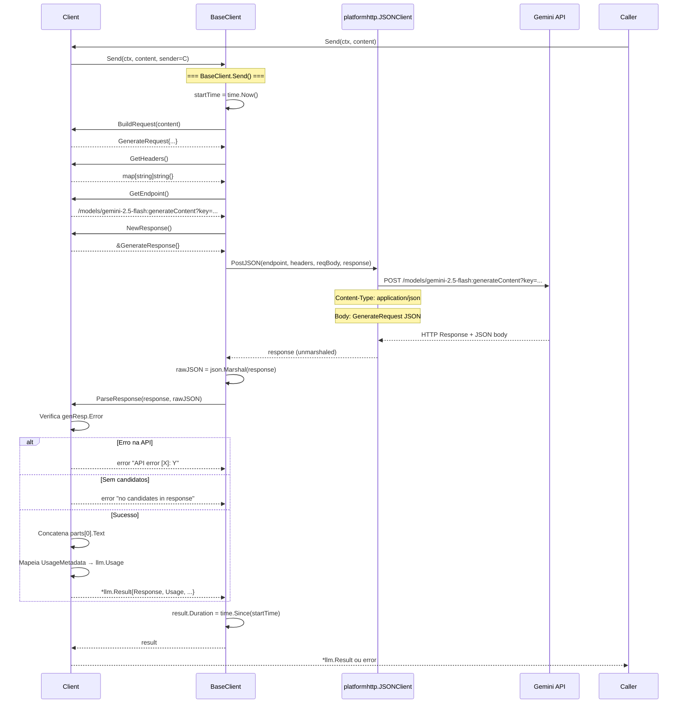

# Fluxo: Envio de Requisição (`Send`)

> **Arquivos:** `client.go` + `llmbase/sender.go`
> **Arquitetura:** Template Method + Strategy Pattern

---

## Mermaid — Diagrama de Sequência



---

## Mermaid — Diagrama de Atividade (Fluxo Lógico)

```mermaid
flowchart TD
    A[Entrada: ctx, content string] --> B[BaseClient.Send]
    B --> C[BuildRequest content]
    C --> D[GenerateRequest]
    D --> E[GetHeaders → {}]
    E --> F[GetEndpoint → /models/M:generateContent?key=K]
    F --> G[NewResponse → &GenerateResponse]
    G --> H[HTTP POST → Gemini API]
    H --> I{HTTP erro?}
    I -- sim --> J[Erro HTTP propagado]
    I -- não --> K[Unmarshal response]
    K --> L[ParseResponse response + rawJSON]
    L --> M{genResp.Error != nil?}
    M -- sim --> N[Erro: 'API error [code]: msg']
    M -- não --> O{len(Candidates) == 0?}
    O -- sim --> P[Erro: 'no candidates']
    O -- não --> Q[Concatena Content.Parts[].Text]
    Q --> R{UsageMetadata != nil?}
    R -- sim --> S[Mapeia → llm.Usage]
    R -- não --> T[Usage = nil]
    S --> U
    T --> U
    U[Monta llm.Result]
    U --> V[Calcula Duration]
    V --> W[Saída: *llm.Result]
```

---

## Etapas Detalhadas

### Etapa 1: BuildRequest (`Client.BuildRequest`)

| Passo | Ação | Detalhe |
|-------|------|---------|
| 1.1 | Cria array `Contents` | 1 elemento |
| 1.2 | Cria `Content` com `Parts: []Part{{Text: content}}` | |
| 1.3 | Cria `GenerationConfig{MaxOutputTokens: c.MaxTokens}` | Apenas max tokens configurado |
| 1.4 | Retorna `GenerateRequest{Contents, GenerationConfig}` | `SafetySettings` é nil |

### Etapa 2: HTTP Post (`BaseClient.Send`)

| Passo | Ação | Detalhe |
|-------|------|---------|
| 2.1 | Coleta headers (`GetHeaders`) | Mapa vazio — auth via URL |
| 2.2 | Coleta endpoint (`GetEndpoint`) | URL contém model + API key |
| 2.3 | Cria response object (`NewResponse`) | `&GenerateResponse{}` para unmarshal |
| 2.4 | POST via `platformhttp.JSONClient.PostJSON` | Content-Type: application/json |
| 2.5 | Serializa resposta para rawJSON | Para passagem a `ParseResponse` |

### Etapa 3: ParseResponse (`Client.ParseResponse`)

| Passo | Ação | Detalhe |
|-------|------|---------|
| 3.1 | Type-assert para `*GenerateResponse` | Fallback: "unexpected response type" |
| 3.2 | Verifica `genResp.Error` | Se não nil → "API error [code]: msg" |
| 3.3 | Verifica `len(genResp.Candidates) > 0` | Se 0 → "no candidates" |
| 3.4 | Concatena `part.Text` do primeiro candidato | Loop sobre `Candidates[0].Content.Parts` |
| 3.5 | Mapeia `UsageMetadata` se presente | Prompt→PromptTokens, Candidates→CompletionTokens, Total→TotalTokens |
| 3.6 | Retorna `llm.Result` | Response, RawResponse, Model, Provider, Usage |

---

## Caminhos de Erro

| Erro | Origem | Mensagem | Tratamento |
|------|--------|----------|------------|
| `BuildRequest` falha | `BuildRequest()` | "failed to build request: ..." | Retorna erro imediato |
| HTTP falha | `PostJSON()` | Erro do transport HTTP | Retornada pelo BaseClient |
| API error | `genResp.Error` | "API error [X]: Y" | `handleError` formatado |
| Sem candidatos | `len(Candidates) == 0` | "no candidates in response" | Erro direto |
| Type mismatch | `ParseResponse` | "unexpected response type" | Type assert falhou |

---

## Dados Transitórios

| Variável | Tipo | Escopo |
|----------|------|--------|
| `startTime` | `time.Time` | `BaseClient.Send()` |
| `reqBody` | `interface{}` | `BaseClient.Send()` |
| `headers` | `map[string]string` | `BaseClient.Send()` |
| `endpoint` | `string` | `BaseClient.Send()` |
| `response` | `interface{}` | `BaseClient.Send()` |
| `rawJSON` | `[]byte` | `BaseClient.Send()` |
| `responseText` | `string` | `Client.ParseResponse()` |
| `usage` | `*llm.Usage` | `Client.ParseResponse()` |
