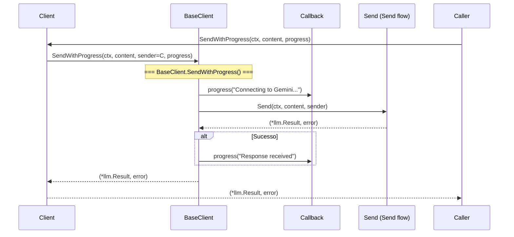

# Fluxo: Envio com Progresso (`SendWithProgress`)

> **Arquivos:** `client.go` + `llmbase/sender.go`
> **Arquitetura:** Wrapper + Callback de progresso

---

## Mermaid — Diagrama de Sequência



---

## Mermaid — Diagrama de Atividade

```mermaid
flowchart TD
    A[Entrada: ctx, content, progress callback] --> B[BaseClient.SendWithProgress]
    B --> C[Callback: 'Connecting to Gemini...']
    C --> D[BaseClient.Send ctx, content, sender]
    D --> E[Fluxo Send completo\nBuildRequest → HTTP → ParseResponse]
    E --> F{Send sucesso?}
    F -- sim --> G[Callback: 'Response received']
    F -- não --> H[Sem callback de erro]
    G --> I[Retorna (*llm.Result, nil)]
    H --> J[Retorna (nil, error)]
    I --> K[Saída]
    J --> K
```

---

## Descrição Textual

1. `Client.SendWithProgress()` é um wrapper direto para `BaseClient.SendWithProgress()`.
2. `BaseClient.SendWithProgress()`:
   - Chama `progress("Connecting to Gemini...")` **antes** de iniciar a requisição.
   - Chama `BaseClient.Send(ctx, content, sender, progress)` (mesmo fluxo do Send).
   - Se `Send` retorna sem erro, chama `progress("Response received")`.
   - Se `Send` retorna erro, **não** chama o callback — o erro é retornado ao chamador.
3. O `Client` passa a si mesmo como `sender`, então todos os 6 métodos `llmbase.Sender` são invocados.

---

## Callbacks Invocados

| Ordem | Mensagem | Condição |
|-------|----------|----------|
| 1 | `"Connecting to Gemini..."` | Sempre, antes da requisição |
| 2 | `"Response received"` | Apenas se Send() retorna nil (sucesso) |

---

## Observações

- 🟡 **INFERIDO** — Não há callback para progresso intermediário (e.g., "Request sent", "Parsing response"). O fluxo é binário: conectado → recebido/falhou.
- O callback de progresso é puramente informativo e não afeta o fluxo de dados.
- O `Client` não intercepta o callback — é invocado diretamente pelo `BaseClient`.
