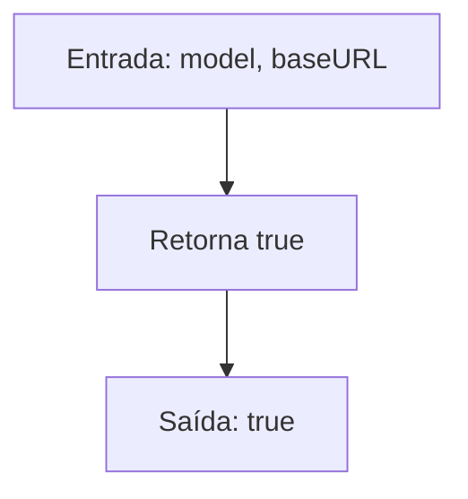

# Fluxo: Validação de Modelos (`ValidModels` / `IsKnownModel`)

> **Arquivo:** `models.go`
> **Status:** `IsKnownModel` é um stub — sempre retorna `true`

---

## 6.1 `ValidModels()`

```mermaid
flowchart TD
    A[Entrada: -] --> B[Retorna array hardcoded]
    B --> C[Array de 5 strings]
    C --> D["gemini-2.5-flash"]
    C --> E["gemini-2.5-pro"]
    C --> F["gemini-2.0-flash"]
    C --> G["gemini-1.5-flash"]
    C --> H["gemini-1.5-pro"]
    D --> I[Saída: []string]
    E --> I
    F --> I
    G --> I
    H --> I
```

**Lista de modelos:**

| Índice | Modelo | Geração |
|--------|--------|---------|
| 0 | `gemini-2.5-flash` | 2.5, Flash |
| 1 | `gemini-2.5-pro` | 2.5, Pro |
| 2 | `gemini-2.0-flash` | 2.0, Flash |
| 3 | `gemini-1.5-flash` | 1.5, Flash |
| 4 | `gemini-1.5-pro` | 1.5, Pro |

---

## 6.2 `IsKnownModel(model, baseURL string) bool`



**Comportamento:** Sempre retorna `true`. Qualquer string de modelo é aceita.

**Comentário no código:**
> "Model validation removed to allow custom/preview models."
> "Deprecated: This function no longer validates models."

**Nota:** 🟡 **INFERIDO** — A função `ValidModels()` ainda existe e é testada, mas `IsKnownModel()` é o único ponto de validação que poderia ser chamado por código externo. Como sempre retorna `true`, não há validação efetiva de modelos neste pacote.

---

## Observações

- `ValidModels()` parece ser mantido como referência/lista de modelos suportados, mas não é chamado em nenhum fluxo de código visível.
- `IsKnownModel()` é um stub que aceita qualquer modelo, incluindo modelos de outros providers (e.g., `"gpt-4"`, `"claude"`).
- A validação de modelo (se existir) deve estar em outro lugar (e.g., registro de providers ou config layer).
