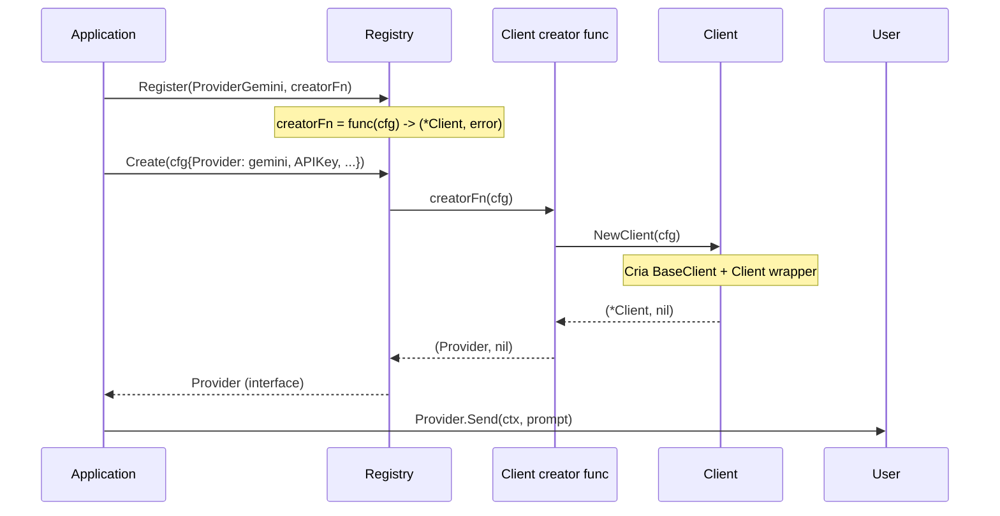

# Fluxo: Integração com o Registro de Providers (`Registry`)

> **Arquivos:** `client.go` + `core/llm/registry.go`
> **Arquitetura:** Registry Pattern com `ProviderCreator`

---

## Mermaid — Diagrama de Sequência



---

## Mermaid — Diagrama de Atividade

```mermaid
flowchart TD
    A[Start: App registra provider] --> B[Registry.Register(ProviderGemini, creatorFn)]
    B --> C[creatorFn = func(cfg llm.Config) (Provider, error)]
    C --> D[// Internamente chama: NewClient(cfg)]
    D --> E{App pede Create(cfg)?}
    E -- sim --> F[Registry.Create(cfg)]
    F --> G{ProviderType registrado?}
    G -- não --> H[Erro: 'unsupported provider: <type>']
    G -- sim --> I[Invoca creatorFn(cfg)]
    I --> J[NewClient(cfg)]
    J --> K{APIKey válido?}
    K -- não --> L[Erro: 'api key is required']
    K -- sim --> M[Cria BaseClient com defaults Gemini]
    M --> N[Retorna *Client as Provider interface]
    N --> O[User chama Provider.Send(ctx, prompt)]
    O --> P[Fluxo Send completo]
    P --> Q[Retorna *llm.Result]
    H --> R[End]
    L --> R
    Q --> R
    E -- não --> S[Provider não criado]
    S --> R
```

---

## Como o Client é Registrado

Embora o código exato de registro não esteja em `geminiapi`, o padrão é:

```go
// Registration (em outro pacote, provavelmente internal/platform ou internal/app)
registry := llm.NewRegistry()
registry.Register(llm.ProviderGemini, func(cfg llm.Config) (llm.Provider, error) {
    return geminiapi.NewClient(cfg)
})
```

O `ProviderCreator` (`func(cfg llm.Config) (Provider, error)`) é exatamente a assinatura de `NewClient`.

---

## Dados do Ciclo de Vida

| Fase | Entidade | Responsável |
|------|----------|-------------|
| Registro | `Registry.Register(ProviderGemini, creator)` | Aplicação / main |
| Criação | `Registry.Create(cfg{Provider: gemini})` | `Registry.Create()` |
| Instanciação | `NewClient(cfg)` | `geminiapi.NewClient()` |
| Uso | `provider.Send(ctx, content)` | Aplicação |
| Destruição | Go GC | Go runtime |

---

## Observações

- O `Client` implementa `llm.Provider` via composição com `BaseClient` (que implementa `Name()`, `IsAvailable()`, `IsConfigured()`, `ValidateConfig()`).
- `Send()` e `SendWithProgress()` são métodos diretos do `Client`, não herdados.
- `IsAvailable()` sempre retorna `true` (herdado de `BaseClient` — provedor HTTP sempre disponível se houver internet).
