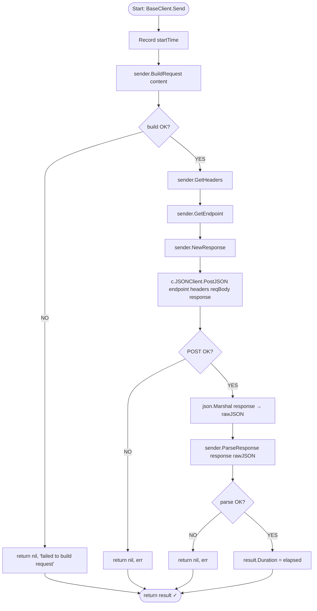

# Flowchart: Consumer Integration (`llmbase.BaseClient.Send`)

> **Caller:** `internal/platform/llmbase.BaseClient.Send(ctx, content, sender) (*llm.Result, error)`
> **Location:** `internal/platform/llmbase/base_client.go:108`
> **Flow:** How LLM providers wire into the `http` package

---

## Mermaid diagram



---

## Step-by-step trace

| # | Step | Called on | Description |
|---|------|-----------|-------------|
| 1 | `time.Now()` | `BaseClient` | Record start for duration tracking |
| 2 | `sender.BuildRequest(content)` | Provider impl (e.g. `openai.Client`) | Build provider-specific JSON payload |
| 3 | `sender.GetHeaders()` | Provider impl | Provider-specific headers (e.g. `Authorization: Bearer <key>`) |
| 4 | `sender.GetEndpoint()` | Provider impl | API path (e.g. `"/chat/completions"`) |
| 5 | `sender.NewResponse()` | Provider impl | Allocate empty response struct for unmarshalling |
| 6 | `c.JSONClient.PostJSON(ctx, endpoint, headers, reqBody, response)` | **internal/platform/http** | **HTTP POST — delegates to this module** |
| 7 | `json.Marshal(response)` | `BaseClient` | Serialize for `rawJSON` in `llm.Result` |
| 8 | `sender.ParseResponse(response, rawJSON)` | Provider impl | Extract `*llm.Result` from provider-specific response |
| 9 | `result.Duration = time.Since(startTime)` | `BaseClient` | Attach duration |
| 10 | Return | `BaseClient` | `*llm.Result` |

---

## Provider-specific wiring

Each LLM provider (`openai`, `anthropic`, `geminiapi`) implements the `Sender` interface:

| Method | OpenAI | Anthropic | Gemini |
|--------|--------|-----------|--------|
| `BuildRequest` | `ChatCompletionRequest{Model, Messages}` | `map[string]interface{}` with model, messages | `map[string]interface{}` with contents |
| `ParseResponse` | Extract `Choices[0].Message.Content` + `Usage` | Extract `Content[0].Text` + usage | Extract candidates + usage |
| `GetEndpoint` | `"/chat/completions"` | `"/v1/messages"` | Dynamic URL with API key |
| `GetHeaders` | `Authorization: Bearer <key>` | `x-api-key: <key>`, `anthropic-version` | No headers (key in URL) |
| `NewResponse` | `&ChatCompletionResponse{}` | `&anthropicResponse{}` | `&geminiResponse{}` |

---

## Integration summary

```
┌────────────────────┐     ┌─────────────────────┐     ┌──────────────────┐
│  Provider Client   │     │   BaseClient        │     │  JSONClient       │
│  (Sender impl)     │────►│   .Send(ctx,...)    │────►│  .PostJSON(...)  │
│                    │     │                     │     │                  │
│  BuildRequest      │     │  BuildRequest       │     │  json.Marshal    │
│  ParseResponse     │     │  GetHeaders         │     │  HTTP POST       │
│  GetEndpoint       │     │  GetEndpoint        │     │  json.Unmarshal  │
│  GetHeaders        │     │  NewResponse        │     │                  │
│  NewResponse       │     │  HandleHTTPError    │     │  HTTPError type  │
│  GetProviderName   │     │                     │     │                  │
└────────────────────┘     └─────────────────────┘     └──────────────────┘
```
