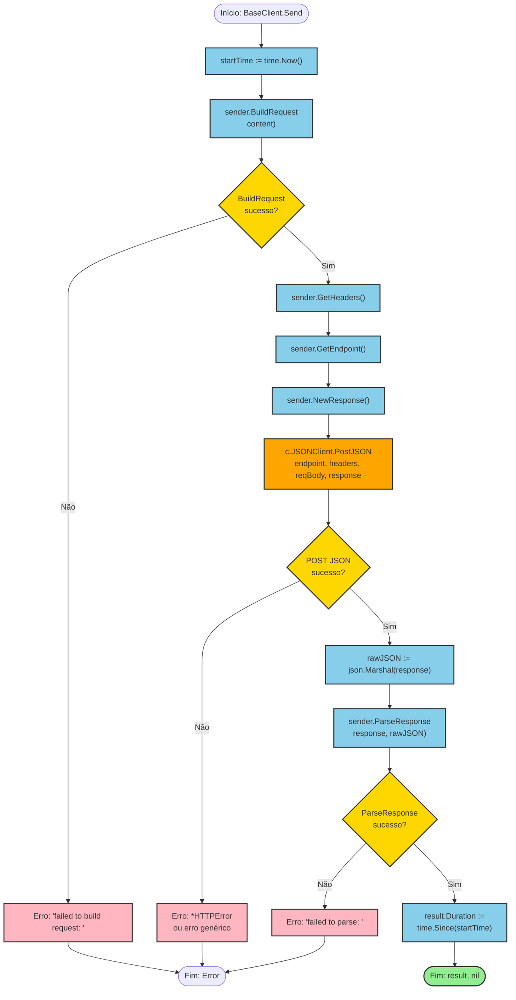
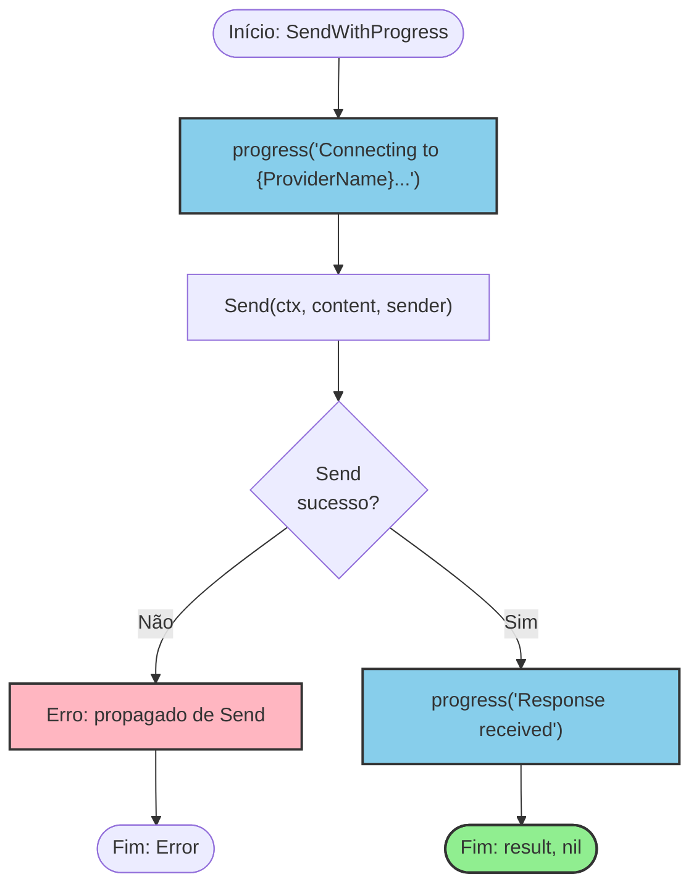

# Fluxograma: Envio de Prompt LLM (`BaseClient.Send`)

**Arquivo fonte:** `base_client.go:84-108`
**Método:** `func (c *BaseClient) Send(ctx context.Context, content string, sender Sender)`
**Iniciador:** `openai.Client.Send()`, `anthropic.Client.Send()`, `geminiapi.Client.Send()`

---

## Fluxograma Mermaid



---

## Detalhamento Passo a Passo

### Etapa 0: Marcação de Tempo
**Linha:** `base_client.go:86`

```go
startTime := time.Now()
```
- Registra o timestamp de início para cálculo de duração.
- Usado apenas para o campo `result.Duration` no retorno.
- **Nota:** Se falhas ocorrerem nas etapas seguintes, o duration será zero/negativo.

---

### Etapa 1: Build do Request (Provider-Specific)
**Linha:** `base_client.go:88-90`

```go
reqBody, err := sender.BuildRequest(content)
if err != nil {
    return nil, fmt.Errorf("failed to build request: %w", err)
}
```

**Comportamento por provider:**

| Provider | Estrutura do Request | Campos Inclusos |
|----------|---------------------|-----------------|
| OpenAI | `ChatCompletionRequest` | `model`, `messages` (role: user, content), `max_tokens` (se > 0) |
| Anthropic | `MessagesRequest` | `model`, `max_tokens`, `messages` (role: user, content) |
| Gemini | `GenerateRequest` | `contents` (parts[{text}]), `generationConfig.maxOutputTokens` |

**Detalhes por provider:**

#### OpenAI — `BuildRequest`
- Linhas: `openai/client.go:62-72`
- Cria `ChatCompletionRequest{Model: c.Model, Messages: [{Role:"user", Content: content}]}`
- Se `c.MaxTokens > 0`, adiciona `MaxTokens` ao request
- **Limitação:** Sempre usa apenas uma mensagem do tipo `user`. Não suporta system prompts ou multi-turn.

#### Anthropic — `BuildRequest`
- Linhas: `anthropic/client.go:84-91`
- Cria `MessagesRequest{Model: c.Model, MaxTokens: c.MaxTokens, Messages: [{Role:"user", Content: content}]}`
- Sempre inclui `MaxTokens` (padrão do BaseClient)
- **Limitação:** Mesma limitação de single-turn.

#### Gemini — `BuildRequest`
- Linhas: `geminiapi/client.go:82-90`
- Cria `GenerateRequest{Contents: [{Parts: [{Text: content}]}], GenerationConfig: {MaxOutputTokens: c.MaxTokens}}`
- Nomenclatura diferente: `MaxOutputTokens` ao invés de `MaxTokens`
- **Limitação:** Mesma limitação de single-turn.

**Retorno:** `interface{}` — qualquer struct serializável para JSON.

---

### Etapa 2: Obtenção de Metadados
**Linha:** `base_client.go:92-94`

```go
headers := sender.GetHeaders()
endpoint := sender.GetEndpoint()
response := sender.NewResponse()
```

Três chamadas provider-specific em sequência:

#### `GetHeaders()`
| Provider | Headers Retornados |
|----------|-------------------|
| OpenAI | `{"Authorization": "Bearer <API_KEY>"}` |
| Anthropic | `{"x-api-key": "<API_KEY>", "anthropic-version": "2023-06-01"}` |
| Gemini | `{}` (vazio — auth via URL query param) |

#### `GetEndpoint()`
| Provider | Endpoint Retornado |
|----------|-------------------|
| OpenAI | `"/chat/completions"` |
| Anthropic | `"/v1/messages"` |
| Gemini | `"/models/{model}:generateContent?key={API_KEY}"` |

**Nota de segurança:** Gemini inclui a API key na URL, o que pode expô-la em logs de servidor proxy, logs de HTTP, history de shell, etc. OpenAI e Anthropic usam headers.

#### `NewResponse()`
| Provider | Tipo Retornado |
|----------|---------------|
| OpenAI | `*ChatCompletionResponse` |
| Anthropic | `*MessagesResponse` |
| Gemini | `*GenerateResponse` |

Cada struct tem campos específicos para o formato de resposta da API correspondente.

---

### Etapa 3: Envio HTTP
**Linha:** `base_client.go:96`

```go
err = c.JSONClient.PostJSON(ctx, endpoint, headers, reqBody, response)
```

**Sub-fluxo interno de `JSONClient.PostJSON`:**

```
1. json.Marshal(reqBody) → jsonBody
   └─ Se falhar: return "failed to marshal request: <err>"
2. nethttp.NewRequestWithContext(ctx, POST, baseURL + path, jsonBody)
   └─ Se falhar: return "failed to create request: <err>"
3. req.Header.Set("Content-Type", "application/json")
4. for k, v := range headers: req.Header.Set(k, v)
5. httpClient.Do(req)
   └─ Se falhar: return "request failed: <err>"
6. io.ReadAll(resp.Body)
   └─ Se falhar: return "failed to read response: <err>"
7. if resp.StatusCode != 200: return &HTTPError{StatusCode, Body}
8. json.Unmarshal(respBody, target)
   └─ Se falhar: return "failed to parse response: <err>"
9. return nil (sucesso)
```

**Detalhes importantes:**
- Timeout é aplicado pelo `http.Client` interno — se excedido, retorna erro de context deadline exceeded.
- `Content-Type: application/json` é sempre setado.
- Headers do provider (Authorization, x-api-key, etc.) são adicionados após Content-Type.
- `resp.Body` é fechado com `defer`.
- Corpo da resposta é lido completamente antes de verificar status code.

---

### Etapa 4: Marshal da Resposta
**Linha:** `base_client.go:98`

```go
rawJSON, _ := json.Marshal(response)
```
- Converte o response struct (já deserializado) de volta para JSON.
- **Erro é ignorado** (`_`). Seguro na prática pois o struct já veio de `json.Unmarshal` válido.
- `rawJSON` é passado para `ParseResponse` para permitir acesso à resposta crua.
- **Obs:** Se houver falha de marshal (rara), `rawJSON` será `nil` e `ParseResponse` pode falhar silenciosamente.

---

### Etapa 5: Parse da Resposta (Provider-Specific)
**Linha:** `base_client.go:100-102`

```go
result, err := sender.ParseResponse(response, rawJSON)
if err != nil {
    return nil, err
}
```

**Comportamento por provider:**

#### OpenAI — `ParseResponse`
- Linhas: `openai/client.go:74-100`
- Type assertion: `*ChatCompletionResponse`
- Valida `len(choices) > 0`
- Extrai `choices[0].message.content` como `Response`
- Se `usage.total_tokens > 0`, popula `*llm.Usage`
- `RawResponse = string(rawJSON)`

#### Anthropic — `ParseResponse`
- Linhas: `anthropic/client.go:93-123`
- Type assertion: `*MessagesResponse`
- Itera `msgResp.Content` blocks, concatena tipo `"text"` para formar `Response`
- Se `input_tokens > 0 || output_tokens > 0`, popula `*llm.Usage`
- `RawResponse = string(rawJSON)`

#### Gemini — `ParseResponse`
- Linhas: `geminiapi/client.go:92-132`
- Type assertion: `*GenerateResponse`
- **Verifica `genResp.Error != nil`** — retorna erro com código HTTP
- Valida `len(candidates) > 0`
- Itera `candidates[0].content.parts`, concatena `part.Text`
- Se `usage_metadata != nil`, popula `*llm.Usage`
- `RawResponse = string(rawJSON)`

---

### Etapa 6: Cálculo de Duração
**Linha:** `base_client.go:104`

```go
result.Duration = time.Since(startTime)
```
- Preenche o campo `Duration` no `llm.Result`.
- Inclui tempo total: build request + HTTP round-trip + parse response.
- Se houve erro antes, esta linha nunca é atingida (Duration não é setado).

---

### Etapa 7: Retorno de Sucesso
**Linha:** `base_client.go:105`

```go
return result, nil
```
- Retorna `*llm.Result` preenchido com `Response`, `RawResponse`, `Model`, `Provider`, `Duration`, `Usage`.

---

## Fluxos de Erro Identificados

| # | Erro | Origem | Mensagem | Causa Comum |
|---|------|--------|----------|-------------|
| 1 | BuildRequest fail | Provider sender | `failed to build request: <err>` | Erro inesperado na construção do payload |
| 2 | HTTP error | JSONClient.PostJSON | `*HTTPError` (status != 200) | 4xx (auth, model invalid), 5xx (server), network timeout |
| 3 | JSON marshal fail (request) | JSONClient.PostJSON | `failed to marshal request: <err>` | Struct inválido/impossível de serializar |
| 4 | HTTP request fail | JSONClient.PostJSON | `request failed: <err>` | DNS, network unreachable, TLS error |
| 5 | JSON parse fail (response) | JSONClient.PostJSON | `failed to parse response: <err>` | API retornou body não-JSON |
| 6 | ParseResponse fail | Provider sender | `<err>` do provider | Type assertion falhou, campo ausente, estrutura inesperada |

---

## Observações de Integração

- **`Send` é não-retryable** — qualquer erro é retornado imediatamente ao caller.
- **`Send` é blocking** — aguarda resposta completa da API antes de retornar.
- **`ctx` é propagado** — cancelamento via `context` é suportado em todas as etapas.
- **Providers embed `*BaseClient`** — chamam `c.BaseClient.Send(ctx, content, c)` passando `c` como `Sender`.
- **`HandleHTTPError` é separado** — providers chamam `c.BaseClient.HandleHTTPError(err, parseBody)` em seus métodos `handleError` para formatar erros HTTP com mensagens legíveis.

---

## Fluxograma Alternativo: `SendWithProgress`



**Diferença de `Send()`:**
- Adiciona callback `progress("Connecting to {ProviderName}...")` antes do envio.
- Adiciona callback `progress("Response received")` apenas se `Send()` retornar sucesso.
- **Limitação:** Se `Send()` falhar, o progresso não é atualizado com a razão do erro.
