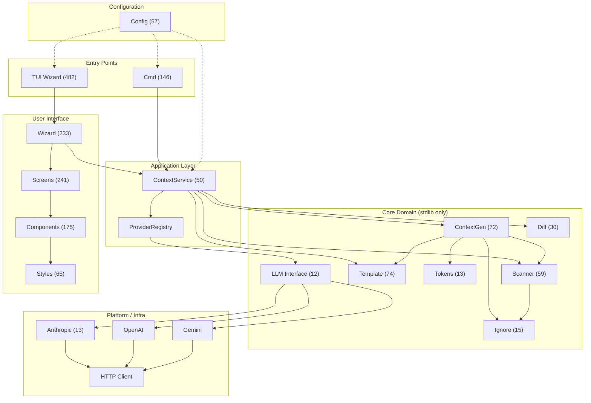

# shotgun-cli Architecture

> Auto-generated from GitNexus knowledge graph (5367 symbols, 15210 relationships, 259 execution flows, 190 clusters).  
> Last updated: 2026-05-20.

## Overview

`shotgun-cli` (module `github.com/quantmind-br/shotgun-cli`, Go 1.24) is a CLI that scans a codebase, applies layered ignore rules, and generates LLM-optimized context files — then optionally sends them to OpenAI, Anthropic, or Gemini. It exposes two front ends sharing a single application core:

- **TUI wizard** (Bubble Tea, 5 steps): launched when `shotgun-cli` runs with no args.
- **Headless CLI**: any subcommand runs without the TUI. Entry: `main.go` → `cmd.Execute()`.

The architecture follows Clean Architecture with strict one-directional imports:
- `core` never imports anything project-internal except stdlib.
- `platform` only imports `core` interfaces.
- `app` coordinates `core` + `platform` and exposes the single API both front ends call.
- `ui` depends on `app` (not the other way around).

## Functional Areas

| Area | Symbols | Cohesion | Description |
|------|---------|----------|-------------|
| **Screens** | 241 | 76% | TUI wizard screens (file selection, config, review, send) |
| **Ui** | 233 | 76% | Bubble Tea MVU framework wiring (`wizard.go`, model management) |
| **Components** | 175 | 89% | Reusable TUI components (tree widget, filter, spinner) |
| **Cmd** | 146 | 82% | CLI subcommands and composition root (`cmd/`) |
| **Template** | 74 | 85% | Output template engine and rendering |
| **Contextgen** | 72 | 86% | Context generation, tree rendering, file assembly |
| **Styles** | 65 | 84% | Lipgloss styles, color palettes, theme constants |
| **Scanner** | 59 | 83% | Filesystem scanning, directory traversal, metadata |
| **Config** | 57 | 92% | Config keys, validation, metadata, Viper integration |
| **App** | 50 | 80% | `ContextService`, `ProviderRegistry`, orchestration layer |
| **Diff** | 30 | 72% | Git diff integration, change detection |
| **E2e** | 20 | 76% | End-to-end CLI tests |
| **Ignore** | 15 | 97% | Layered ignore rules (.gitignore, .shotgunignore, etc.) |
| **Anthropic** | 13 | 100% | Anthropic LLM provider implementation |
| **Tokens** | 13 | 90% | Token counting and estimation |
| **Llm** | 12 | 87% | LLM provider abstractions and interfaces |

## Architecture Diagram



## Key Execution Flows

### 1. Context Generation → Tree Rendering (8 steps)
```
Generate (internal/core/contextgen/generator.go)
  → GenerateWithProgress
  → GenerateWithProgressEx
  → RenderTree (internal/core/contextgen/tree.go)
  → renderNode
  → formatNodeLine
  → getIgnoreIndicator
  → IsIgnored (internal/core/scanner/scanner.go)
```
**Purpose:** Produces the final LLM context string by scanning the codebase, filtering ignored files, rendering a directory tree, and formatting file contents. The `ContextService` drives this synchronously for CLI and asynchronously (with progress callbacks) for TUI.

### 2. Context Generation → File Size Formatting (8 steps)
```
Generate (internal/core/contextgen/generator.go)
  → GenerateWithProgress
  → GenerateWithProgressEx
  → RenderTree (internal/core/contextgen/tree.go)
  → renderNode
  → formatNodeLine
  → getSizeInfo
  → formatFileSize (internal/core/contextgen/tree.go)
```
**Purpose:** Decorates tree nodes with human-readable file sizes (e.g., "2.4 KB") during context rendering.

### 3. Context Generation → Child Sorting (7 steps)
```
Generate (internal/core/contextgen/generator.go)
  → GenerateWithProgress
  → GenerateWithProgressEx
  → RenderTree (internal/core/contextgen/tree.go)
  → renderNode
  → renderChildren
  → sortChildren (internal/core/contextgen/tree.go)
```
**Purpose:** Sorts directory entries alphabetically before rendering the tree output.

### 4. TUI Wizard → Tree Filter → Visibility Check (7 steps)
```
handleStepInput (internal/ui/wizard.go)
  → Update (internal/ui/screens/file_selection.go)
  → handleFilterMode
  → SetFilter (internal/ui/components/tree.go)
  → rebuildVisibleItems
  → buildVisibleItems
  → shouldShowNode (internal/ui/components/tree.go)
```
**Purpose:** When the user types in the TUI file-selection screen, the tree component rebuilds its visible items by evaluating each node against the filter string. This is the primary interactive loop of the wizard.

### 5. TUI Wizard → Tree Filter → Item Creation (7 steps)
```
handleStepInput (internal/ui/wizard.go)
  → Update (internal/ui/screens/file_selection.go)
  → handleFilterMode
  → SetFilter (internal/ui/components/tree.go)
  → rebuildVisibleItems
  → buildVisibleItems
  → treeItem (internal/ui/components/tree.go)
```
**Purpose:** Companion to flow #4 — after a node passes the visibility check, a `treeItem` Bubble Tea model is created to represent it in the viewport.

## Dependency Rules

| Layer | Allowed Imports |
|-------|-----------------|
| `cmd/` | everything (composition root) |
| `internal/ui/` | `app/`, `config/`, external (Bubble Tea, Lipgloss) |
| `internal/app/` | `core/`, `platform/`, `config/` |
| `internal/core/` | stdlib ONLY |
| `internal/platform/` | `core/` interfaces, `config/`, external SDKs |
| `internal/config/` | stdlib, Viper |

## Central Seam: `ContextService`

`internal/app/context.go` is the single API both front ends call. Key methods:

- `Generate(ctx, cfg)` — synchronous, used by CLI.
- `GenerateWithProgress(ctx, cfg, callback)` — async with progress, used by TUI.
- `SendToLLMWithProgress(ctx, content, cfg, cb)` — send generated context to a provider.

Progress callbacks are **not optional** in the TUI path — dropping them stalls the wizard UI.

## Provider Architecture

LLM providers are created only through `app.DefaultProviderRegistry.Create(...)`; never constructed directly. All providers issue HTTP via `platform/http`'s JSON client rather than raw `net/http`. The registry maps provider names ("openai", "anthropic", "gemini") to their implementations.

---

*Generated via GitNexus. Stats: 5367 nodes, 15210 edges, 259 flows, 190 clusters.*
