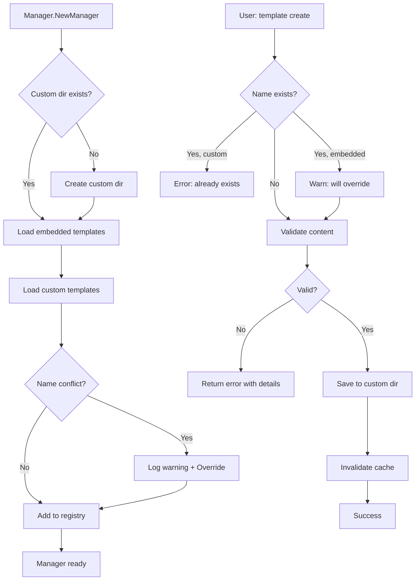

# Plano de Implementação: Suporte a Templates Customizados Globais

## 1. Sumário Executivo & Objetivos

### Objetivo Principal
Implementar suporte completo para templates customizados definidos pelo usuário a nível global, permitindo que usuários criem, gerenciem e utilizem seus próprios templates de prompt personalizado sem modificar o código-fonte da aplicação.

### Metas Chave
1. **Extensibilidade**: Permitir que usuários criem templates personalizados sem recompilar o binário
2. **Gerenciamento Global**: Templates armazenados em diretório de configuração global do usuário
3. **Integração Transparente**: Templates customizados funcionam perfeitamente ao lado dos templates embeded
4. **Experiência de Usuário**: Interface CLI e TUI intuitiva para gerenciar templates customizados

---

## 2. Análise da Situação Atual

### 2.1. Arquitetura Atual de Templates

**Sistema de Templates Embeded:**
- Templates armazenados em `templates/` e embeded no binário via `//go:embed`
- Carregamento através de `assets.Templates` (embed.FS)
- Manager carrega templates do filesystem embeded em `internal/core/template/manager.go:54-85`
- Estrutura de arquivo: `.md` com variáveis no formato `{VAR_NAME}`

**Fluxo de Processamento:**
```
embed.FS → Manager.loadTemplates() → parseTemplate() → Template struct → Renderer.RenderTemplate()
```

**Estrutura do Template:**
```go
type Template struct {
    Name         string   // Nome do template (sem extensão .md)
    Description  string   // Extraída do primeiro comentário/header
    Content      string   // Conteúdo markdown com variáveis
    RequiredVars []string // Variáveis extraídas via regex {VAR_NAME}
    FilePath     string   // Path original do arquivo
    IsEmbedded   bool     // Flag indicando origem (sempre true atualmente)
}
```

### 2.2. Limitações Atuais

1. **Imutabilidade**: Templates só podem ser adicionados modificando o código-fonte
2. **Distribuição**: Novos templates requerem rebuild e redistribuição do binário
3. **Personalização Limitada**: Usuários não podem adaptar templates para seu workflow
4. **Sem Versionamento de Usuário**: Impossível manter templates customizados versionados separadamente

### 2.3. Comandos CLI Existentes

**Template List** (`cmd/template.go:20-71`):
- Lista todos templates disponíveis
- Exibe nome e descrição em formato tabular

**Template Render** (`cmd/template.go:73-226`):
- Renderiza template com variáveis via `--var key=value`
- Valida variáveis requeridas antes de renderizar
- Suporta output para stdout ou arquivo via `-o`

### 2.4. Integração TUI

**Template Selection Screen** (`internal/ui/screens/template_selection.go`):
- Lista templates em interface navegável (↑/↓)
- Exibe descrição e variáveis requeridas do template selecionado
- Marca visualmente template selecionado com ✓

---

## 3. Solução Proposta: Sistema Dual de Templates

### 3.1. Visão Arquitetural de Alto Nível

**Estratégia: Sistema Dual com Priorização**

```
┌─────────────────────────────────────────────────────────────┐
│                    Template Manager                          │
│                                                              │
│  ┌──────────────────┐         ┌──────────────────────┐     │
│  │  Embedded Source │         │  Custom Source       │     │
│  │  (embed.FS)      │         │  (Filesystem)        │     │
│  └────────┬─────────┘         └──────────┬───────────┘     │
│           │                               │                  │
│           ▼                               ▼                  │
│  ┌─────────────────────────────────────────────────┐        │
│  │        Template Registry (map[string]*Template) │        │
│  │                                                  │        │
│  │  - Embedded templates carregados primeiro       │        │
│  │  - Custom templates podem sobrescrever          │        │
│  │  - Metadata indica origem (IsEmbedded field)    │        │
│  └─────────────────────────────────────────────────┘        │
│                                                              │
└─────────────────────────────────────────────────────────────┘

Diretórios de Template (por plataforma):
├── Linux:   ~/.config/shotgun-cli/templates/
├── macOS:   ~/Library/Application Support/shotgun-cli/templates/
└── Windows: %APPDATA%/shotgun-cli/templates/
```

### 3.2. Componentes Principais

#### A. Template Source Interface (Nova Abstração)

**Arquivo**: `internal/core/template/source.go`

```go
// TemplateSource define interface para diferentes fontes de templates
type TemplateSource interface {
    // Load carrega templates da fonte
    Load() (map[string]*Template, error)

    // GetSourceType retorna tipo da fonte (embedded/custom)
    GetSourceType() SourceType

    // GetBasePath retorna path base da fonte (se aplicável)
    GetBasePath() string
}

type SourceType string

const (
    SourceTypeEmbedded SourceType = "embedded"
    SourceTypeCustom   SourceType = "custom"
)

// EmbeddedSource implementa TemplateSource para templates embeded
type EmbeddedSource struct {
    fs fs.FS
}

// CustomSource implementa TemplateSource para templates do filesystem
type CustomSource struct {
    basePath string
}
```

**Justificativa**: Abstração permite adicionar novas fontes no futuro (ex: templates de projetos específicos, se necessário) e simplifica teste unitário.

#### B. Enhanced Template Struct

**Modificações em**: `internal/core/template/template.go`

```go
type Template struct {
    Name         string
    Description  string
    Content      string
    RequiredVars []string
    FilePath     string
    IsEmbedded   bool
    SourceType   SourceType  // NOVO: tipo de fonte
    CreatedAt    time.Time   // NOVO: timestamp criação (custom apenas)
    ModifiedAt   time.Time   // NOVO: timestamp modificação (custom apenas)
    Author       string      // NOVO: autor do template (opcional, custom apenas)
}
```

#### C. Refactored Template Manager

**Modificações em**: `internal/core/template/manager.go`

```go
type Manager struct {
    templates map[string]*Template
    sources   []TemplateSource  // NOVO: múltiplas fontes
    mu        sync.RWMutex
    renderer  *Renderer
}

// NewManager inicializa com múltiplas fontes
func NewManager() (*Manager, error)

// NewManagerWithCustomPath permite especificar path customizado (para testes)
func NewManagerWithCustomPath(customPath string) (*Manager, error)

// loadFromSources carrega templates de todas as fontes
func (m *Manager) loadFromSources() error

// CreateCustomTemplate cria novo template customizado
func (m *Manager) CreateCustomTemplate(name, content string) error

// UpdateCustomTemplate atualiza template customizado existente
func (m *Manager) UpdateCustomTemplate(name, content string) error

// DeleteCustomTemplate remove template customizado
func (m *Manager) DeleteCustomTemplate(name string) error

// GetCustomTemplatesPath retorna path do diretório de templates customizados
func (m *Manager) GetCustomTemplatesPath() string

// IsCustomTemplate verifica se template é customizado
func (m *Manager) IsCustomTemplate(name string) bool
```

### 3.3. Plano de Ação Detalhado

#### **FASE 1: Fundação - Abstração e Infraestrutura**

**Objetivo**: Criar abstrações necessárias e infraestrutura de carregamento dual

**Prioridade**: ALTA (bloqueante para demais fases)

---

**Task 1.1: Criar Template Source Interface**
- **Arquivo**: `internal/core/template/source.go`
- **Descrição**: Implementar interface `TemplateSource` e implementações `EmbeddedSource` e `CustomSource`
- **Rationale**: Desacopla lógica de carregamento da fonte de dados, permitindo extensibilidade futura
- **Critérios de Conclusão**:
  - Interface `TemplateSource` definida com métodos `Load()`, `GetSourceType()`, `GetBasePath()`
  - `EmbeddedSource` implementada para templates embeded
  - `CustomSource` implementada para filesystem
  - Testes unitários cobrindo ambas implementações
- **Estimativa**: M (2-3 dias)
- **Dependências**: Nenhuma

**Detalhamento Técnico**:
```go
// EmbeddedSource.Load()
- Reutilizar lógica atual de loadTemplates()
- Retornar map[string]*Template com IsEmbedded=true

// CustomSource.Load()
- Verificar se diretório existe (criar se não existir)
- Ler todos arquivos .md do diretório
- Para cada arquivo:
  - Ler conteúdo
  - Chamar parseTemplate() existente
  - Adicionar metadata: IsEmbedded=false, timestamps, etc.
  - Validar template com validateTemplateContent()
- Retornar map[string]*Template
```

---

**Task 1.2: Implementar Path de Templates Customizados Multiplataforma**
- **Arquivo**: `internal/core/template/paths.go` (novo)
- **Descrição**: Funções para obter diretório de templates customizados respeitando convenções de cada OS
- **Rationale**: Garantir compatibilidade com convenções de cada plataforma
- **Critérios de Conclusão**:
  - Função `GetCustomTemplatesDir()` implementada
  - Suporte para Linux (`~/.config/shotgun-cli/templates/`)
  - Suporte para macOS (`~/Library/Application Support/shotgun-cli/templates/`)
  - Suporte para Windows (`%APPDATA%/shotgun-cli/templates/`)
  - Função `EnsureCustomTemplatesDir()` cria diretório se não existir
  - Testes para todas as plataformas (usando build tags)
- **Estimativa**: S (1 dia)
- **Dependências**: Nenhuma

**Detalhamento Técnico**:
```go
func GetCustomTemplatesDir() (string, error) {
    switch runtime.GOOS {
    case "windows":
        return filepath.Join(os.Getenv("APPDATA"), "shotgun-cli", "templates"), nil
    case "darwin":
        home, _ := os.UserHomeDir()
        return filepath.Join(home, "Library", "Application Support", "shotgun-cli", "templates"), nil
    default: // Linux e outros
        if xdg := os.Getenv("XDG_CONFIG_HOME"); xdg != "" {
            return filepath.Join(xdg, "shotgun-cli", "templates"), nil
        }
        home, _ := os.UserHomeDir()
        return filepath.Join(home, ".config", "shotgun-cli", "templates"), nil
    }
}

func EnsureCustomTemplatesDir() error {
    dir, err := GetCustomTemplatesDir()
    if err != nil {
        return err
    }
    return os.MkdirAll(dir, 0755)
}
```

---

**Task 1.3: Refatorar Template Manager para Suportar Múltiplas Fontes**
- **Arquivo**: `internal/core/template/manager.go`
- **Descrição**: Modificar Manager para carregar templates de múltiplas fontes com priorização
- **Rationale**: Permitir coexistência de templates embeded e customizados
- **Critérios de Conclusão**:
  - Manager inicializa com slice de `TemplateSource`
  - Método `loadFromSources()` carrega de todas as fontes
  - Custom templates sobrescrevem embedded se houver conflito de nome
  - Metadata `SourceType` preservada em cada Template
  - Backward compatibility mantida (API pública inalterada)
  - Testes unitários atualizados
- **Estimativa**: M (2-3 dias)
- **Dependências**: Task 1.1, Task 1.2

**Lógica de Priorização**:
```
1. Carregar embedded templates primeiro (prioridade baixa)
2. Carregar custom templates depois (prioridade alta)
3. Se custom template tem mesmo nome que embedded:
   - Sobrescrever entrada no map
   - Log warning sobre override
4. Resultado final: map unificado com custom templates tendo precedência
```

---

**Task 1.4: Estender Template Struct com Metadata Adicional**
- **Arquivo**: `internal/core/template/template.go`
- **Descrição**: Adicionar campos para metadata de templates customizados
- **Rationale**: Permitir tracking de origem, timestamps e autoria
- **Critérios de Conclusão**:
  - Campos `SourceType`, `CreatedAt`, `ModifiedAt`, `Author` adicionados
  - Função `parseTemplate()` atualizada para extrair metadata de custom templates
  - Metadata opcional extraída de frontmatter YAML (se presente)
  - Serialização/deserialização funcional (para futuro export/import)
  - Testes unitários para parsing de metadata
- **Estimativa**: S (1 dia)
- **Dependências**: Task 1.1

**Formato de Template Customizado com Metadata** (opcional):
```markdown
---
author: John Doe
created: 2025-10-02
tags: [code-review, golang]
---

# Code Review Template

Review the following code...

Variables:
- {CODE_SNIPPET}
- {LANGUAGE}
```

---

#### **FASE 2: Comandos CLI para Gerenciamento**

**Objetivo**: Implementar comandos CLI completos para CRUD de templates customizados

**Prioridade**: ALTA

---

**Task 2.1: Comando `template create`**
- **Arquivo**: `cmd/template.go`
- **Descrição**: Comando para criar novo template customizado
- **Rationale**: Interface primária para usuários criarem templates
- **Critérios de Conclusão**:
  - Comando `shotgun-cli template create <name>` implementado
  - Flag `--content` para especificar conteúdo inline
  - Flag `--file` para ler conteúdo de arquivo
  - Flag `--editor` para abrir editor padrão ($EDITOR)
  - Flag `--description` para adicionar descrição
  - Validação: nome não pode conflitar com embedded templates (warning se sobrescrever)
  - Validação de template usando `validateTemplateContent()`
  - Extração automática de variáveis requeridas
  - Preview do template antes de salvar (modo interativo)
- **Estimativa**: M (2 dias)
- **Dependências**: Fase 1 completa

**Exemplos de Uso**:
```bash
# Criar com conteúdo inline
shotgun-cli template create my-template --content "Review {CODE}..."

# Criar a partir de arquivo
shotgun-cli template create my-template --file ./my-template.md

# Abrir editor interativo
shotgun-cli template create my-template --editor

# Com descrição
shotgun-cli template create my-template --file ./template.md --description "My custom review template"
```

---

**Task 2.2: Comando `template edit`**
- **Arquivo**: `cmd/template.go`
- **Descrição**: Editar template customizado existente
- **Rationale**: Permitir modificação de templates sem recriar
- **Critérios de Conclusão**:
  - Comando `shotgun-cli template edit <name>` implementado
  - Abre template em editor padrão ($EDITOR)
  - Flag `--content` para substituição inline
  - Validação pré-salvamento
  - Backup automático antes de modificar (`.bak` suffix)
  - Erro se template não existe ou é embedded
  - Atualização do timestamp `ModifiedAt`
- **Estimativa**: S (1 dia)
- **Dependências**: Task 2.1

**Detalhamento**:
```bash
# Editar no editor padrão
shotgun-cli template edit my-template

# Substituir conteúdo inline
shotgun-cli template edit my-template --content "New content..."

# Sistema de backup:
~/.config/shotgun-cli/templates/my-template.md
~/.config/shotgun-cli/templates/my-template.md.bak  # backup automático
```

---

**Task 2.3: Comando `template delete`**
- **Arquivo**: `cmd/template.go`
- **Descrição**: Remover template customizado
- **Rationale**: Gerenciamento completo de ciclo de vida
- **Critérios de Conclusão**:
  - Comando `shotgun-cli template delete <name>` implementado
  - Flag `--force` para pular confirmação
  - Confirmação interativa por padrão ("Are you sure?")
  - Erro se template não existe ou é embedded
  - Opção de mover para lixeira ao invés de deletar permanentemente
  - Log de operação
- **Estimativa**: S (1 dia)
- **Dependências**: Task 2.1

---

**Task 2.4: Comando `template show`**
- **Arquivo**: `cmd/template.go`
- **Descrição**: Exibir detalhes de um template
- **Rationale**: Inspeção de templates e debugging
- **Critérios de Conclusão**:
  - Comando `shotgun-cli template show <name>` implementado
  - Exibe metadata completa (nome, descrição, source type, timestamps, autor)
  - Flag `--content` para exibir conteúdo completo
  - Flag `--preview` para renderizar com valores placeholder
  - Flag `--path` para mostrar caminho do arquivo
  - Lista de variáveis requeridas
  - Output formatado (pode usar lipgloss para styling)
- **Estimativa**: S (1 dia)
- **Dependências**: Task 2.1

**Exemplo de Output**:
```
Template: my-review-template
─────────────────────────────────────────
Source:       custom
Description:  Code review template for Go
Author:       John Doe
Created:      2025-10-02 10:30:00
Modified:     2025-10-02 15:45:00
Path:         ~/.config/shotgun-cli/templates/my-review-template.md

Required Variables:
  • CODE_SNIPPET
  • LANGUAGE
  • REVIEWER_NOTES

Use --content to view template content
Use --preview to see rendered preview
```

---

**Task 2.5: Atualizar `template list` para Diferenciar Fontes**
- **Arquivo**: `cmd/template.go`
- **Descrição**: Melhorar output de `list` para indicar origem dos templates
- **Rationale**: Usuários precisam saber quais templates são customizados
- **Critérios de Conclusão**:
  - Indicador visual de origem (emoji ou símbolo)
  - Flag `--source` para filtrar por tipo (embedded/custom/all)
  - Sorting: custom templates primeiro, depois embedded
  - Flag `--verbose` para mostrar path e metadata adicional
  - Color coding (custom = verde, embedded = azul)
- **Estimativa**: S (1 dia)
- **Dependências**: Fase 1 completa

**Exemplo de Output**:
```
Available Templates:
════════════════════════════════════════════════════════════

Custom Templates:
  📝 my-review          My custom code review template
  📝 quick-refactor     Quick refactoring guide

Embedded Templates:
  📦 analyzeBug         For analyzing and debugging issues
  📦 makeDiffGitFormat  For creating git-format diff files
  📦 makePlan           For project planning and task breakdown
  📦 projectManager     For project management tasks

Total: 6 templates (2 custom, 4 embedded)
```

---

**Task 2.6: Comando `template validate`**
- **Arquivo**: `cmd/template.go`
- **Descrição**: Validar template sem salvar
- **Rationale**: Debugging e verificação de sintaxe
- **Critérios de Conclusão**:
  - Comando `shotgun-cli template validate <name-or-file>` implementado
  - Valida template existente ou arquivo
  - Verifica sintaxe de variáveis
  - Verifica balanceamento de chaves
  - Lista variáveis detectadas
  - Exit code 0 se válido, 1 se inválido
  - Output detalhado de erros com linha/coluna
- **Estimativa**: S (1 dia)
- **Dependências**: Task 2.1

---

**Task 2.7: Comandos `template import/export`**
- **Arquivo**: `cmd/template.go`
- **Descrição**: Importar/exportar templates customizados
- **Rationale**: Compartilhamento e backup de templates
- **Critérios de Conclusão**:
  - Comando `shotgun-cli template export <name> --output file.md` implementado
  - Comando `shotgun-cli template import <file.md>` implementado
  - Flag `--all` para exportar todos custom templates (cria tar.gz)
  - Metadata preservada no export (frontmatter YAML)
  - Validação no import
  - Detecção de conflitos no import (sobrescrever ou renomear)
- **Estimativa**: M (2 dias)
- **Dependências**: Task 2.1

**Formato de Export**:
```markdown
---
name: my-template
description: My custom template
author: John Doe
created: 2025-10-02T10:30:00Z
source: custom
---

# Template Content

{VARIABLES} go here...
```

---

#### **FASE 3: Integração TUI (Wizard)**

**Objetivo**: Integrar templates customizados na interface TUI do wizard

**Prioridade**: MÉDIA

---

**Task 3.1: Atualizar Template Selection Screen**
- **Arquivo**: `internal/ui/screens/template_selection.go`
- **Descrição**: Adicionar indicadores visuais para templates customizados
- **Rationale**: Usuários precisam distinguir templates no TUI
- **Critérios de Conclusão**:
  - Ícone/badge diferenciado para custom templates (📝 vs 📦)
  - Seção separada ou agrupamento visual (Custom / Embedded)
  - Tooltip/descrição expandida mostra source type
  - Color coding consistente com CLI (usando lipgloss)
  - Path exibido para custom templates (ao pressionar 'i' para info)
- **Estimativa**: M (2 dias)
- **Dependências**: Fase 2 (Task 2.5)

**Mockup Visual**:
```
┌─ Choose Template ────────────────────────────────┐
│                                                   │
│  Custom Templates                                 │
│  ▶ 📝 my-review          My custom review         │
│    📝 quick-refactor     Quick refactoring guide  │
│                                                   │
│  Embedded Templates                               │
│    📦 analyzeBug         For analyzing bugs       │
│    📦 makePlan           For project planning     │
│                                                   │
│  Description:                                     │
│  My custom code review template for Go projects   │
│                                                   │
│  Required Variables:                              │
│    • CODE_SNIPPET                                 │
│    • LANGUAGE                                     │
│                                                   │
│  ↑/↓: Navigate  Enter: Select  i: Info  F1: Help  │
└───────────────────────────────────────────────────┘
```

---

**Task 3.2: Template Quick Actions no TUI**
- **Arquivo**: `internal/ui/screens/template_selection.go`
- **Descrição**: Ações rápidas para templates customizados no TUI
- **Rationale**: Gerenciamento conveniente sem sair do wizard
- **Critérios de Conclusão**:
  - Pressionar 'e' em custom template abre editor externo
  - Pressionar 'd' deleta custom template (com confirmação)
  - Pressionar 'c' clona template (embedded→custom ou custom→custom)
  - Pressionar 'v' valida template e exibe erros
  - Mensagens de sucesso/erro usando toast notifications
- **Estimativa**: M (2 dias)
- **Dependências**: Task 3.1, Fase 2 completa

---

**Task 3.3: Template Creation Flow no TUI**
- **Arquivo**: `internal/ui/screens/template_creation.go` (novo)
- **Descrição**: Tela de criação de template dentro do wizard
- **Rationale**: Experiência completa sem sair do TUI
- **Critérios de Conclusão**:
  - Pressionar 'n' na template selection abre tela de criação
  - Form multi-step: nome → descrição → conteúdo (textarea)
  - Preview em tempo real de variáveis detectadas
  - Validação inline
  - Opção de salvar e usar imediatamente
  - Cancelar retorna à seleção
- **Estimativa**: L (3-4 dias)
- **Dependências**: Task 3.1

---

#### **FASE 4: Validação, Testes e Qualidade**

**Objetivo**: Garantir robustez e confiabilidade do sistema

**Prioridade**: ALTA

---

**Task 4.1: Testes Unitários Completos**
- **Arquivos**: `*_test.go` em `internal/core/template/`
- **Descrição**: Cobertura de testes para toda nova funcionalidade
- **Critérios de Conclusão**:
  - Cobertura mínima de 80% para novos arquivos
  - Testes para TemplateSource (embedded e custom)
  - Testes para Manager com múltiplas fontes
  - Testes de priorização (custom override embedded)
  - Testes de validação de templates
  - Testes de paths multiplataforma (build tags)
  - Mocks para filesystem operations
- **Estimativa**: L (3-4 dias)
- **Dependências**: Fases 1-3 completas

**Casos de Teste Chave**:
```go
// Casos de sucesso
- Load embedded templates
- Load custom templates
- Custom template overrides embedded
- Create/update/delete custom template
- Path resolution por OS

// Casos de erro
- Invalid template syntax
- Missing required variables
- Permission denied no diretório custom
- Circular variable references
- Malformed YAML frontmatter
```

---

**Task 4.2: Testes End-to-End (E2E)**
- **Arquivo**: `test/e2e/template_custom_test.go` (novo)
- **Descrição**: Testes E2E para fluxos completos de templates customizados
- **Critérios de Conclusão**:
  - Teste: create → list → render → delete
  - Teste: import → validate → export
  - Teste: edit → validate → render
  - Teste: override embedded template
  - Teste: TUI template selection (usando testeable TUI driver)
  - CI/CD pipeline executando E2E tests
- **Estimativa**: M (2-3 dias)
- **Dependências**: Task 4.1

---

**Task 4.3: Validation Engine Robusto**
- **Arquivo**: `internal/core/template/validator.go` (novo)
- **Descrição**: Motor de validação avançado para templates
- **Rationale**: Prevenir templates malformados ou perigosos
- **Critérios de Conclusão**:
  - Validação de sintaxe markdown
  - Detecção de variáveis malformadas
  - Validação de balanceamento de braces (considerando code blocks)
  - Detecção de variáveis não utilizadas
  - Warning sobre templates muito grandes (>100KB)
  - Validação de frontmatter YAML
  - Sanitização de paths no template content
- **Estimativa**: M (2 dias)
- **Dependências**: Task 4.1

---

**Task 4.4: Error Handling e Recovery**
- **Arquivos**: Todos os arquivos modificados
- **Descrição**: Tratamento robusto de erros e mensagens úteis
- **Critérios de Conclusão**:
  - Todos os erros têm mensagens descritivas e contextualizadas
  - Sugestões de correção incluídas nos erros
  - Graceful degradation se diretório custom inacessível
  - Recovery de backups automático em caso de corrupção
  - Logging estruturado de operações (zerolog)
- **Estimativa**: S (1-2 dias)
- **Dependências**: Todas as tasks anteriores

---

#### **FASE 5: Documentação e Experiência do Usuário**

**Objetivo**: Documentar funcionalidade e garantir descoberta fácil

**Prioridade**: MÉDIA-ALTA

---

**Task 5.1: Atualizar README.md**
- **Arquivo**: `README.md`
- **Descrição**: Documentar nova funcionalidade de templates customizados
- **Critérios de Conclusão**:
  - Seção dedicada "Custom Templates"
  - Exemplos de uso para cada comando
  - Tutorial passo-a-passo de criação
  - Best practices e guidelines
  - Troubleshooting section
  - Links para localização de diretórios por OS
- **Estimativa**: S (1 dia)
- **Dependências**: Fase 1-4 completas

**Estrutura Sugerida**:
```markdown
## Custom Templates

### Creating Templates
...

### Managing Templates
...

### Template Syntax
...

### Examples
...

### Troubleshooting
...
```

---

**Task 5.2: CLAUDE.md e Documentação para IA**
- **Arquivo**: `CLAUDE.md`
- **Descrição**: Atualizar instruções para Claude Code sobre templates customizados
- **Critérios de Conclusão**:
  - Explicação da arquitetura dual de templates
  - Exemplos de comandos
  - Padrões de teste
  - Debugging tips
- **Estimativa**: S (meio dia)
- **Dependências**: Task 5.1

---

**Task 5.3: Help Text e Completions**
- **Arquivos**: `cmd/template.go`, `cmd/completion.go`
- **Descrição**: Help text detalhado e shell completions
- **Critérios de Conclusão**:
  - Help text (`--help`) atualizado para todos comandos
  - Exemplos incluídos no help
  - Shell completions para bash/zsh/fish atualizados
  - Completion context-aware (sugere apenas custom templates para delete/edit)
- **Estimativa**: S (1 dia)
- **Dependências**: Fase 2 completa

---

**Task 5.4: Template Examples e Starter Pack**
- **Arquivo**: `docs/template-examples.md` (novo)
- **Descrição**: Coleção de templates exemplo e starter pack
- **Critérios de Conclusão**:
  - 5-10 templates exemplo bem documentados
  - Template "meta-template" para criar novos templates
  - Categorização por caso de uso (code review, refactoring, docs, etc.)
  - README em cada categoria
  - Script de quick-start que instala examples
- **Estimativa**: M (2 dias)
- **Dependências**: Task 5.1

**Exemplos de Templates**:
```
- code-review-detailed.md
- refactor-plan.md
- api-documentation.md
- bug-investigation.md
- performance-analysis.md
- security-audit.md
- test-strategy.md
```

---

**Task 5.5: Video Tutorial / GIF Demos**
- **Arquivos**: `docs/demos/`
- **Descrição**: Demos visuais de uso de templates customizados
- **Critérios de Conclusão**:
  - GIF animado de CLI workflow
  - GIF animado de TUI workflow
  - Screencast curto (2-3 min) no YouTube
  - Embedded no README
- **Estimativa**: S (1-2 dias)
- **Dependências**: Task 5.1
- **Nota**: Pode ser feito em paralelo com outras tasks

---

#### **FASE 6: Performance, Segurança e Polimento**

**Objetivo**: Otimização e hardening

**Prioridade**: MÉDIA

---

**Task 6.1: Performance Optimization**
- **Arquivos**: `internal/core/template/`
- **Descrição**: Otimizações de performance para carregamento
- **Rationale**: Garantir startup rápido mesmo com muitos custom templates
- **Critérios de Conclusão**:
  - Lazy loading de custom templates (carregar sob demanda)
  - Cache de templates parseados em memória
  - Invalidação de cache em modificações
  - Benchmarks: carregamento <100ms para até 100 templates
  - Profiling e otimização de hotpaths
- **Estimativa**: M (2 dias)
- **Dependências**: Fase 1-4 completas

---

**Task 6.2: Security Hardening**
- **Arquivos**: `internal/core/template/`
- **Descrição**: Medidas de segurança para templates customizados
- **Rationale**: Prevenir exploits via templates maliciosos
- **Critérios de Conclusão**:
  - Sanitização de paths (prevenir directory traversal)
  - Validação de permissões de arquivo (no write-back para embedded)
  - Size limits (templates >10MB rejeitados)
  - Content sanitization (strip potential script injection)
  - Audit log de operações críticas
  - Documentation de security considerations
- **Estimativa**: M (2 dias)
- **Dependências**: Task 4.3

**Security Checks**:
```go
// Path sanitization
- Rejeitar paths com ".."
- Normalizar paths (filepath.Clean)
- Verificar que path está dentro de custom dir

// Content validation
- Strip <script> tags
- Validar que variáveis não contêm shell commands
- Size limit enforcement

// Permissions
- Verificar permissões 0644 para templates
- Error se grupo/world writable
```

---

**Task 6.3: Migration Guide e Backwards Compatibility**
- **Arquivo**: `docs/MIGRATION.md` (novo)
- **Descrição**: Garantir compatibilidade com versões anteriores
- **Critérios de Conclusão**:
  - API pública não quebrada (Manager interface preservada)
  - Versionamento de templates (schema v1, v2...)
  - Migration path de versões antigas
  - Deprecation notices para APIs antigas
  - Testes de compatibilidade
- **Estimativa**: S (1 dia)
- **Dependências**: Fase 1-5 completas

---

**Task 6.4: Monitoring e Telemetry**
- **Arquivo**: `internal/core/template/telemetry.go` (novo)
- **Descrição**: Instrumentação para monitoramento
- **Rationale**: Entender uso de templates customizados
- **Critérios de Conclusão**:
  - Logging estruturado de operações (zerolog)
  - Métricas de uso (optional, opt-in)
  - Error tracking e reporting
  - Debug mode com verbose logging
- **Estimativa**: S (1 dia)
- **Dependências**: Fase 1-4 completas

---

## 4. Considerações Chave e Mitigação de Riscos

### 4.1. Riscos Técnicos e Desafios

**Risco 1: Conflito de Nomes (Custom vs Embedded)**
- **Probabilidade**: Alta
- **Impacto**: Médio
- **Mitigação**:
  - Sistema de priorização claro (custom > embedded)
  - Warning visual quando custom override embedded
  - Opção de prefixar custom templates (`custom/name`)
  - Comando `template show` exibe origem claramente

**Risco 2: Corrupção de Templates Customizados**
- **Probabilidade**: Baixa
- **Impacto**: Alto (perda de dados do usuário)
- **Mitigação**:
  - Backup automático antes de edições (`.bak` suffix)
  - Validação estrita antes de salvar
  - Checksums para detecção de corrupção
  - Recovery automático de backups

**Risco 3: Performance Degradation com Muitos Templates**
- **Probabilidade**: Média
- **Impacto**: Médio
- **Mitigação**:
  - Lazy loading de templates
  - Cache em memória
  - Benchmarks de performance (Task 6.1)
  - Limit de 500 custom templates (configurable)

**Risco 4: Path Traversal e Security Issues**
- **Probabilidade**: Média
- **Impacto**: Alto
- **Mitigação**:
  - Sanitização rigorosa de paths
  - Validação que paths estão dentro de custom dir
  - Security audit (Task 6.2)
  - Content sanitization

**Risco 5: Cross-Platform Compatibility Issues**
- **Probabilidade**: Média
- **Impacto**: Médio
- **Mitigação**:
  - Testes em múltiplas plataformas (Linux, macOS, Windows)
  - Build tags para testes platform-specific
  - CI/CD matrix com todas plataformas
  - Normalização de line endings

### 4.2. Dependências

**Dependências Internas (task-to-task)**:
- Fase 1 é bloqueante para todas as outras
- Fase 2 (CLI commands) é parcialmente independente da Fase 3 (TUI)
- Fase 4 (testes) depende de Fases 1-3
- Fase 5 (docs) pode começar em paralelo com Fase 4
- Fase 6 (polimento) é final

**Dependências Externas**:
- Nenhuma biblioteca externa nova necessária
- Usa bibliotecas já presentes: Cobra, Viper, Bubble Tea, etc.
- Editor externo ($EDITOR) para `template edit --editor`

**Dependências de Equipe**:
- Conhecimento de Go (internal packages, interfaces, embed.FS)
- Familiaridade com Bubble Tea para tasks de TUI
- Experiência com CLI design para UX consistente

### 4.3. Non-Functional Requirements (NFRs)

**Performance**:
- Startup time: <100ms para carregar até 100 templates
- Template render: <10ms para templates típicos (100-500 linhas)
- TUI responsiveness: <50ms para interações de usuário

**Segurança**:
- Path sanitization obrigatória
- Content validation pré-salvamento
- Permissões de arquivo restritivas (0644)
- Audit logging de operações críticas

**Usabilidade**:
- Help text compreensivo para todos comandos
- Mensagens de erro acionáveis (sugestões de correção)
- Feedback visual claro (success/error states)
- Shell completions funcionais

**Manutenibilidade**:
- Código modular e testável
- Separação de concerns (source, manager, validator)
- Documentação inline (godoc)
- Testes com alta cobertura (>80%)

**Confiabilidade**:
- Graceful degradation se custom dir inacessível
- Recovery automático de backups
- Validação antes de operações destrutivas
- Rollback capability para edições

**Compatibilidade**:
- Backwards compatible com versões anteriores
- Versionamento de schema de templates
- Migration path documentado

---

## 5. Métricas de Sucesso e Critérios de Validação

### 5.1. Métricas Quantitativas

**Funcionalidade**:
- ✅ 100% dos comandos planejados implementados (create, edit, delete, show, validate, import, export)
- ✅ Suporte completo a 3 plataformas (Linux, macOS, Windows)
- ✅ TUI com integração visual de custom templates

**Qualidade**:
- ✅ Cobertura de testes >80% para código novo
- ✅ Todos E2E tests passando
- ✅ 0 critical security issues (audit completo)

**Performance**:
- ✅ Startup <100ms com 100 templates
- ✅ Render <10ms para templates típicos
- ✅ TUI responsiveness <50ms

**Documentação**:
- ✅ README atualizado com exemplos
- ✅ 5+ templates de exemplo fornecidos
- ✅ Tutorial em vídeo criado

### 5.2. Métricas Qualitativas

**Experiência de Usuário**:
- Usuários conseguem criar template customizado em <2 minutos
- Interface CLI é intuitiva (help text suficiente)
- TUI permite gerenciamento sem sair do wizard
- Mensagens de erro são claras e acionáveis

**Developer Experience**:
- Código é fácil de entender para contributors
- Testes são fáceis de escrever e manter
- Arquitetura permite extensões futuras

**Integração**:
- Templates customizados coexistem perfeitamente com embedded
- Usuários podem migrar de embedded para custom facilmente
- Nenhuma quebra de funcionalidade existente

---

## 6. Assumptions Made

1. **Editor Externo**: Assumimos que usuários têm variável `$EDITOR` configurada ou usarão editor inline
2. **Formato Markdown**: Templates continuarão sendo `.md` (não suporte a outros formatos nesta fase)
3. **Syntax de Variáveis**: Mantemos `{VAR_NAME}` (não mudamos para `{{.VarName}}` ou outra sintaxe)
4. **Sem Versionamento de Templates**: Não implementamos git-like versioning de templates nesta fase (pode ser fase 7)
5. **Sem Sharing Built-in**: Não criamos marketplace de templates (usuários compartilham via export/import manual)
6. **Single-User**: Templates são globais por usuário, não multi-tenant
7. **File-based Storage**: Custom templates ficam em filesystem local (não DB ou cloud sync)

---

## 7. Open Questions & Areas for Further Investigation

### 7.1. Questões Técnicas

**Q1**: Devemos permitir templates customizados sobrescreverem templates embedded?
- **Opção A**: Sim, com warning
- **Opção B**: Não, erro ao tentar criar com nome conflitante
- **Recomendação**: Opção A, com warning claro

**Q2**: Como lidar com templates customizados que referenciam outros templates?
- **Opção A**: Não suportar referências (simplicidade)
- **Opção B**: Implementar sistema de includes
- **Recomendação**: Opção A nesta fase, Opção B como feature futura

**Q3**: Devemos adicionar template categories/tags?
- **Opção A**: Sim, usar YAML frontmatter
- **Opção B**: Não, apenas usar nome/descrição
- **Recomendação**: Opção A, permite melhor organização

**Q4**: Qual estratégia de cache para templates?
- **Opção A**: In-memory cache com invalidação manual
- **Opção B**: File watcher para invalidação automática
- **Recomendação**: Opção A (simplicidade), Opção B se performance for issue

### 7.2. Questões de Produto

**Q5**: Devemos criar template registry/marketplace?
- **Status**: Out of scope para MVP
- **Futuro**: Considerar GitHub-based registry

**Q6**: Suporte a templates compartilhados em equipe (project-level)?
- **Status**: Inicialmente apenas global (user-level)
- **Futuro**: Adicionar suporte a `.shotgun/templates/` em projetos

**Q7**: Integração com VSCode/IDEs?
- **Status**: Out of scope
- **Futuro**: Considerar extension/plugin

### 7.3. Pontos de Discussão para Equipe

1. **Naming Convention**: Prefixar custom templates com namespace? (`custom/my-template` vs `my-template`)
2. **UI/UX**: Qual ícone/símbolo usar para custom templates no TUI? (📝 vs ⭐ vs 🔧)
3. **Defaults**: Incluir algum custom template como exemplo no first-run?
4. **Limits**: Qual limite de custom templates? (100? 500? unlimited?)
5. **Permissions**: Devemos suportar templates read-only? (shared team templates)

---

## 8. Timeline Estimado

### 8.1. Breakdown por Fase

| Fase | Estimativa | Prioridade | Pode Paralelizar? |
|------|-----------|-----------|-------------------|
| Fase 1: Fundação | 5-7 dias | ALTA | Não |
| Fase 2: CLI Commands | 8-10 dias | ALTA | Parcial (após Fase 1) |
| Fase 3: TUI Integration | 5-8 dias | MÉDIA | Sim (com Fase 2) |
| Fase 4: Testes & QA | 6-9 dias | ALTA | Parcial (após Fases 1-3) |
| Fase 5: Documentação | 3-5 dias | MÉDIA-ALTA | Sim (em paralelo com Fase 4) |
| Fase 6: Polimento | 4-5 dias | MÉDIA | Não (final) |

**Total Estimado**: 31-44 dias úteis (~6-9 semanas)

### 8.2. Critical Path

```
Fase 1 (fundação)
    → Fase 2 (CLI)
        → Fase 4 (testes)
            → Fase 6 (polimento)

Fase 1
    → Fase 3 (TUI)
        → Fase 4 (testes)

Fase 5 (docs) pode rodar em paralelo com Fase 4
```

### 8.3. Milestones

**M1: Fundação Completa** (Fim Fase 1)
- Template dual loading funcional
- Custom templates carregam corretamente
- Testes unitários de fundação passando

**M2: CLI Funcional** (Fim Fase 2)
- Todos comandos CRUD implementados
- Validação e import/export funcionais
- Usuários podem criar e usar custom templates via CLI

**M3: TUI Completo** (Fim Fase 3)
- Templates customizados visíveis no wizard
- Gerenciamento básico no TUI
- Experiência unificada CLI+TUI

**M4: Production Ready** (Fim Fase 4)
- Todos testes passando
- Sem bugs conhecidos críticos
- Performance validada

**M5: Documented & Polished** (Fim Fases 5-6)
- Documentação completa
- Security audit concluído
- Ready for release

---

## 9. Notas de Implementação

### 9.1. Ordem de Implementação Recomendada

**Sprint 1** (Semana 1-2): Fase 1 completa
- Task 1.1 → 1.2 → 1.3 → 1.4

**Sprint 2** (Semana 3-4): Fase 2 parte 1
- Task 2.1 → 2.2 → 2.3 → 2.4

**Sprint 3** (Semana 4-5): Fase 2 parte 2 + Fase 3 início
- Task 2.5 → 2.6 → 2.7 (paralelo com 3.1)

**Sprint 4** (Semana 5-6): Fase 3 completa
- Task 3.1 → 3.2 → 3.3

**Sprint 5** (Semana 6-7): Fase 4
- Task 4.1 → 4.2 → 4.3 → 4.4 (paralelo com Fase 5)

**Sprint 6** (Semana 8): Fase 5 + Fase 6
- Docs + Polimento final

### 9.2. Code Review Checkpoints

**Checkpoint 1**: Após Task 1.3 (Manager refactor)
- Review arquitetura de sources
- Validar approach de priorização

**Checkpoint 2**: Após Task 2.1 (template create)
- Review validação e error handling
- Validar UX de comando

**Checkpoint 3**: Após Task 3.1 (TUI integration)
- Review visual design
- Validar navegação

**Checkpoint 4**: Após Task 4.2 (E2E tests)
- Review cobertura de testes
- Validar casos de borda

**Checkpoint 5**: Final (antes de release)
- Security audit
- Performance review
- Documentation completeness

---

## 10. Glossário

**Template**: Arquivo markdown contendo prompt estruturado com variáveis substituíveis
**Embedded Template**: Template incluso no binário via go:embed
**Custom Template**: Template criado pelo usuário, armazenado em diretório de config
**Template Source**: Interface abstrata para carregar templates de diferentes origens
**Template Manager**: Componente que gerencia carga, validação e renderização de templates
**Template Renderer**: Componente que substitui variáveis em templates
**Frontmatter**: Metadata YAML no início de arquivo markdown
**Override**: Custom template com mesmo nome que embedded (tem precedência)

---

## Apêndice A: Estrutura de Diretórios Proposta

```
~/.config/shotgun-cli/                 # Linux config dir
├── config.yaml                        # Configuração existente
└── templates/                         # NOVO: Templates customizados
    ├── my-review.md
    ├── quick-refactor.md
    ├── api-docs.md
    └── .metadata/                     # OPCIONAL: Metadata cache
        └── index.json

~/Library/Application Support/shotgun-cli/  # macOS
└── templates/
    └── ...

%APPDATA%/shotgun-cli/                 # Windows
└── templates\
    └── ...
```

---

## Apêndice B: Exemplo de Template Customizado Completo

```markdown
---
name: golang-code-review
description: Comprehensive code review template for Go projects
author: John Doe
created: 2025-10-02T10:30:00Z
modified: 2025-10-02T15:45:00Z
tags: [golang, code-review, best-practices]
version: 1.0.0
---

# Go Code Review: {PACKAGE_NAME}

## Overview
Review the following Go code for best practices, performance, and maintainability.

## Code to Review
```go
{CODE_SNIPPET}
```

## Review Criteria

### 1. Code Quality
- [ ] Follows Go conventions and idioms
- [ ] Proper error handling
- [ ] Clear variable naming
- [ ] Appropriate comments

### 2. Performance
- [ ] Efficient algorithms
- [ ] Proper concurrency usage
- [ ] Memory allocation patterns

### 3. Testing
- [ ] Test coverage: {TEST_COVERAGE}%
- [ ] Edge cases covered
- [ ] Benchmarks if needed

### 4. Security
- [ ] Input validation
- [ ] No SQL injection risks
- [ ] Proper authentication/authorization

## Additional Notes
{REVIEWER_NOTES}

## Recommendations

[Your detailed review goes here]

---
Reviewer: {REVIEWER_NAME}
Date: {CURRENT_DATE}
```

**Variáveis Requeridas**:
- PACKAGE_NAME
- CODE_SNIPPET
- TEST_COVERAGE
- REVIEWER_NOTES
- REVIEWER_NAME

**Variáveis Auto-geradas**:
- CURRENT_DATE

---

## Apêndice C: Fluxograma de Decisão



---

**FIM DO PLANO DE IMPLEMENTAÇÃO**

Este plano deve ser revisado e ajustado conforme necessário durante a implementação. Questões abertas devem ser discutidas e decididas antes de iniciar as respectivas fases.
