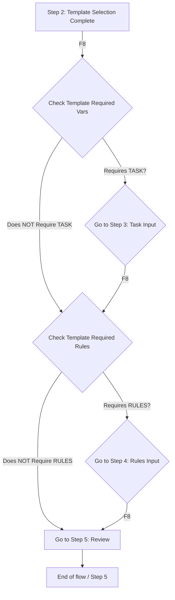

# Refactoring/Design Plan: Implement Wizard Screen Skipping Logic

## 1\. Executive Summary & Goals

The primary objective of this plan is to modify the TUI wizard flow (`internal/ui/wizard.go` and its screens) to automatically skip the **Task Input** (Step 3) and **Rules Input** (Step 4) screens if the currently selected template does not contain the required `{TASK}` or `{RULES}` placeholder variables.

### Key Goals

1.  **Skip Logic Implementation:** Introduce a check in `internal/ui/wizard.go` (specifically in `handleNextStep` and `initStep`) to determine if the next screen can be skipped based on the selected template's required variables.
2.  **Screen Logic Preservation:** Ensure the Task Input (`screens/task_input.go`) and Rules Input (`screens/rules_input.go`) screens are functional and correctly handle the flow when they *are* required and shown.
3.  **Prompt Generation Integrity:** Verify that the final context generation (`internal/ui/wizard.go:generateContextCmd`) proceeds normally even if `{TASK}` and/or `{RULES}` variables are empty due to a skip.

## 2\. Current Situation Analysis

The current TUI wizard flow (`internal/ui/wizard.go`) is strictly sequential (Step 1 -\> Step 2 -\> Step 3 -\> Step 4 -\> Step 5).

  * **Step 2 (`TemplateSelection`):** Sets `m.template`.
  * **Step 3 (`TaskInput`):** Collects `m.taskDesc` (mapped to `{TASK}`).
  * **Step 4 (`RulesInput`):** Collects `m.rules` (mapped to `{RULES}`).
  * **Template Dependency:** The existence of `{TASK}` and `{RULES}` is defined in `internal/core/template/template.go` and extracted into `Template.RequiredVars` when templates are loaded (`internal/core/template/manager.go`).
  * **Pain Point:** A user must click "Next" through steps 3 and 4 even if the chosen template (e.g., a simple file listing template) does not require a task description or custom rules.

## 3\. Proposed Solution / Refactoring Strategy

The strategy involves centralizing the skip logic within `internal/ui/wizard.go` to intercept navigation events between steps 2 and 5.

### 3.1. High-Level Design / Architectural Overview

The core change will be modifying the `WizardModel.handleNextStep()` and `WizardModel.canAdvanceStep()` logic to be aware of template variable requirements.

### 3.2. Key Components / Modules

  * **`internal/ui/wizard.go`**: **Primary modification target.** Implement logic in `handleNextStep` to check `m.template.RequiredVars` and jump steps.
  * **`internal/core/template/template.go`**: Contains variable definitions (`VarTask`, `VarRules`) that will be checked. (No modification needed, as it already defines the constants).
  * **`internal/ui/screens/task_input.go` & `internal/ui/screens/rules_input.go`**: No functional change is necessary, but the `IsValid()` checks should remain for when the screen is *not* skipped.

### 3.3. Detailed Action Plan / Phases

#### Phase 1: Implement Variable Requirement Check in Wizard

  * **Objective(s):** Create utility functions to determine if the selected template explicitly requires the `{TASK}` or `{RULES}` variable.
  * **Priority:** High

| Task | Description | Rationale/Goal | Estimated Effort | Deliverable/Criteria for Completion |
|---|---|---|---|---|
| **1.1** | Create `template.go` utility function `RequiresVar(varName string) bool` on `*template.Template` struct. | Centralize variable checking logic. | S | New method available on `*template.Template`. |
| **1.2** | Update `internal/ui/wizard.go:canAdvanceStep()` logic. | Prevent advancing from Task Input (Step 3) if input is empty AND the template *requires* `{TASK}`. | M | `canAdvanceStep()` correctly enforces non-empty task description only when `{TASK}` is a required var. |

#### Phase 2: Modify Navigation Logic in Wizard

  * **Objective(s):** Implement the core skipping logic in `handleNextStep()` and ensure seamless transition when skipping occurs.
  * **Priority:** High

| Task | Description | Rationale/Goal | Estimated Effort | Deliverable/Criteria for Completion |
|---|---|---|---|---|
| **2.1** | Refactor `internal/ui/wizard.go:handleNextStep()` to use a `switch` statement for navigation logic. | Enable complex, conditional multi-step advances. | M | `handleNextStep` uses a clean `switch m.step` structure. |
| **2.2** | Implement skip logic from Step 2 to Step 5. | If template doesn't require `{TASK}` and `{RULES}`, skip both. | L | Navigation `2 -> 5` works correctly when applicable. |
| **2.3** | Implement skip logic from Step 3 to Step 5. | If template doesn't require `{RULES}`, skip Step 4. | L | Navigation `3 -> 5` works correctly when applicable. |
| **2.4** | Update the `F8` shortcut hint (footer) on Step 2, 3, and 4 to reflect potential skipping (e.g., "F8: Next (Skip to Review)"). | Improve TUI usability by informing the user of the auto-skip behavior. | S | Screen footers accurately reflect the action of `F8`. |

#### Phase 3: Final Verification and Cleanup

  * **Objective(s):** Confirm that the context generation remains stable and the TUI handles size changes.
  * **Priority:** Medium

| Task | Description | Rationale/Goal | Estimated Effort | Deliverable/Criteria for Completion |
|---|---|---|---|---|
| **3.1** | Validate `generateContextCmd` logic. | Ensure that if `{TASK}` or `{RULES}` are skipped/empty, the context generation still completes and templates render correctly (with empty strings substituted for variables). | S | Successful context file generation after skipping steps. |
| **3.2** | Update `m.taskDesc` and `m.rules` to be empty strings in `initStep` if the screen is skipped. | Maintain a clean state for variables even if screens are skipped. (Currently, the input models handle initial value, but explicitly resetting on transition is safer if needed.) | S | Task and rules variables are reset/preserved as expected after skipping. |

-----

## 4\. Key Considerations & Risk Mitigation

### 4.1. Technical Risks & Challenges

  * **Risk:** Incorrect conditional branching leading to infinite loops or skipping mandatory steps (e.g., skipping Step 5).
      * **Mitigation:** The logic must be strictly applied only between Step 2 and Step 5, checking `RequiredVars` from the immutable `m.template`. Use `if m.template == nil` guards.
  * **Risk:** Regression in validation on non-skipped screens.
      * **Mitigation:** Ensure `canAdvanceStep()` (Task 1.2) still calls the appropriate screen validation before allowing the advance, but only if the required variable is present in the template.

### 4.2. Dependencies

  * **Internal:** The plan heavily relies on the correct implementation of `Template.RequiredVars` extraction in `internal/core/template/template.go`.

### 4.3. Non-Functional Requirements (NFRs) Addressed

  * **Usability:** Significantly improves the usability of the wizard by eliminating unnecessary steps for simple templates. (Goal)
  * **Maintainability:** Centralizing the skipping logic in `internal/ui/wizard.go` keeps the screens themselves highly cohesive and modular. (By Design)

## 5\. Success Metrics / Validation Criteria

  * **Functional Test 1 (Skip All):** Select a template that *only* requires `{FILE_STRUCTURE}`. Pressing F8 on Step 2 should immediately transition to Step 5 (`Review`).
  * **Functional Test 2 (Skip Rules Only):** Select a template that requires `{TASK}` but not `{RULES}`. Navigation should be `Step 2 -> Step 3 -> Step 5`.
  * **Functional Test 3 (No Skip):** Select a template that requires both `{TASK}` and `{RULES}`. Navigation should be `Step 2 -> Step 3 -> Step 4 -> Step 5`.
  * **Content Validation:** After any successful skip, the generated context file should correctly substitute empty strings for any skipped variables in the template.

## 6\. Assumptions Made

  * The template variable constants (`VarTask`, `VarRules`, etc.) in `internal/core/template/template.go` are accurate and complete for the purpose of checking requirements.
  * The `WizardModel` state (`m.selectedFiles`, `m.template`, `m.taskDesc`, `m.rules`) is guaranteed to be up-to-date and reliable when `handleNextStep` is called.
  * The step numbering (`StepFileSelection`=1 to `StepReview`=5) is fixed and contiguous.

## 7\. Open Questions / Areas for Further Investigation

  * None. The current request is self-contained and can be fully addressed by modifying the wizard's navigation logic based on existing template metadata.