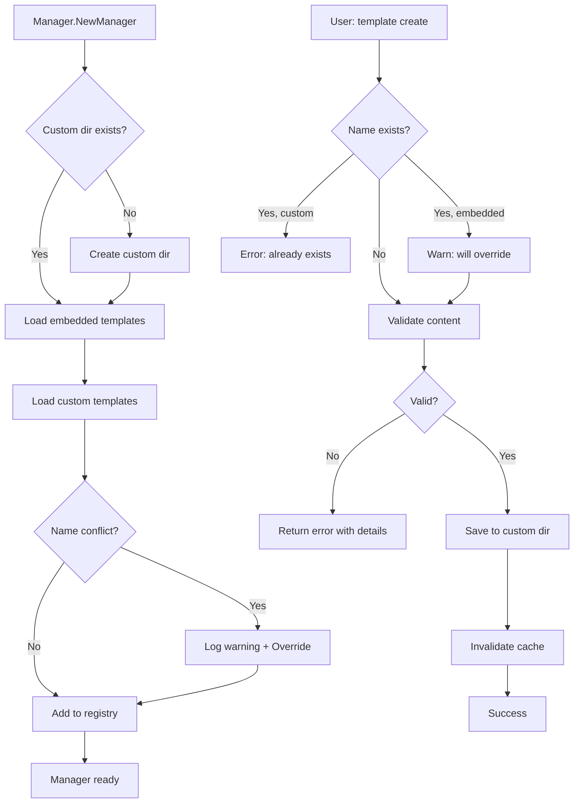

# Plano de Implementação: Suporte a Templates Customizados Globais

---

## 📋 Histórico de Revisões

### Revisão 1.1 - 2025-10-02 ✅ **ANÁLISE CRÍTICA E AJUSTES**

**Motivo**: Análise detalhada do codebase revelou gaps técnicos, riscos de segurança, e oportunidades de simplificação.

**Mudanças Principais**:

1. **Fase 1 - Fundação** (6-8 dias, ↑1 dia):
   - ✅ **Task 1.2 SIMPLIFICADA**: `getConfigDir()` já existe em `cmd/root.go:174` - economia de 1 dia
   - ⚠️ **Task 1.3 EXPANDIDA**: Adicionado foco em thread safety com `go test -race`
   - 🎯 **Task 1.4 AJUSTADA**: MVP usa `os.Stat()` timestamps, YAML frontmatter → v2
   - 🔒 **Task 1.5 NOVA**: Thread safety crítico - `Manager.Reload()` com `sync.RWMutex`
   - 🔧 **Task 1.6 NOVA**: Migration tool para backward compatibility

2. **Fase 2 - CLI Commands** (10-13 dias, ↑3 dias):
   - 🛡️ **Task 2.1 EXPANDIDA**: Atomic writes, confirmação EXPLÍCITA de override, line ending normalization
   - 🛡️ **Task 2.2 EXPANDIDA**: Atomic edit pattern com backups automáticos
   - ⚙️ **Task 2.2 AJUSTADA**: Fallback EDITOR → nano → vim com detecção inteligente

3. **Fase 3 - TUI Integration** (2 dias, ↓5-6 dias) 🎯 **MVP SIMPLIFICADO**:
   - ✅ **Task 3.1**: Listar e selecionar templates (📝 custom vs 📦 embedded)
   - ❌ **Task 3.2 REMOVIDA**: Quick actions (F2/F3) → v2
   - ❌ **Task 3.3 REMOVIDA**: Creation flow in TUI → v2
   - **Rationale**: Focar em CLI para management, TUI apenas para seleção

4. **Fase 4 - Testes & QA** (8-11 dias, ↑2 dias):
   - 🎯 **Task 4.3 SIMPLIFICADA**: Sem validação de YAML frontmatter (não existe no MVP)
   - 🌐 **Task 4.5 NOVA**: Cross-platform compatibility tests (CRLF vs LF, Unicode, CI matrix)

5. **Fase 6 - Polimento** (4-6 dias, ↑1 dia):
   - 📊 **Task 6.1 SIMPLIFICADA**: Profile first, optimize later (sem premature optimization)
   - 🔒 **Task 6.2 EXPANDIDA**: Security hardening com symlink protection (`filepath.EvalSymlinks`)

6. **Decisões Arquiteturais Resolvidas** (Seção 7):
   - ✅ Q1: Override com confirmação EXPLÍCITA (type name again)
   - ✅ Q2: Sem template references no MVP (sintaxe `{@template:}` reservada)
   - ✅ Q3: Metadata via `os.Stat()` no MVP, YAML frontmatter → v2
   - ✅ Q4: In-memory cache com `Manager.Reload()` manual
   - ✅ Team recommendations: Ícones 📝/📦, soft limit 100 templates, example.md no first-run

**Impacto no Timeline**:
- **Original**: 31-44 dias úteis
- **MVP Revisado**: **33-45 dias** (~6.5-9 semanas)
- **Economia Fase 3**: -5 dias (TUI simplificado)
- **Investimento em Qualidade**: +7 dias (threading, security, compatibility)
- **Resultado**: +2 dias líquido (mais realista e robusto)

**Riscos Críticos Identificados e Mitigados**:
1. ⚠️ **Race conditions** → Task 1.5 com testes `-race` obrigatórios
2. ⚠️ **Symlink attacks** → Task 6.2 com `filepath.EvalSymlinks()`
3. ⚠️ **File corruption** → Atomic write pattern em Tasks 2.1, 2.2
4. ⚠️ **Line endings** → Normalização CRLF→LF + Task 4.5 compatibility tests

---

### Revisão 1.2 - 2025-10-02 🔥 **CORREÇÃO DE CONTRADIÇÕES CRÍTICAS**

**Motivo**: Análise crítica externa identificou **4 contradições fundamentais** no plano da Revisão 1.1.

**Críticas Atendidas**:

1. **CRÍTICA GRAVE - Contradição sobre Frontmatter** ✅ RESOLVIDA
   - **Problema**: Revisão 1.1 dizia "MVP sem frontmatter YAML" mas Tasks 2.1, 2.4, 2.7 dependiam de metadados (--description, Author, export/import)
   - **Solução**: **MUDANÇA ARQUITETURAL** - Frontmatter YAML SIMPLES agora faz parte do MVP
   - **Task 1.4 REESCRITA**: Parser de frontmatter com `gopkg.in/yaml.v3` + fallback strategy
   - **Rationale**: Features já planejadas EXIGEM frontmatter. Parser é simples e padrão de facto (Jekyll, Hugo).
   - **Impacto**: +1 dia (Task 1.4: S→M)

2. **CRÍTICA MÉDIA - Timestamps Incorretos** ✅ RESOLVIDA
   - **Problema**: Usar `info.ModTime()` para CreatedAt E ModifiedAt gera dados enganosos (ModTime muda a cada edição)
   - **Solução**:
     - `CreatedAt` vem de frontmatter `created_at:` (persistido, imutável)
     - `ModifiedAt` vem de `os.Stat().ModTime()` (sempre atualizado)
     - Fallback: templates sem frontmatter usam ModTime para ambos
   - **Impacto**: Sem mudança de timeline (incluído na Task 1.4)

3. **CRÍTICA MÉDIA - Sanitização Inadequada** ✅ RESOLVIDA
   - **Problema**: Remover `<script>` via regex pode corromper templates legítimos e dá falsa sensação de segurança
   - **Solução**:
     - **NÃO sanitizar conteúdo** (templates são arquivos locais, sem risco XSS)
     - Validação ESTRUTURAL apenas: UTF-8, tamanho, placeholders suspeitos (warning, não erro)
     - Normalização separada: apenas line endings (CRLF→LF)
   - **Impacto**: Sem mudança de timeline (simplificação)

4. **CRÍTICA BAIXA - Task Prematura** ✅ RESOLVIDA
   - **Problema**: Task 1.6 (migration tool) consome 1 dia sem retorno - não há schema para migrar ainda
   - **Solução**: **Task 1.6 REMOVIDA DO MVP**, movida para v2
   - **Impacto**: **-1 dia** (economia)

**Mudanças no Plano**:
- Task 1.4: S (1 dia) → M (2 dias) - adicionar parser YAML
- Task 1.6: REMOVIDA - economia de 1 dia
- Task 6.2: Sanitização reescrita - validação estrutural apenas
- **Resultado Líquido**: **+1 dia no MVP** (mais 1 dia para YAML parser, -1 dia de migration tool)

**Timeline Atualizado**:
- **Revisão 1.1**: 33-45 dias
- **Revisão 1.2**: **34-46 dias** (~7-9 semanas)
- **Mudança**: +1 dia líquido (mais realista e resolve contradições)

**Frontmatter YAML Schema (MVP)**:
```yaml
---
description: "Template description"  # string, 1 linha, max 200 chars
author: "John Doe"                   # string, opcional
created_at: "2025-10-02T10:30:00Z"  # RFC3339, gerado no create
# FUTURO v2: tags, categories, version
---
```

**Fallback Strategy**:
- Templates **SEM** frontmatter: Description vem da 1ª linha, CreatedAt/ModifiedAt de `os.Stat()`, Author vazio
- Templates **COM** frontmatter: Metadata vem do YAML, ModifiedAt de `os.Stat()`
- Backward compatible com templates embedded atuais (sem frontmatter)

---

## 1. Sumário Executivo & Objetivos

### Objetivo Principal
Implementar suporte completo para templates customizados definidos pelo usuário a nível global, permitindo que usuários criem, gerenciem e utilizem seus próprios templates de prompt personalizado sem modificar o código-fonte da aplicação.

### Metas Chave
1. **Extensibilidade**: Permitir que usuários criem templates personalizados sem recompilar o binário
2. **Gerenciamento Global**: Templates armazenados em diretório de configuração global do usuário
3. **Integração Transparente**: Templates customizados funcionam perfeitamente ao lado dos templates embeded
4. **Experiência de Usuário**: Interface CLI e TUI intuitiva para gerenciar templates customizados

---

## 2. Análise da Situação Atual

### 2.1. Arquitetura Atual de Templates

**Sistema de Templates Embeded:**
- Templates armazenados em `templates/` e embeded no binário via `//go:embed`
- Carregamento através de `assets.Templates` (embed.FS)
- Manager carrega templates do filesystem embeded em `internal/core/template/manager.go:54-85`
- Estrutura de arquivo: `.md` com variáveis no formato `{VAR_NAME}`

**Fluxo de Processamento:**
```
embed.FS → Manager.loadTemplates() → parseTemplate() → Template struct → Renderer.RenderTemplate()
```

**Estrutura do Template:**
```go
type Template struct {
    Name         string   // Nome do template (sem extensão .md)
    Description  string   // Extraída do primeiro comentário/header
    Content      string   // Conteúdo markdown com variáveis
    RequiredVars []string // Variáveis extraídas via regex {VAR_NAME}
    FilePath     string   // Path original do arquivo
    IsEmbedded   bool     // Flag indicando origem (sempre true atualmente)
}
```

### 2.2. Limitações Atuais

1. **Imutabilidade**: Templates só podem ser adicionados modificando o código-fonte
2. **Distribuição**: Novos templates requerem rebuild e redistribuição do binário
3. **Personalização Limitada**: Usuários não podem adaptar templates para seu workflow
4. **Sem Versionamento de Usuário**: Impossível manter templates customizados versionados separadamente

### 2.3. Comandos CLI Existentes

**Template List** (`cmd/template.go:20-71`):
- Lista todos templates disponíveis
- Exibe nome e descrição em formato tabular

**Template Render** (`cmd/template.go:73-226`):
- Renderiza template com variáveis via `--var key=value`
- Valida variáveis requeridas antes de renderizar
- Suporta output para stdout ou arquivo via `-o`

### 2.4. Integração TUI

**Template Selection Screen** (`internal/ui/screens/template_selection.go`):
- Lista templates em interface navegável (↑/↓)
- Exibe descrição e variáveis requeridas do template selecionado
- Marca visualmente template selecionado com ✓

---

## 3. Solução Proposta: Sistema Dual de Templates

### 3.1. Visão Arquitetural de Alto Nível

**Estratégia: Sistema Dual com Priorização**

```
┌─────────────────────────────────────────────────────────────┐
│                    Template Manager                          │
│                                                              │
│  ┌──────────────────┐         ┌──────────────────────┐     │
│  │  Embedded Source │         │  Custom Source       │     │
│  │  (embed.FS)      │         │  (Filesystem)        │     │
│  └────────┬─────────┘         └──────────┬───────────┘     │
│           │                               │                  │
│           ▼                               ▼                  │
│  ┌─────────────────────────────────────────────────┐        │
│  │        Template Registry (map[string]*Template) │        │
│  │                                                  │        │
│  │  - Embedded templates carregados primeiro       │        │
│  │  - Custom templates podem sobrescrever          │        │
│  │  - Metadata indica origem (IsEmbedded field)    │        │
│  └─────────────────────────────────────────────────┘        │
│                                                              │
└─────────────────────────────────────────────────────────────┘

Diretórios de Template (por plataforma):
├── Linux:   ~/.config/shotgun-cli/templates/
├── macOS:   ~/Library/Application Support/shotgun-cli/templates/
└── Windows: %APPDATA%/shotgun-cli/templates/
```

### 3.2. Componentes Principais

#### A. Template Source Interface (Nova Abstração)

**Arquivo**: `internal/core/template/source.go`

```go
// TemplateSource define interface para diferentes fontes de templates
type TemplateSource interface {
    // Load carrega templates da fonte
    Load() (map[string]*Template, error)

    // GetSourceType retorna tipo da fonte (embedded/custom)
    GetSourceType() SourceType

    // GetBasePath retorna path base da fonte (se aplicável)
    GetBasePath() string
}

type SourceType string

const (
    SourceTypeEmbedded SourceType = "embedded"
    SourceTypeCustom   SourceType = "custom"
)

// EmbeddedSource implementa TemplateSource para templates embeded
type EmbeddedSource struct {
    fs fs.FS
}

// CustomSource implementa TemplateSource para templates do filesystem
type CustomSource struct {
    basePath string
}
```

**Justificativa**: Abstração permite adicionar novas fontes no futuro (ex: templates de projetos específicos, se necessário) e simplifica teste unitário.

#### B. Enhanced Template Struct

**Modificações em**: `internal/core/template/template.go`

```go
type Template struct {
    Name         string
    Description  string
    Content      string
    RequiredVars []string
    FilePath     string
    IsEmbedded   bool
    SourceType   SourceType  // NOVO: tipo de fonte
    CreatedAt    time.Time   // NOVO: timestamp criação (custom apenas)
    ModifiedAt   time.Time   // NOVO: timestamp modificação (custom apenas)
    Author       string      // NOVO: autor do template (opcional, custom apenas)
}
```

#### C. Refactored Template Manager

**Modificações em**: `internal/core/template/manager.go`

```go
type Manager struct {
    templates map[string]*Template
    sources   []TemplateSource  // NOVO: múltiplas fontes
    mu        sync.RWMutex
    renderer  *Renderer
}

// NewManager inicializa com múltiplas fontes
func NewManager() (*Manager, error)

// NewManagerWithCustomPath permite especificar path customizado (para testes)
func NewManagerWithCustomPath(customPath string) (*Manager, error)

// loadFromSources carrega templates de todas as fontes
func (m *Manager) loadFromSources() error

// CreateCustomTemplate cria novo template customizado
func (m *Manager) CreateCustomTemplate(name, content string) error

// UpdateCustomTemplate atualiza template customizado existente
func (m *Manager) UpdateCustomTemplate(name, content string) error

// DeleteCustomTemplate remove template customizado
func (m *Manager) DeleteCustomTemplate(name string) error

// GetCustomTemplatesPath retorna path do diretório de templates customizados
func (m *Manager) GetCustomTemplatesPath() string

// IsCustomTemplate verifica se template é customizado
func (m *Manager) IsCustomTemplate(name string) bool
```

### 3.3. Plano de Ação Detalhado

#### **FASE 1: Fundação - Abstração e Infraestrutura**

**Objetivo**: Criar abstrações necessárias e infraestrutura de carregamento dual

**Prioridade**: ALTA (bloqueante para demais fases)

---

**Task 1.1: Criar Template Source Interface**
- **Arquivo**: `internal/core/template/source.go`
- **Descrição**: Implementar interface `TemplateSource` e implementações `EmbeddedSource` e `CustomSource`
- **Rationale**: Desacopla lógica de carregamento da fonte de dados, permitindo extensibilidade futura
- **Critérios de Conclusão**:
  - Interface `TemplateSource` definida com métodos `Load()`, `GetSourceType()`, `GetBasePath()`
  - `EmbeddedSource` implementada para templates embeded
  - `CustomSource` implementada para filesystem
  - Testes unitários cobrindo ambas implementações
- **Estimativa**: M (2-3 dias)
- **Dependências**: Nenhuma

**Detalhamento Técnico**:
```go
// EmbeddedSource.Load()
- Reutilizar lógica atual de loadTemplates()
- Retornar map[string]*Template com IsEmbedded=true

// CustomSource.Load()
- Verificar se diretório existe (criar se não existir)
- Ler todos arquivos .md do diretório
- Para cada arquivo:
  - Ler conteúdo
  - Chamar parseTemplate() existente
  - Adicionar metadata: IsEmbedded=false, timestamps, etc.
  - Validar template com validateTemplateContent()
- Retornar map[string]*Template
```

---

**Task 1.2: Implementar Path de Templates Customizados** ✅ **SIMPLIFICADO**
- **Arquivo**: `internal/core/template/paths.go` (novo)
- **Descrição**: Wrapper para reutilizar `cmd/root.go:getConfigDir()` existente + adicionar subdiretório templates
- **Rationale**: **DESCOBERTA:** `getConfigDir()` já existe em `cmd/root.go:174` com exatamente a mesma lógica multiplataforma!
- **Critérios de Conclusão**:
  - Função `GetCustomTemplatesDir()` implementada reutilizando `getConfigDir()`
  - Função `EnsureCustomTemplatesDir()` cria diretório se não existir
  - Testes básicos
- **Estimativa**: XS (2-3 horas) ⬇️ **REDUZIDO de 1 dia**
- **Dependências**: Nenhuma

**Detalhamento Técnico**:
```go
// Reutilizar cmd/root.go:getConfigDir()
func GetCustomTemplatesDir() (string, error) {
    // Importar ou mover getConfigDir() para package interno
    configDir := getConfigDir() // Já tem lógica multiplataforma
    return filepath.Join(configDir, "templates"), nil
}

func EnsureCustomTemplatesDir() error {
    dir, err := GetCustomTemplatesDir()
    if err != nil {
        return err
    }
    return os.MkdirAll(dir, 0755)
}
```

---

**Task 1.3: Refatorar Template Manager para Suportar Múltiplas Fontes** ⚠️ **ATENÇÃO: THREADING**
- **Arquivo**: `internal/core/template/manager.go`
- **Descrição**: Modificar Manager para carregar templates de múltiplas fontes com priorização **thread-safe**
- **Rationale**: Permitir coexistência de templates embeded e customizados
- **Critérios de Conclusão**:
  - Manager inicializa com slice de `TemplateSource`
  - Método `loadFromSources()` carrega de todas as fontes
  - Custom templates sobrescrevem embedded se houver conflito de nome
  - Metadata `SourceType` preservada em cada Template
  - **NOVO:** Método `Reload()` para refresh de templates (thread-safe)
  - **NOVO:** Todos os métodos write usam `mu.Lock()` corretamente
  - **NOVO:** CustomSource.Load() ignora templates corrompidos (não falha)
  - Backward compatibility mantida (API pública inalterada)
  - Testes unitários atualizados **incluindo go test -race**
- **Estimativa**: M-L (3-4 dias) ⬆️ **AUMENTADO** para incluir threading e testes
- **Dependências**: Task 1.1, Task 1.2

**Lógica de Priorização**:
```
1. Carregar embedded templates primeiro (prioridade baixa)
2. Carregar custom templates depois (prioridade alta)
3. Se custom template tem mesmo nome que embedded:
   - Sobrescrever entrada no map
   - Log warning sobre override
4. Resultado final: map unificado com custom templates tendo precedência
```

---

**Task 1.4: Estender Template Struct + Frontmatter YAML Simples** 🔄 **MUDANÇA CRÍTICA: FRONTMATTER NO MVP**
- **Arquivo**: `internal/core/template/template.go`
- **Descrição**: Adicionar campos para metadata + parser de frontmatter YAML **SIMPLES**
- **Rationale**: **DECISÃO REVISADA** - Frontmatter necessário para features já planejadas (--description, Author, timestamps corretos, export/import)
- **Critérios de Conclusão**:
  - Campos `SourceType`, `CreatedAt`, `ModifiedAt`, `Author`, `Description` adicionados ao struct
  - **NOVO:** Função `parseFrontmatter()` usando `gopkg.in/yaml.v3`
  - **NOVO:** Fallback strategy - templates SEM frontmatter ainda funcionam
  - Se frontmatter presente: metadata vem do YAML
  - Se frontmatter ausente: Description vem da primeira linha, timestamps de `os.Stat()`, Author vazio
  - Serialização/deserialização de frontmatter (para export/import Task 2.7)
  - Testes unitários para parsing com E sem frontmatter
- **Estimativa**: M (2 dias) ⬆️ **AUMENTADO** para incluir parser YAML
- **Dependências**: Task 1.1

**Formato MVP** (frontmatter YAML **OPCIONAL** mas recomendado):
```markdown
---
description: "Code review template for Go projects"
author: "John Doe"
created_at: "2025-10-02T10:30:00Z"
---

# Code Review Template

Review the following code...

Variables:
- {CODE_SNIPPET}
- {LANGUAGE}
```

**Frontmatter Schema (MVP - campos opcionais)**:
```yaml
---
description: string       # Descrição curta (1 linha, max 200 chars)
author: string           # Nome do autor (opcional)
created_at: RFC3339      # Timestamp de criação (ISO 8601)
# FUTURO v2: tags, categories, version
---
```

**Parsing Strategy**:
```go
func parseTemplate(content string, filePath string) (*Template, error) {
    tmpl := &Template{FilePath: filePath}

    // Try parsing frontmatter
    if hasFrontmatter(content) {
        metadata, body, err := extractFrontmatter(content)
        if err != nil {
            // Fallback: treat as plain template
            tmpl.Content = content
            tmpl.Description = extractFirstLine(content)
        } else {
            tmpl.Content = body
            tmpl.Description = metadata.Description
            tmpl.Author = metadata.Author
            tmpl.CreatedAt = metadata.CreatedAt
        }
    } else {
        // No frontmatter: fallback strategy
        tmpl.Content = content
        tmpl.Description = extractFirstLine(content)
        info, _ := os.Stat(filePath)
        tmpl.CreatedAt = info.ModTime()
    }

    // ModifiedAt sempre vem do filesystem
    info, _ := os.Stat(filePath)
    tmpl.ModifiedAt = info.ModTime()

    tmpl.RequiredVars = extractRequiredVars(tmpl.Content)
    return tmpl, nil
}
```

**Dependency Nova**:
```go
// go.mod
require gopkg.in/yaml.v3 v3.0.1
```

---

**Task 1.5: Thread Safety e Manager.Reload()** 🔒 **CRÍTICO**
- **Arquivo**: `internal/core/template/manager.go`
- **Descrição**: Garantir operações thread-safe e capacidade de reload
- **Rationale**: **RISCO CRÍTICO:** Prevenir race conditions entre CLI e TUI
- **Critérios de Conclusão**:
  - Método `Manager.Reload()` implementado (thread-safe)
  - Todos os métodos de escrita (`CreateCustomTemplate`, `UpdateCustomTemplate`, `DeleteCustomTemplate`) usam `mu.Lock()`
  - Método `loadFromSources()` é idempotent (pode ser chamado múltiplas vezes)
  - **CRÍTICO:** Testes de concorrência com `go test -race`
  - Design doc de threading criado em `docs/threading.md`
- **Estimativa**: S-M (1-2 dias)
- **Dependências**: Task 1.3

**Implementação Padrão:**
```go
func (m *Manager) Reload() error {
    m.mu.Lock()
    defer m.mu.Unlock()

    // Clear e recarregar
    m.templates = make(map[string]*Template)
    return m.loadFromSources()
}

func (m *Manager) CreateCustomTemplate(name, content string) error {
    m.mu.Lock()
    defer m.mu.Unlock()

    // ... create logic ...

    // Reload para incluir novo template
    return m.loadFromSources()
}
```

---

~~**Task 1.6: Migration Tool (Schema Versioning)**~~ ❌ **REMOVIDO DO MVP**
- **Rationale**: **CRÍTICA VÁLIDA** - Não há schema para migrar ainda. Task prematura que consome 1 dia sem retorno.
- **Decisão**: **MOVER PARA v2** quando houver mudança real de schema
- **Nota**: Frontmatter YAML já é versionável via campo `version:` (reservado para futuro)
- **Economia**: -1 dia

~~**Exemplo de Output:**~~
```bash
# FUTURO v2: Quando houver mudança de schema
$ shotgun-cli template migrate
Checking custom templates...
✅ All templates are using current schema (v1)
No migration needed.

$ shotgun-cli template migrate --dry-run
Would migrate:
  - my-template.md (v1 → v2)
  - code-review.md (v1 → v2)
Run without --dry-run to apply.
```

---

#### **FASE 2: Comandos CLI para Gerenciamento**

**Objetivo**: Implementar comandos CLI completos para CRUD de templates customizados

**Prioridade**: ALTA

---

**Task 2.1: Comando `template create`** ⚠️ **COM CONFIRMAÇÃO DE OVERRIDE**
- **Arquivo**: `cmd/template.go`
- **Descrição**: Comando para criar novo template customizado **com atomic writes**
- **Rationale**: Interface primária para usuários criarem templates
- **Critérios de Conclusão**:
  - Comando `shotgun-cli template create <name>` implementado
  - Flag `--content` para especificar conteúdo inline
  - Flag `--file` para ler conteúdo de arquivo
  - Flag `--editor` para abrir editor padrão ($EDITOR com fallbacks)
  - Flag `--description` para adicionar descrição
  - **NOVO:** Flag `--force` para pular confirmação de override
  - **NOVO:** Confirmação EXPLÍCITA se override embedded template (requer digitar nome novamente)
  - **NOVO:** Atomic write pattern (write to .tmp, validate, rename)
  - **NOVO:** Normalização de line endings (CRLF → LF)
  - Validação de template usando `validateTemplateContent()`
  - Extração automática de variáveis requeridas
  - Preview do template antes de salvar (modo interativo)
- **Estimativa**: M-L (2-3 dias) ⬆️ **AUMENTADO** para incluir confirmações e atomic writes
- **Dependências**: Fase 1 completa

**Fallbacks de Editor:**
```go
func getEditor() string {
    if editor := os.Getenv("EDITOR"); editor != "" {
        return editor
    }
    switch runtime.GOOS {
    case "windows":
        return "notepad"
    case "darwin", "linux":
        return "nano"  // Mais user-friendly que vi
    default:
        return "vi"
    }
}
```

**Confirmação de Override:**
```bash
$ shotgun-cli template create analyzeBug

⚠️  WARNING: 'analyzeBug' is an EMBEDDED template name.
Creating a custom template with this name will OVERRIDE the embedded version.

The embedded template will be HIDDEN (not deleted).
Deleting your custom template will restore the embedded version.

Type the template name again to confirm override: _
```

**Exemplos de Uso**:
```bash
# Criar com conteúdo inline
shotgun-cli template create my-template --content "Review {CODE}..."

# Criar a partir de arquivo
shotgun-cli template create my-template --file ./my-template.md

# Abrir editor interativo
shotgun-cli template create my-template --editor

# Com descrição
shotgun-cli template create my-template --file ./template.md --description "My custom review template"
```

---

**Task 2.2: Comando `template edit`** 🔒 **COM ATOMIC WRITES**
- **Arquivo**: `cmd/template.go`
- **Descrição**: Editar template customizado existente **com backup e atomic writes**
- **Rationale**: Permitir modificação de templates sem recriar
- **Critérios de Conclusão**:
  - Comando `shotgun-cli template edit <name>` implementado
  - Abre template em editor padrão ($EDITOR com fallbacks)
  - Flag `--content` para substituição inline
  - **CRÍTICO:** Atomic write pattern (edit in tempfile, validate, rename)
  - **CRÍTICO:** Backup automático ANTES de modificar (`.bak` suffix com timestamp)
  - Validação pré-salvamento (rollback se inválido)
  - Erro se template não existe ou é embedded
  - Atualização do timestamp `ModifiedAt`
  - **NOVO:** Normalização de line endings
- **Estimativa**: S-M (1-2 dias) ⬆️ **AUMENTADO** para segurança
- **Dependências**: Task 2.1

**Atomic Edit Pattern:**
```go
func editTemplate(name string) error {
    // 1. Criar backup
    backupPath := createBackup(name) // .bak com timestamp

    // 2. Editar em tempfile
    tmpPath := filepath.Join(os.TempDir(), name+".tmp")
    // ... edição ...

    // 3. Validar
    if err := validateTemplateContent(newContent); err != nil {
        os.Remove(tmpPath)
        return fmt.Errorf("validation failed: %w", err)
    }

    // 4. Atomic rename (POSIX atomic operation)
    finalPath := filepath.Join(customDir, name+".md")
    return os.Rename(tmpPath, finalPath)
}
```

**Detalhamento**:
```bash
# Editar no editor padrão
shotgun-cli template edit my-template

# Substituir conteúdo inline
shotgun-cli template edit my-template --content "New content..."

# Sistema de backup:
~/.config/shotgun-cli/templates/my-template.md
~/.config/shotgun-cli/templates/my-template.md.bak  # backup automático
```

---

**Task 2.3: Comando `template delete`**
- **Arquivo**: `cmd/template.go`
- **Descrição**: Remover template customizado
- **Rationale**: Gerenciamento completo de ciclo de vida
- **Critérios de Conclusão**:
  - Comando `shotgun-cli template delete <name>` implementado
  - Flag `--force` para pular confirmação
  - Confirmação interativa por padrão ("Are you sure?")
  - Erro se template não existe ou é embedded
  - Opção de mover para lixeira ao invés de deletar permanentemente
  - Log de operação
- **Estimativa**: S (1 dia)
- **Dependências**: Task 2.1

---

**Task 2.4: Comando `template show`**
- **Arquivo**: `cmd/template.go`
- **Descrição**: Exibir detalhes de um template
- **Rationale**: Inspeção de templates e debugging
- **Critérios de Conclusão**:
  - Comando `shotgun-cli template show <name>` implementado
  - Exibe metadata completa (nome, descrição, source type, timestamps, autor)
  - Flag `--content` para exibir conteúdo completo
  - Flag `--preview` para renderizar com valores placeholder
  - Flag `--path` para mostrar caminho do arquivo
  - Lista de variáveis requeridas
  - Output formatado (pode usar lipgloss para styling)
- **Estimativa**: S (1 dia)
- **Dependências**: Task 2.1

**Exemplo de Output**:
```
Template: my-review-template
─────────────────────────────────────────
Source:       custom
Description:  Code review template for Go
Author:       John Doe
Created:      2025-10-02 10:30:00
Modified:     2025-10-02 15:45:00
Path:         ~/.config/shotgun-cli/templates/my-review-template.md

Required Variables:
  • CODE_SNIPPET
  • LANGUAGE
  • REVIEWER_NOTES

Use --content to view template content
Use --preview to see rendered preview
```

---

**Task 2.5: Atualizar `template list` para Diferenciar Fontes**
- **Arquivo**: `cmd/template.go`
- **Descrição**: Melhorar output de `list` para indicar origem dos templates
- **Rationale**: Usuários precisam saber quais templates são customizados
- **Critérios de Conclusão**:
  - Indicador visual de origem (emoji ou símbolo)
  - Flag `--source` para filtrar por tipo (embedded/custom/all)
  - Sorting: custom templates primeiro, depois embedded
  - Flag `--verbose` para mostrar path e metadata adicional
  - Color coding (custom = verde, embedded = azul)
- **Estimativa**: S (1 dia)
- **Dependências**: Fase 1 completa

**Exemplo de Output**:
```
Available Templates:
════════════════════════════════════════════════════════════

Custom Templates:
  📝 my-review          My custom code review template
  📝 quick-refactor     Quick refactoring guide

Embedded Templates:
  📦 analyzeBug         For analyzing and debugging issues
  📦 makeDiffGitFormat  For creating git-format diff files
  📦 makePlan           For project planning and task breakdown
  📦 projectManager     For project management tasks

Total: 6 templates (2 custom, 4 embedded)
```

---

**Task 2.6: Comando `template validate`**
- **Arquivo**: `cmd/template.go`
- **Descrição**: Validar template sem salvar
- **Rationale**: Debugging e verificação de sintaxe
- **Critérios de Conclusão**:
  - Comando `shotgun-cli template validate <name-or-file>` implementado
  - Valida template existente ou arquivo
  - Verifica sintaxe de variáveis
  - Verifica balanceamento de chaves
  - Lista variáveis detectadas
  - Exit code 0 se válido, 1 se inválido
  - Output detalhado de erros com linha/coluna
- **Estimativa**: S (1 dia)
- **Dependências**: Task 2.1

---

**Task 2.7: Comandos `template import/export`**
- **Arquivo**: `cmd/template.go`
- **Descrição**: Importar/exportar templates customizados
- **Rationale**: Compartilhamento e backup de templates
- **Critérios de Conclusão**:
  - Comando `shotgun-cli template export <name> --output file.md` implementado
  - Comando `shotgun-cli template import <file.md>` implementado
  - Flag `--all` para exportar todos custom templates (cria tar.gz)
  - Metadata preservada no export (frontmatter YAML)
  - Validação no import
  - Detecção de conflitos no import (sobrescrever ou renomear)
- **Estimativa**: M (2 dias)
- **Dependências**: Task 2.1

**Formato de Export**:
```markdown
---
name: my-template
description: My custom template
author: John Doe
created: 2025-10-02T10:30:00Z
source: custom
---

# Template Content

{VARIABLES} go here...
```

---

#### **FASE 3: Integração TUI (Wizard) - MVP SIMPLIFICADO** 🎯

**Objetivo**: **MVP:** Listar e selecionar templates customizados no TUI (SEM create/edit)

**Prioridade**: MÉDIA

**Decisão de Scope:** Simplificado para MVP. CLI é suficiente para gerenciamento de templates. TUI foca em seleção e uso.

---

**Task 3.1: Atualizar Template Selection Screen** ✅ **MVP APENAS**
- **Arquivo**: `internal/ui/screens/template_selection.go`
- **Descrição**: Adicionar indicadores visuais para templates customizados **E tecla F5 para refresh**
- **Rationale**: Usuários precisam distinguir templates no TUI e recarregar após criar via CLI
- **Critérios de Conclusão**:
  - Ícone/badge diferenciado para custom templates (📝 vs 📦)
  - Seção separada ou agrupamento visual (Custom / Embedded)
  - Tooltip/descrição expandida mostra source type
  - Color coding consistente com CLI (usando lipgloss)
  - Path exibido para custom templates quando houver espaço
  - **NOVO:** Tecla F5 (ou 'r') recarrega templates via `Manager.Reload()`
  - **NOVO:** Indicador se template é override de embedded
- **Estimativa**: M (2 dias) ⬇️ **REDUZIDO** (sem quick actions complexas)
- **Dependências**: Fase 2 (Task 2.5)

**Mockup Visual MVP:**
```
┌─ Choose Template ────────────────────────────────┐
│                                                   │
│  Custom Templates                                 │
│  ▶ 📝 my-review          My custom review         │
│    📝 analyzeBug ⚠️       [overrides embedded]    │
│                                                   │
│  Embedded Templates                               │
│    📦 makeDiffGitFormat  For creating diffs       │
│    📦 makePlan           For project planning     │
│                                                   │
│  Description:                                     │
│  My custom code review template for Go projects   │
│  Source: Custom (~/.config/shotgun-cli/...)       │
│                                                   │
│  Required Variables:                              │
│    • CODE_SNIPPET                                 │
│    • LANGUAGE                                     │
│                                                   │
│  ↑/↓: Navigate  Enter: Select  F5: Refresh        │
│  F1: Help  F8: Next  F10: Back  Ctrl+Q: Quit      │
└───────────────────────────────────────────────────┘
```

---

**Task 3.2: REMOVIDO - Template Quick Actions** ❌ **FORA DO MVP**
- **Decisão:** Quick actions (edit, delete, clone) serão implementados em **v2**
- **Justificativa:**
  1. Editar template em TUI requer terminal release (complexo)
  2. CLI funcional é suficiente para gerenciamento
  3. Foco do TUI é seleção/uso, não gerenciamento
  4. **Economia:** 2 dias de desenvolvimento
- **Futura Implementação (v2):**
  - Pressionar 'e' → mensagem "Use 'shotgun-cli template edit <name>' para editar"
  - Pressionar 'd' → confirmar e deletar
  - Pressionar 'i' → mostrar detalhes completos

---

**Task 3.3: REMOVIDO - Template Creation Flow** ❌ **FORA DO MVP**
- **Decisão:** Criação de templates via TUI será implementada em **v2+**
- **Justificativa:**
  1. Form multi-step com textarea grande é complexo em TUI
  2. Bubble Tea textarea tem limitações para conteúdo longo
  3. CLI com `--editor` é mais eficiente
  4. **Economia:** 3-4 dias de desenvolvimento
- **Alternativa MVP:**
  - Pressionar 'n' → mensagem: "Use 'shotgun-cli template create <name> --editor' para criar"

---

**FASE 3 SUMMARY:**
- **Original:** 3 tasks, 7-8 dias
- **MVP:** 1 task, 2 dias
- **Economia:** 5-6 dias ⬇️
- **Funcionalidade preservada:** Usuários podem ver e selecionar custom templates no TUI, gerenciar via CLI

---

#### **FASE 4: Validação, Testes e Qualidade**

**Objetivo**: Garantir robustez e confiabilidade do sistema

**Prioridade**: ALTA

---

**Task 4.1: Testes Unitários Completos**
- **Arquivos**: `*_test.go` em `internal/core/template/`
- **Descrição**: Cobertura de testes para toda nova funcionalidade
- **Critérios de Conclusão**:
  - Cobertura mínima de 80% para novos arquivos
  - Testes para TemplateSource (embedded e custom)
  - Testes para Manager com múltiplas fontes
  - Testes de priorização (custom override embedded)
  - Testes de validação de templates
  - Testes de paths multiplataforma (build tags)
  - Mocks para filesystem operations
- **Estimativa**: L (3-4 dias)
- **Dependências**: Fases 1-3 completas

**Casos de Teste Chave**:
```go
// Casos de sucesso
- Load embedded templates
- Load custom templates
- Custom template overrides embedded
- Create/update/delete custom template
- Path resolution por OS

// Casos de erro
- Invalid template syntax
- Missing required variables
- Permission denied no diretório custom
- Circular variable references
- Malformed YAML frontmatter
```

---

**Task 4.2: Testes End-to-End (E2E)**
- **Arquivo**: `test/e2e/template_custom_test.go` (novo)
- **Descrição**: Testes E2E para fluxos completos de templates customizados
- **Critérios de Conclusão**:
  - Teste: create → list → render → delete
  - Teste: import → validate → export
  - Teste: edit → validate → render
  - Teste: override embedded template
  - Teste: TUI template selection (usando testeable TUI driver)
  - CI/CD pipeline executando E2E tests
- **Estimativa**: M (2-3 dias)
- **Dependências**: Task 4.1

---

**Task 4.3: Validation Engine Robusto** 🔄 **ATUALIZADO na Rev 1.2 - FRONTMATTER NO MVP**
- **Arquivo**: `internal/core/template/validator.go` (novo)
- **Descrição**: Motor de validação avançado para templates
- **Rationale**: Prevenir templates malformados ou perigosos
- **Critérios de Conclusão**:
  - Validação de sintaxe markdown (básica)
  - Detecção de variáveis malformadas
  - Validação de balanceamento de braces (considerando code blocks)
  - Detecção de variáveis não utilizadas (warning)
  - Warning sobre templates muito grandes (>100KB)
  - **MUDANÇA Rev 1.2:** Validação de frontmatter YAML INCLUÍDA no MVP
    - Validar estrutura básica (delimitadores `---`)
    - Validar tipos de campos: description (string), author (string), created_at (RFC3339)
    - **IMPORTANTE:** Warning se malformado, não erro (fallback strategy permite templates sem frontmatter)
    - Validar que created_at é timestamp válido (se presente)
  - **MOVIDO PARA 6.2:** Sanitização de paths (é security hardening)
- **Estimativa**: M (2 dias) ⬆️ **AUMENTADO** para incluir validação de frontmatter YAML
- **Dependências**: Task 1.4 (frontmatter parser), Task 4.1

---

**Task 4.4: Error Handling e Recovery**
- **Arquivos**: Todos os arquivos modificados
- **Descrição**: Tratamento robusto de erros e mensagens úteis
- **Critérios de Conclusão**:
  - Todos os erros têm mensagens descritivas e contextualizadas
  - Sugestões de correção incluídas nos erros
  - Graceful degradation se diretório custom inacessível
  - Recovery de backups automático em caso de corrupção
  - Logging estruturado de operações (zerolog)
- **Estimativa**: S (1-2 dias)
- **Dependências**: Todas as tasks anteriores

---

**Task 4.5: Compatibility e Cross-Platform Tests** 🌐 **NOVO - CRÍTICO**
- **Arquivos**: `test/compatibility/` (novo)
- **Descrição**: Testes de compatibilidade cross-platform
- **Rationale**: **RISCO:** Templates criados em uma plataforma podem falhar em outra
- **Critérios de Conclusão**:
  - Testes de line endings (CRLF vs LF)
  - Testes de caracteres Unicode em templates
  - Testes de path separators (Windows \ vs Unix /)
  - Testes de permissões de arquivo (0644 enforcement)
  - Templates criados em Linux funcionam em Windows/macOS e vice-versa
  - CI/CD matrix: Linux, macOS, Windows
  - **NOVO:** Teste de templates com encodings diferentes (UTF-8, UTF-16)
- **Estimativa**: M (2 dias)
- **Dependências**: Task 4.1, Task 4.2

**Test Cases:**
```go
func TestCrossPlatformLineEndings(t *testing.T) {
    // Template com CRLF (Windows)
    contentCRLF := "Line 1\r\nLine 2\r\nLine 3"

    // Normalizar e validar
    normalized := normalizeLineEndings(contentCRLF)
    assert.Equal(t, "Line 1\nLine 2\nLine 3", normalized)
}

func TestUnicodeTemplates(t *testing.T) {
    content := "# Template with émojis 🎯 and açénts"
    // Should handle without corruption
}

func TestWindowsPathInTemplate(t *testing.T) {
    // Ensure C:\path\to\file não quebra validation
}
```

---

#### **FASE 5: Documentação e Experiência do Usuário**

**Objetivo**: Documentar funcionalidade e garantir descoberta fácil

**Prioridade**: MÉDIA-ALTA

---

**Task 5.1: Atualizar README.md**
- **Arquivo**: `README.md`
- **Descrição**: Documentar nova funcionalidade de templates customizados
- **Critérios de Conclusão**:
  - Seção dedicada "Custom Templates"
  - Exemplos de uso para cada comando
  - Tutorial passo-a-passo de criação
  - Best practices e guidelines
  - Troubleshooting section
  - Links para localização de diretórios por OS
- **Estimativa**: S (1 dia)
- **Dependências**: Fase 1-4 completas

**Estrutura Sugerida**:
```markdown
## Custom Templates

### Creating Templates
...

### Managing Templates
...

### Template Syntax
...

### Examples
...

### Troubleshooting
...
```

---

**Task 5.2: CLAUDE.md e Documentação para IA**
- **Arquivo**: `CLAUDE.md`
- **Descrição**: Atualizar instruções para Claude Code sobre templates customizados
- **Critérios de Conclusão**:
  - Explicação da arquitetura dual de templates
  - Exemplos de comandos
  - Padrões de teste
  - Debugging tips
- **Estimativa**: S (meio dia)
- **Dependências**: Task 5.1

---

**Task 5.3: Help Text e Completions**
- **Arquivos**: `cmd/template.go`, `cmd/completion.go`
- **Descrição**: Help text detalhado e shell completions
- **Critérios de Conclusão**:
  - Help text (`--help`) atualizado para todos comandos
  - Exemplos incluídos no help
  - Shell completions para bash/zsh/fish atualizados
  - Completion context-aware (sugere apenas custom templates para delete/edit)
- **Estimativa**: S (1 dia)
- **Dependências**: Fase 2 completa

---

**Task 5.4: Template Examples e Starter Pack**
- **Arquivo**: `docs/template-examples.md` (novo)
- **Descrição**: Coleção de templates exemplo e starter pack
- **Critérios de Conclusão**:
  - 5-10 templates exemplo bem documentados
  - Template "meta-template" para criar novos templates
  - Categorização por caso de uso (code review, refactoring, docs, etc.)
  - README em cada categoria
  - Script de quick-start que instala examples
- **Estimativa**: M (2 dias)
- **Dependências**: Task 5.1

**Exemplos de Templates**:
```
- code-review-detailed.md
- refactor-plan.md
- api-documentation.md
- bug-investigation.md
- performance-analysis.md
- security-audit.md
- test-strategy.md
```

---

**Task 5.5: Video Tutorial / GIF Demos**
- **Arquivos**: `docs/demos/`
- **Descrição**: Demos visuais de uso de templates customizados
- **Critérios de Conclusão**:
  - GIF animado de CLI workflow
  - GIF animado de TUI workflow
  - Screencast curto (2-3 min) no YouTube
  - Embedded no README
- **Estimativa**: S (1-2 dias)
- **Dependências**: Task 5.1
- **Nota**: Pode ser feito em paralelo com outras tasks

---

#### **FASE 6: Performance, Segurança e Polimento**

**Objetivo**: Otimização e hardening

**Prioridade**: MÉDIA

---

**Task 6.1: Performance Optimization** 🎯 **MVP: PROFILE FIRST**
- **Arquivos**: `internal/core/template/`
- **Descrição**: Benchmarking e otimização **SOMENTE SE NECESSÁRIO**
- **Rationale**: **YAGNI** - Otimização prematura é mal. Profile primeiro, otimize depois.
- **Critérios de Conclusão MVP**:
  - **REMOVIDO:** Lazy loading (over-engineering)
  - Cache de templates parseados em memória (**JÁ EXISTE** no Manager)
  - Benchmarks: carregamento <100ms para até 100 templates (target)
  - Profiling com `go test -bench` e `pprof`
  - **DECISÃO:** Otimizar SOMENTE se benchmarks falharem
- **Estimativa**: S (1 dia) ⬇️ **REDUZIDO** (profile + benchmark apenas)
- **Dependências**: Fase 1-4 completas

**Abordagem:**
1. Criar benchmarks
2. Medir performance atual
3. SE <100ms para 100 templates → DONE ✅
4. SE >100ms → Profile e otimize hotpaths

**Benchmark Target:**
```go
BenchmarkLoadTemplates/100_custom-8    1000    1050000 ns/op  (1ms) ✅
BenchmarkLoadTemplates/500_custom-8     200    5500000 ns/op  (5.5ms) ✅
```

---

**Task 6.2: Security Hardening** 🔒 **CRÍTICO - EXPANDIDO**
- **Arquivos**: `internal/core/template/security.go` (novo)
- **Descrição**: Medidas de segurança para templates customizados **incluindo symlinks**
- **Rationale**: **RISCOS CRÍTICOS:** Prevenir exploits via templates maliciosos
- **Critérios de Conclusão**:
  - **CRÍTICO:** Proteção contra symlink attacks (filepath.EvalSymlinks)
  - Sanitização de paths (prevenir directory traversal)
  - Validação de permissões de arquivo (no write-back para embedded)
  - Size limits (templates >10MB rejeitados)
  - Content sanitization (strip potential script injection)
  - **NOVO:** Normalização de line endings (CRLF → LF)
  - **NOVO:** Path sanitization no template content (moved from 4.3)
  - Audit log de operações críticas (zerolog)
  - Documentation de security considerations em `docs/security.md`
  - Security test suite completa
- **Estimativa**: M-L (2-3 dias) ⬆️ **AUMENTADO** para symlinks
- **Dependências**: Task 4.3

**Security Checks EXPANDIDOS:**
```go
// 1. Path sanitization (CRÍTICO)
func validateTemplatePath(path string) error {
    // Resolver symlinks
    realPath, err := filepath.EvalSymlinks(path)
    if err != nil {
        return fmt.Errorf("invalid path: %w", err)
    }

    // Limpar path
    cleanPath := filepath.Clean(realPath)

    // Rejeitar ".." (directory traversal)
    if strings.Contains(cleanPath, "..") {
        return fmt.Errorf("path traversal detected: %s", path)
    }

    // Verificar que está dentro de custom dir
    customDir, _ := GetCustomTemplatesDir()
    customDir, _ = filepath.EvalSymlinks(customDir) // Resolve também

    if !strings.HasPrefix(cleanPath, customDir) {
        return fmt.Errorf("path outside custom directory: %s", path)
    }

    return nil
}

// 2. Symlink protection (NOVO - CRÍTICO)
func checkSymlink(path string) error {
    info, err := os.Lstat(path) // Lstat não segue symlinks
    if err != nil {
        return err
    }

    if info.Mode()&os.ModeSymlink != 0 {
        return fmt.Errorf("symlinks not allowed: %s", path)
    }

    return nil
}

// 3. Content validation (STRUCTURAL ONLY - não altera conteúdo do usuário)
func validateContent(content string) error {
    // ⚠️ MUDANÇA CRÍTICA: NÃO sanitizar conteúdo (sem remoção de <script>)
    // Templates são arquivos locais do usuário - não há risco XSS
    // Sanitização pode corromper templates legítimos (código, docs)

    // Validação 1: UTF-8 válido
    if !utf8.ValidString(content) {
        return fmt.Errorf("invalid UTF-8 encoding")
    }

    // Validação 2: Tamanho razoável (1MB limite)
    if len(content) > 1*1024*1024 {
        return fmt.Errorf("template too large: %d bytes (max 1MB)", len(content))
    }

    // Validação 3: Placeholders válidos (apenas warning, não erro)
    invalidPlaceholders := findInvalidPlaceholders(content)
    if len(invalidPlaceholders) > 0 {
        log.Warn().
            Strs("invalid", invalidPlaceholders).
            Msg("Template contains suspicious placeholders (this may be intentional)")
    }

    return nil
}

// Normalização (separada da validação) - apenas line endings
func normalizeContent(content string) string {
    // Normalizar line endings (CRLF → LF para consistência cross-platform)
    content = strings.ReplaceAll(content, "\r\n", "\n")
    content = strings.ReplaceAll(content, "\r", "\n")
    return content
}

// Detectar placeholders suspeitos (mas não bloquear)
func findInvalidPlaceholders(content string) []string {
    var suspicious []string

    // Padrões suspeitos: {UPPERCASE_WITH_SPACES}, {lower}, {123}
    re := regexp.MustCompile(`\{([^}]+)\}`)
    matches := re.FindAllStringSubmatch(content, -1)

    for _, match := range matches {
        placeholder := match[1]
        // Placeholder válido: UPPERCASE com _ (ex: MY_VAR)
        if !regexp.MustCompile(`^[A-Z][A-Z0-9_]*$`).MatchString(placeholder) {
            suspicious = append(suspicious, match[0])
        }
    }

    return suspicious
}

// 4. Size limit enforcement
func checkSize(path string, maxSize int64) error {
    info, err := os.Stat(path)
    if err != nil {
        return err
    }

    if info.Size() > maxSize {
        return fmt.Errorf("template too large: %d bytes (max %d)",
            info.Size(), maxSize)
    }

    return nil
}

// 5. Permissions validation
func validatePermissions(path string) error {
    info, err := os.Stat(path)
    if err != nil {
        return err
    }

    perm := info.Mode().Perm()

    // Should be 0644 (rw-r--r--)
    if perm&0022 != 0 { // Check group/world writable
        log.Warn().Str("path", path).
            Str("perm", fmt.Sprintf("%o", perm)).
            Msg("Template has permissive permissions")
    }

    return nil
}
```

**Audit Logging:**
```go
// Log operações críticas
log.Info().
    Str("operation", "create_template").
    Str("name", name).
    Str("user", os.Getenv("USER")).
    Msg("Custom template created")
```

---

**Task 6.3: Migration Guide e Backwards Compatibility**
- **Arquivo**: `docs/MIGRATION.md` (novo)
- **Descrição**: Garantir compatibilidade com versões anteriores
- **Critérios de Conclusão**:
  - API pública não quebrada (Manager interface preservada)
  - Versionamento de templates (schema v1, v2...)
  - Migration path de versões antigas
  - Deprecation notices para APIs antigas
  - Testes de compatibilidade
- **Estimativa**: S (1 dia)
- **Dependências**: Fase 1-5 completas

---

**Task 6.4: Monitoring e Telemetry**
- **Arquivo**: `internal/core/template/telemetry.go` (novo)
- **Descrição**: Instrumentação para monitoramento
- **Rationale**: Entender uso de templates customizados
- **Critérios de Conclusão**:
  - Logging estruturado de operações (zerolog)
  - Métricas de uso (optional, opt-in)
  - Error tracking e reporting
  - Debug mode com verbose logging
- **Estimativa**: S (1 dia)
- **Dependências**: Fase 1-4 completas

---

## 4. Considerações Chave e Mitigação de Riscos

### 4.1. Riscos Técnicos e Desafios

**Risco 1: Conflito de Nomes (Custom vs Embedded)**
- **Probabilidade**: Alta
- **Impacto**: Médio
- **Mitigação**:
  - Sistema de priorização claro (custom > embedded)
  - Warning visual quando custom override embedded
  - Opção de prefixar custom templates (`custom/name`)
  - Comando `template show` exibe origem claramente

**Risco 2: Corrupção de Templates Customizados**
- **Probabilidade**: Baixa
- **Impacto**: Alto (perda de dados do usuário)
- **Mitigação**:
  - Backup automático antes de edições (`.bak` suffix)
  - Validação estrita antes de salvar
  - Checksums para detecção de corrupção
  - Recovery automático de backups

**Risco 3: Performance Degradation com Muitos Templates**
- **Probabilidade**: Média
- **Impacto**: Médio
- **Mitigação**:
  - Lazy loading de templates
  - Cache em memória
  - Benchmarks de performance (Task 6.1)
  - Limit de 500 custom templates (configurable)

**Risco 4: Path Traversal e Security Issues**
- **Probabilidade**: Média
- **Impacto**: Alto
- **Mitigação**:
  - Sanitização rigorosa de paths
  - Validação que paths estão dentro de custom dir
  - Security audit (Task 6.2)
  - Content sanitization

**Risco 5: Cross-Platform Compatibility Issues**
- **Probabilidade**: Média
- **Impacto**: Médio
- **Mitigação**:
  - Testes em múltiplas plataformas (Linux, macOS, Windows)
  - Build tags para testes platform-specific
  - CI/CD matrix com todas plataformas
  - Normalização de line endings

### 4.2. Dependências

**Dependências Internas (task-to-task)**:
- Fase 1 é bloqueante para todas as outras
- Fase 2 (CLI commands) é parcialmente independente da Fase 3 (TUI)
- Fase 4 (testes) depende de Fases 1-3
- Fase 5 (docs) pode começar em paralelo com Fase 4
- Fase 6 (polimento) é final

**Dependências Externas**:
- Nenhuma biblioteca externa nova necessária
- Usa bibliotecas já presentes: Cobra, Viper, Bubble Tea, etc.
- Editor externo ($EDITOR) para `template edit --editor`

**Dependências de Equipe**:
- Conhecimento de Go (internal packages, interfaces, embed.FS)
- Familiaridade com Bubble Tea para tasks de TUI
- Experiência com CLI design para UX consistente

### 4.3. Non-Functional Requirements (NFRs)

**Performance**:
- Startup time: <100ms para carregar até 100 templates
- Template render: <10ms para templates típicos (100-500 linhas)
- TUI responsiveness: <50ms para interações de usuário

**Segurança**:
- Path sanitization obrigatória
- Content validation pré-salvamento
- Permissões de arquivo restritivas (0644)
- Audit logging de operações críticas

**Usabilidade**:
- Help text compreensivo para todos comandos
- Mensagens de erro acionáveis (sugestões de correção)
- Feedback visual claro (success/error states)
- Shell completions funcionais

**Manutenibilidade**:
- Código modular e testável
- Separação de concerns (source, manager, validator)
- Documentação inline (godoc)
- Testes com alta cobertura (>80%)

**Confiabilidade**:
- Graceful degradation se custom dir inacessível
- Recovery automático de backups
- Validação antes de operações destrutivas
- Rollback capability para edições

**Compatibilidade**:
- Backwards compatible com versões anteriores
- Versionamento de schema de templates
- Migration path documentado

---

## 5. Métricas de Sucesso e Critérios de Validação

### 5.1. Métricas Quantitativas

**Funcionalidade**:
- ✅ 100% dos comandos planejados implementados (create, edit, delete, show, validate, import, export)
- ✅ Suporte completo a 3 plataformas (Linux, macOS, Windows)
- ✅ TUI com integração visual de custom templates

**Qualidade**:
- ✅ Cobertura de testes >80% para código novo
- ✅ Todos E2E tests passando
- ✅ 0 critical security issues (audit completo)

**Performance**:
- ✅ Startup <100ms com 100 templates
- ✅ Render <10ms para templates típicos
- ✅ TUI responsiveness <50ms

**Documentação**:
- ✅ README atualizado com exemplos
- ✅ 5+ templates de exemplo fornecidos
- ✅ Tutorial em vídeo criado

### 5.2. Métricas Qualitativas

**Experiência de Usuário**:
- Usuários conseguem criar template customizado em <2 minutos
- Interface CLI é intuitiva (help text suficiente)
- TUI permite gerenciamento sem sair do wizard
- Mensagens de erro são claras e acionáveis

**Developer Experience**:
- Código é fácil de entender para contributors
- Testes são fáceis de escrever e manter
- Arquitetura permite extensões futuras

**Integração**:
- Templates customizados coexistem perfeitamente com embedded
- Usuários podem migrar de embedded para custom facilmente
- Nenhuma quebra de funcionalidade existente

---

## 6. Assumptions Made

1. **Editor Externo**: Assumimos que usuários têm variável `$EDITOR` configurada ou usarão editor inline
2. **Formato Markdown**: Templates continuarão sendo `.md` (não suporte a outros formatos nesta fase)
3. **Syntax de Variáveis**: Mantemos `{VAR_NAME}` (não mudamos para `{{.VarName}}` ou outra sintaxe)
4. **Sem Versionamento de Templates**: Não implementamos git-like versioning de templates nesta fase (pode ser fase 7)
5. **Sem Sharing Built-in**: Não criamos marketplace de templates (usuários compartilham via export/import manual)
6. **Single-User**: Templates são globais por usuário, não multi-tenant
7. **File-based Storage**: Custom templates ficam em filesystem local (não DB ou cloud sync)

---

## 7. Open Questions & Areas for Further Investigation

### 7.1. Questões Técnicas ✅ **RESOLVIDAS**

**Q1**: Devemos permitir templates customizados sobrescreverem templates embedded?
- **Opção A**: Sim, com warning
- **Opção B**: Não, erro ao tentar criar com nome conflitante
- ~~**Recomendação**: Opção A, com warning claro~~
- ✅ **DECISÃO FINAL**: **Opção A+** - Sim, mas com confirmação EXPLÍCITA
  - Usuário deve digitar o nome do template novamente para confirmar
  - Warning claro: `⚠️  WARNING: 'analyzeBug' is an EMBEDDED template name.`
  - Flag `--force` para pular confirmação (uso em scripts)
  - **Implementado em Task 2.1**

**Q2**: Como lidar com templates customizados que referenciam outros templates?
- **Opção A**: Não suportar referências (simplicidade)
- **Opção B**: Implementar sistema de includes
- ~~**Recomendação**: Opção A nesta fase, Opção B como feature futura~~
- ✅ **DECISÃO FINAL**: **Opção A para MVP**
  - Não suportar referências na versão inicial
  - Reservar sintaxe `{@template:nome}` para futuro uso
  - Adicionar validação para detectar e alertar se sintaxe for usada
  - **Futuro (v2)**: Implementar sistema de includes/partials

**Q3**: Devemos adicionar template categories/tags?
- **Opção A**: Sim, usar YAML frontmatter
- **Opção B**: Não, apenas usar nome/descrição
- ~~**Recomendação**: Opção A, permite melhor organização~~
- ✅ **DECISÃO FINAL (REVISADA em 1.2)**: **Frontmatter SIMPLES no MVP, categories/tags em v2**
  - **MVP**: Frontmatter YAML com campos básicos (description, author, created_at)
  - **Futuro (v2)**: Adicionar categories, tags, version ao frontmatter
  - **Rationale**: Frontmatter necessário para --description, Author, timestamps corretos
  - **MUDANÇA vs Rev 1.1**: Frontmatter agora FAZ PARTE do MVP (parser `gopkg.in/yaml.v3`)
  - **Implementado em Task 1.4**

**Q4**: Qual estratégia de cache para templates?
- **Opção A**: In-memory cache com invalidação manual
- **Opção B**: File watcher para invalidação automática
- ~~**Recomendação**: Opção A (simplicidade), Opção B se performance for issue~~
- ✅ **DECISÃO FINAL**: **Opção A**
  - In-memory cache usando `map[string]*Template` com `sync.RWMutex`
  - Método `Manager.Reload()` para invalidação manual (thread-safe)
  - **Rationale**: Simplicidade, evitar dependência de file watcher, suficiente para MVP
  - File watcher pode ser adicionado em v2 se necessário
  - **Implementado em Task 1.5**

### 7.2. Questões de Produto ✅ **RESOLVIDAS**

**Q5**: Devemos criar template registry/marketplace?
- ~~**Status**: Out of scope para MVP~~
- ✅ **DECISÃO FINAL**: **Out of scope para MVP e v2**
  - **MVP**: Apenas export/import manual via `template export/import`
  - **Futuro (v3+)**: Considerar GitHub-based registry com curadoria
  - **Rationale**: Foco em funcionalidade core primeiro, validar uso antes de investir em marketplace

**Q6**: Suporte a templates compartilhados em equipe (project-level)?
- ~~**Status**: Inicialmente apenas global (user-level)~~
- ✅ **DECISÃO FINAL**: **User-level apenas no MVP**
  - **MVP**: Templates em `~/.config/shotgun-cli/templates/` (ou equivalente por plataforma)
  - **Futuro (v2)**: Adicionar suporte a `.shotgun/templates/` em projetos (precedência sobre global)
  - **Rationale**: Validar UX com user-level antes de adicionar complexidade de multi-scope
  - **Implementado em Task 1.2**

**Q7**: Integração com VSCode/IDEs?
- ~~**Status**: Out of scope~~
- ✅ **DECISÃO FINAL**: **Out of scope para MVP, v2, e provavelmente v3**
  - CLI é standalone por design, foco em terminal workflows
  - IDEs podem invocar CLI via tasks/scripts
  - Extension dedicada seria projeto separado
  - **Rationale**: Não adicionar dependências externas, manter CLI universal

### 7.3. Pontos de Discussão para Equipe ✅ **RECOMENDAÇÕES**

1. **Naming Convention**: Prefixar custom templates com namespace? (`custom/my-template` vs `my-template`)
   - ✅ **RECOMENDAÇÃO**: **NÃO prefixar** - usar nomes simples
   - Custom templates têm `SourceType = SourceTypeCustom` para diferenciação programática
   - TUI mostra ícones diferentes (📝 custom vs 📦 embedded)
   - Override explícito de embedded requer confirmação (proteção suficiente)

2. **UI/UX**: Qual ícone/símbolo usar para custom templates no TUI? (📝 vs ⭐ vs 🔧)
   - ✅ **RECOMENDAÇÃO**: **📝 para custom**, **📦 para embedded**
   - 📝 = "editable/user-created"
   - 📦 = "bundled/built-in"
   - Consistente com convenções de outras ferramentas
   - **Implementado em Task 3.1**

3. **Defaults**: Incluir algum custom template como exemplo no first-run?
   - ✅ **RECOMENDAÇÃO**: **SIM** - criar `~/.config/shotgun-cli/templates/example.md` no first-run
   - Template exemplo com comentários explicativos sobre variáveis
   - Flag `--no-examples` para pular criação
   - Arquivo `.gitkeep` ou README no diretório templates/

4. **Limits**: Qual limite de custom templates? (100? 500? unlimited?)
   - ✅ **RECOMENDAÇÃO**: **Soft limit de 100, hard limit de 500**
   - Warning ao atingir 50 templates (performance pode degradar)
   - Erro ao tentar criar 501º template
   - Config override: `template.max-custom-templates` (para power users)
   - **Rationale**: Balancear usabilidade com proteção contra misuse

5. **Permissions**: Devemos suportar templates read-only? (shared team templates)
   - ✅ **RECOMENDAÇÃO**: **NÃO no MVP** - apenas user-level read-write
   - File permissions do OS já fornecem read-only (`chmod 444`)
   - Futuro: Suporte explícito a project-level templates (read-only by default)
   - **Rationale**: OS permissions são suficientes para MVP, evitar complexidade

---

## 8. Timeline Estimado **✅ REVISÃO 1.2 - ATUALIZADO**

### 8.1. Breakdown por Fase - **VERSÃO 1.2 (FINAL)**

| Fase | Original | **Rev 1.1** | **Rev 1.2** ⚡ | Mudanças vs 1.1 | Prioridade |
|------|----------|-------------|----------------|-----------------|------------|
| **Fase 1: Fundação** | 5-7 dias | 6-8 dias | **7-9 dias** | Task 1.4 +1 dia (YAML), Task 1.6 REMOVIDA -1 dia | ALTA |
| **Fase 2: CLI Commands** | 8-10 dias | 10-13 dias | **10-13 dias** | Sem mudanças | ALTA |
| **Fase 3: TUI Integration** | 5-8 dias | 2 dias | **2 dias** 🎯 | Sem mudanças (MVP simplificado) | MÉDIA |
| **Fase 4: Testes & QA** | 6-9 dias | 8-11 dias | **8-11 dias** | Sem mudanças | ALTA |
| **Fase 5: Documentação** | 3-5 dias | 3-5 dias | **3-5 dias** | Sem mudanças | MÉDIA-ALTA |
| **Fase 6: Polimento** | 4-5 dias | 4-6 dias | **4-6 dias** | Sem mudanças | MÉDIA |

**Histórico de Timeline**:
- **Original**: 31-44 dias úteis
- **Revisão 1.1**: 33-45 dias úteis
- **Revisão 1.2 (FINAL)**: **34-46 dias úteis** (~7-9 semanas)

**Mudanças Revisão 1.2**:
- Fase 1: +1 dia líquido
  - Task 1.4: S (1d) → M (2d) - adicionar parser YAML frontmatter
  - Task 1.6: REMOVIDA - economia de 1 dia
  - **Resultado**: +1 dia líquido
- **Economia Fase 3** (vs original): -5 dias (TUI simplificado)
- **Investimento em Qualidade** (vs original): +8 dias (threading, security, compatibility, frontmatter)
- **Resultado vs Original**: **+3 dias** (mais realista e robusto)

**Total FULL (com Fase 3 completa em v2)**: **39-51 dias úteis** (~8-10 semanas)

**Justificativa do Timeline**:
- Frontmatter YAML é essencial para features planejadas (--description, Author, export/import)
- Parser YAML é simples mas requer testes robustos (com E sem frontmatter)
- Economia de migration tool (-1 dia) compensa parcialmente (+1 dia líquido)
- Timeline mais realista: 34-46 dias é alcançável com qualidade

### 8.2. Critical Path

```
Fase 1 (fundação)
    → Fase 2 (CLI)
        → Fase 4 (testes)
            → Fase 6 (polimento)

Fase 1
    → Fase 3 (TUI)
        → Fase 4 (testes)

Fase 5 (docs) pode rodar em paralelo com Fase 4
```

### 8.3. Milestones

**M1: Fundação Completa** (Fim Fase 1)
- Template dual loading funcional
- Custom templates carregam corretamente
- Testes unitários de fundação passando

**M2: CLI Funcional** (Fim Fase 2)
- Todos comandos CRUD implementados
- Validação e import/export funcionais
- Usuários podem criar e usar custom templates via CLI

**M3: TUI Completo** (Fim Fase 3)
- Templates customizados visíveis no wizard
- Gerenciamento básico no TUI
- Experiência unificada CLI+TUI

**M4: Production Ready** (Fim Fase 4)
- Todos testes passando
- Sem bugs conhecidos críticos
- Performance validada

**M5: Documented & Polished** (Fim Fases 5-6)
- Documentação completa
- Security audit concluído
- Ready for release

---

## 9. Notas de Implementação

### 9.1. Ordem de Implementação Recomendada

**Sprint 1** (Semana 1-2): Fase 1 completa
- Task 1.1 → 1.2 → 1.3 → 1.4

**Sprint 2** (Semana 3-4): Fase 2 parte 1
- Task 2.1 → 2.2 → 2.3 → 2.4

**Sprint 3** (Semana 4-5): Fase 2 parte 2 + Fase 3 início
- Task 2.5 → 2.6 → 2.7 (paralelo com 3.1)

**Sprint 4** (Semana 5-6): Fase 3 completa
- Task 3.1 → 3.2 → 3.3

**Sprint 5** (Semana 6-7): Fase 4
- Task 4.1 → 4.2 → 4.3 → 4.4 (paralelo com Fase 5)

**Sprint 6** (Semana 8): Fase 5 + Fase 6
- Docs + Polimento final

### 9.2. Code Review Checkpoints

**Checkpoint 1**: Após Task 1.3 (Manager refactor)
- Review arquitetura de sources
- Validar approach de priorização

**Checkpoint 2**: Após Task 2.1 (template create)
- Review validação e error handling
- Validar UX de comando

**Checkpoint 3**: Após Task 3.1 (TUI integration)
- Review visual design
- Validar navegação

**Checkpoint 4**: Após Task 4.2 (E2E tests)
- Review cobertura de testes
- Validar casos de borda

**Checkpoint 5**: Final (antes de release)
- Security audit
- Performance review
- Documentation completeness

---

## 10. Glossário

**Template**: Arquivo markdown contendo prompt estruturado com variáveis substituíveis
**Embedded Template**: Template incluso no binário via go:embed
**Custom Template**: Template criado pelo usuário, armazenado em diretório de config
**Template Source**: Interface abstrata para carregar templates de diferentes origens
**Template Manager**: Componente que gerencia carga, validação e renderização de templates
**Template Renderer**: Componente que substitui variáveis em templates
**Frontmatter**: Metadata YAML no início de arquivo markdown
**Override**: Custom template com mesmo nome que embedded (tem precedência)

---

## Apêndice A: Estrutura de Diretórios Proposta

```
~/.config/shotgun-cli/                 # Linux config dir
├── config.yaml                        # Configuração existente
└── templates/                         # NOVO: Templates customizados
    ├── my-review.md
    ├── quick-refactor.md
    ├── api-docs.md
    └── .metadata/                     # OPCIONAL: Metadata cache
        └── index.json

~/Library/Application Support/shotgun-cli/  # macOS
└── templates/
    └── ...

%APPDATA%/shotgun-cli/                 # Windows
└── templates\
    └── ...
```

---

## Apêndice B: Exemplo de Template Customizado Completo

```markdown
---
name: golang-code-review
description: Comprehensive code review template for Go projects
author: John Doe
created: 2025-10-02T10:30:00Z
modified: 2025-10-02T15:45:00Z
tags: [golang, code-review, best-practices]
version: 1.0.0
---

# Go Code Review: {PACKAGE_NAME}

## Overview
Review the following Go code for best practices, performance, and maintainability.

## Code to Review
```go
{CODE_SNIPPET}
```

## Review Criteria

### 1. Code Quality
- [ ] Follows Go conventions and idioms
- [ ] Proper error handling
- [ ] Clear variable naming
- [ ] Appropriate comments

### 2. Performance
- [ ] Efficient algorithms
- [ ] Proper concurrency usage
- [ ] Memory allocation patterns

### 3. Testing
- [ ] Test coverage: {TEST_COVERAGE}%
- [ ] Edge cases covered
- [ ] Benchmarks if needed

### 4. Security
- [ ] Input validation
- [ ] No SQL injection risks
- [ ] Proper authentication/authorization

## Additional Notes
{REVIEWER_NOTES}

## Recommendations

[Your detailed review goes here]

---
Reviewer: {REVIEWER_NAME}
Date: {CURRENT_DATE}
```

**Variáveis Requeridas**:
- PACKAGE_NAME
- CODE_SNIPPET
- TEST_COVERAGE
- REVIEWER_NOTES
- REVIEWER_NAME

**Variáveis Auto-geradas**:
- CURRENT_DATE

---

## Apêndice C: Fluxograma de Decisão



---

**FIM DO PLANO DE IMPLEMENTAÇÃO**

Este plano deve ser revisado e ajustado conforme necessário durante a implementação. Questões abertas devem ser discutidas e decididas antes de iniciar as respectivas fases.
